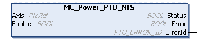
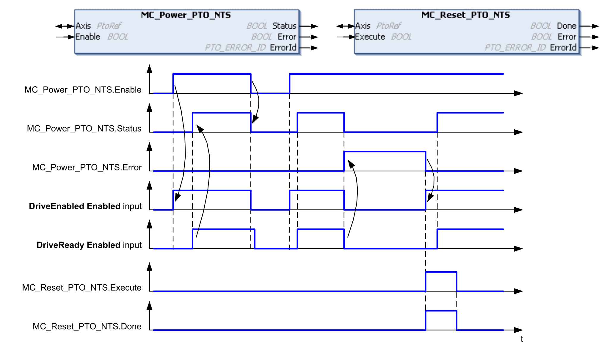

# MC\_Power\_PTO\_NTS: Manages the Power of the Axis

## Function Block Description

The MC\_Power\_PTO\_NTS function block is mandatory for execution of the other PTO function blocks. It allows enabling power and control to the axis, switching the axis state from Disabled to Standstill.

This function block needs to be the first PTO function block that is called.

No motion function block is allowed to affect the axis until the MC\_Power\_PTO\_NTS.Status bit is TRUE.

Disabling power (MC\_Power\_PTO\_NTS.Enable equals to FALSE) switches the axis:

* from Standstill to Disabled state.
* from an ongoing motion to ErrorStop, and then to Disabled when the detected error is reset.

If the DriveReady Enabled input parameter is reset, the axis state switches to ErrorStop.

## Graphical Representation

## I/O Variable Description

This table describes the input variables:

[For further information, refer to *PTO Configuration*.](../../../../../api/crossBook?lang=en-US&virtualBookName=EdgeIO_NTS_Exp_UG&topicID=PTOInterfaceConfiguration_827F6FBC)

| Input | Data type | Description |
| --- | --- | --- |
| Axis | PtoRef | Reference to the name of the axis (instance) for which the function block is to be executed. In the Devices tree, the name is declared in the controller configuration. |
| Enable | BOOL | When TRUE and the [DriveReady Enabled](../../../../../api/crossBook?lang=en-US&virtualBookName=EdgeIO_NTS_Exp_UG&topicID=PTOInterfaceConfiguration_827F6FBC) input parameter is TRUE, and no error is detected, power is supplied to the axis. The axis state is switched from Disabled to Standstill.  When FALSE, terminates the function block execution and resets the outputs. |

This table describes the output variables:

| Output | Data type | Description |
| --- | --- | --- |
| Status | BOOL | When TRUE, power is enabled, motion commands can be executed. |
| Error | BOOL | TRUE indicates that an error is detected. Function block execution is finished. |
| ErrorId | [PTO\_ERROR\_ID](PTO_ERRORID-91F1AFCB.html) | Indicates the identification number of the detected error when Error is TRUE. |

## Timing Diagram Example

The diagram illustrates the function block operation:

The DriveEnabled Enabled input parameter and the DriveReady Enabled input parameter are configured in the Edge I/O NTS Editor of the Logic Builder. For further information, [refer to the *PTO Configuration*](../../../../../api/crossBook?lang=en-US&virtualBookName=EdgeIO_NTS_Exp_UG&topicID=PTOInterfaceConfiguration_827F6FBC).

EIO000005480.01