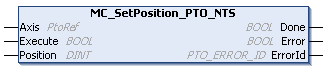

# MC\_SetPosition\_PTO\_NTS: Modifies the Reference Position of the Axis

## Function Block Description

The MC\_SetPosition\_PTO\_NTS function block modifies the coordinates of the position of the axis without physical movement. This function block can only be used while the axis is in Standstill state. It can be used as a simple homing mode. Once executed, absolute positioning is allowed.

The MC\_SetPosition\_PTO\_NTS function block executes the [Set Position motion command.](../../../../../api/crossBook?lang=en-US&virtualBookName=EdgeIO_NTS_Exp_UG&topicID=MotionCommandSetPosition_978B4914)

## Graphical Representation

## I/O Variable Description

This table describes the input variables:

| Input | Data type | Description |
| --- | --- | --- |
| Axis | PtoRef | Reference to the name of the axis (instance) for which the function block is to be executed. In the Devices tree, the name is declared in the controller configuration. |
| Execute | BOOL | When a rising edge is detected, the function block starts execution.  When a falling edge is detected, the function block stops execution and the outputs are reset. |
| Position | DINT | New value of the position of the Axis.  Default value: 0 |

This table describes the output variables:

| Output | Data type | Description |
| --- | --- | --- |
| Done | BOOL | TRUE indicates that the SetPosition process is finished. Function block execution is finished. |
| Error | BOOL | TRUE indicates that an error is detected. Function block execution is finished. |
| ErrorId | [PTO\_ERROR\_ID](PTO_ERRORID-91F1AFCB.html) | Indicates the identification number of the detected error when Error is TRUE. |

EIO000005480.01