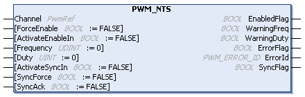

# PWM\_NTS: Commands a PWM Signal

## Function Block Description

The PWM\_NTS function block commands a Pulse Width Modulation (PWM) signal output at the specified frequency and duty cycle. For further information, refer to [Pulse Width Modulation Mode Principle Description](../../../../../api/crossBook?lang=en-US&virtualBookName=EdgeIO_NTS_Exp_UG&topicID=TPC_PulseWidthModulationModePrincip_C4F3F02F).

## Graphical Representation

## I/O Variables Description

This table describes the input variables:

| Input | Data type | Description |
| --- | --- | --- |
| Channel | PwmRef | Reference to the PWM instance. |
| ForceEnable | BOOL | When TRUE, forces the pulse generation. The ActivateEnableIn input is ignored.  Default value: FALSE |
| ActivateEnableIn | BOOL | When TRUE, enables pulse generation provided that the [EnConfigured input](../../../../../api/crossBook?lang=en-US&virtualBookName=EdgeIO_NTS_Exp_UG&topicID=FrequencyGeneratorInterfaceConfigur_828CE9AC) TRUE.  Default value: FALSE |
| Frequency | UDINT | Frequency to apply to the pulse generation in steps of 0.1 Hz.  Value range: 0...200,000 (0...20 kHz)  Default value: 0 |
| Duty | UINT | Duty cycle to apply to the pulse generation in steps of 0.1%.  Value range: 0...1000 (0...100%)  Default value: 0 |
| ActivateSyncIn | BOOL | When TRUE, the synchronization is started when a [SyncConfigured input parameter](../../../../../api/crossBook?lang=en-US&virtualBookName=EdgeIO_NTS_Exp_UG&topicID=FrequencyGeneratorInterfaceConfigur_828CE9AC) is defined other than 0 and the SyncFlag output is set to TRUE.  Default value: FALSE |
| SyncForce | BOOL | When a rising edge is detected, forces the synchronization and sets the SyncFlag output to TRUE independently of the defined [SyncConfigured input parameter](../../../../../api/crossBook?lang=en-US&virtualBookName=EdgeIO_NTS_Exp_UG&topicID=FrequencyGeneratorInterfaceConfigur_828CE9AC).  Default value: FALSE |
| SyncAck | BOOL | When a rising edge is detected, the SyncFlag output is reset.  Default value: FALSE |

This table describes the output variables:

| Output | Data type | Description |
| --- | --- | --- |
| EnabledFlag | BOOL | TRUE indicates that the output values on the function block are valid. If the function block is disabled, the output is set to FALSE. |
| WarningFreq | BOOL | When TRUE, the value of the input Frequency exceeds the maximum frequency. The applied frequency is the maximum frequency.  Default value: FALSE |
| WarningDuty | BOOL | When TRUE, the value of the input Duty exceeds the maximum duty. The applied duty is the maximum duty.  Default value: FALSE |
| ErrorFlag | BOOL | TRUE indicates that an error is detected. |
| ErrorId | [PWM\_ERROR\_ID](PWM_ERRORID-917F07DD.html) | Indicates the identification number of the detected error when Error is TRUE. |
| SyncFlag | BOOL | When TRUE, synchronization has been performed.  Default value: FALSE |

EIO000005480.01