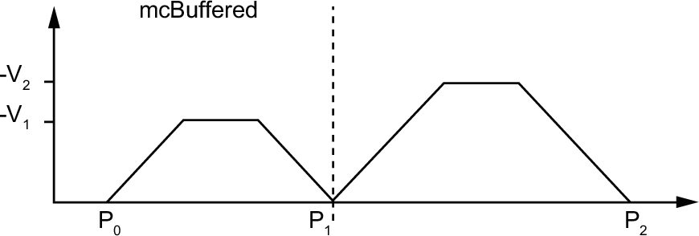
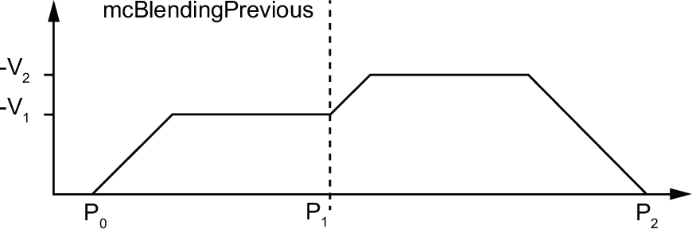

# MC\_BUFFER\_MODE

## Description

The MC\_BUFFER\_MODE enumeration provides the buffer modes. For a general description of the buffer mode, refer to [Buffer Mode Description](../../../../../api/crossBook?lang=en-US&virtualBookName=EdgeIO_NTS_Exp_UG&topicID=BufferModeDescription_7BCA9A92).

## Enumeration Elements

The enumeration data type ENUM contains the following values:

| Name | Value | Description |
| --- | --- | --- |
| mcAborting | 0 | The function block is enabled immediately. Ongoing motion is aborted and the motion queue is cleared.  Default mode |
| mcBuffered | 1 | The function block is enabled after the ongoing motion has been completed (the Done or InVelocity bit is set to TRUE). Blending is not performed. |
| mcBlendingPrevious | 3 | The velocity is blended with the velocity of the first function block (blending with the velocity of function block 1 at the end position of function block 1). |
| seTrigger | 10 | When the function block is executed, the motion command is buffered. When the touchprobe event conditions are met, the motion command is executed aborting any ongoing motion command. |
| seBufferedDelay | 11 | This buffer mode operates like the mcBuffered but the execution of the function block starts after the Delay parameter value duration.  For further information, [refer to the *PTO Configuration*](../../../../../api/crossBook?lang=en-US&virtualBookName=EdgeIO_NTS_Exp_UG&topicID=PTOInterfaceConfiguration_827F6FBC). |

## Examples

The examples below show a movement executed by two motion commands. The axis moves from the position P0 to P1 and then P2. The second command is passed while the axis is executing the first command but before the stopping ramp is reached. For each motion profile below, P1 is the reference point for the blending calculation. The buffer mode determines whether velocity V1 or V2 is reached at position P1.

EIO000005480.01