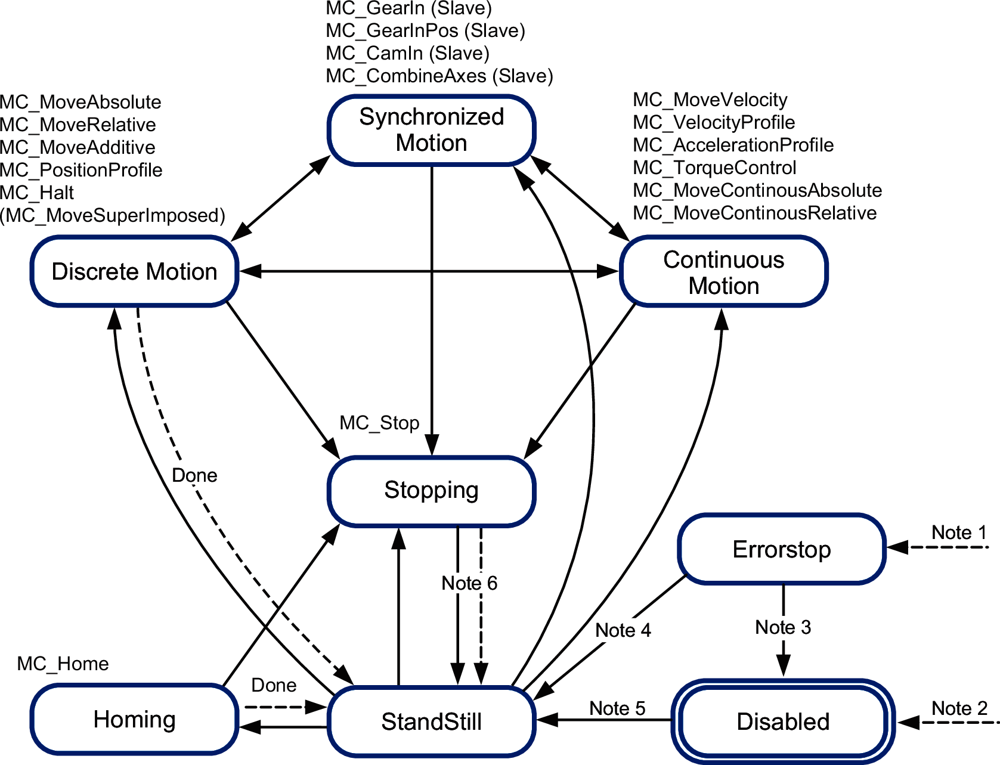

# PLCopen State Diagram

The state diagram represents the axis in terms of PLCopen. At any given point in time, the axis is in exactly one state. If a function block is executed or an error is detected, this may cause a state transition. The function block MC\_ReadStatus delivers the current status of the axis.

**Note 1** An error has been detected. (Transition from any state).

**Note 2** The input Enable of the function block MC\_Power is set to FALSE and no error has been detected (transition from any state).

**Note 3** MC\_Reset and MC\_Power.Status = FALSE.

**Note 4** MC\_Reset and MC\_Power.Status = TRUE and MC\_Power.Enable = TRUE.

**Note 5** MC\_Power.Enable = TRUE and MC\_Power.Status = TRUE.

**Note 6** MC\_Stop.Done = TRUE and MC\_Stop.Execute = FALSE.

EIO0000003592.04