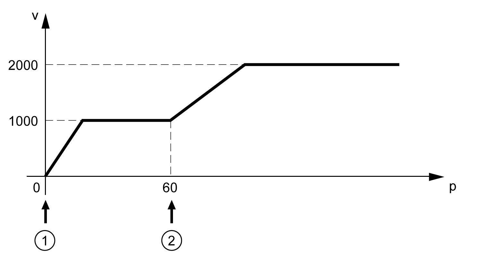
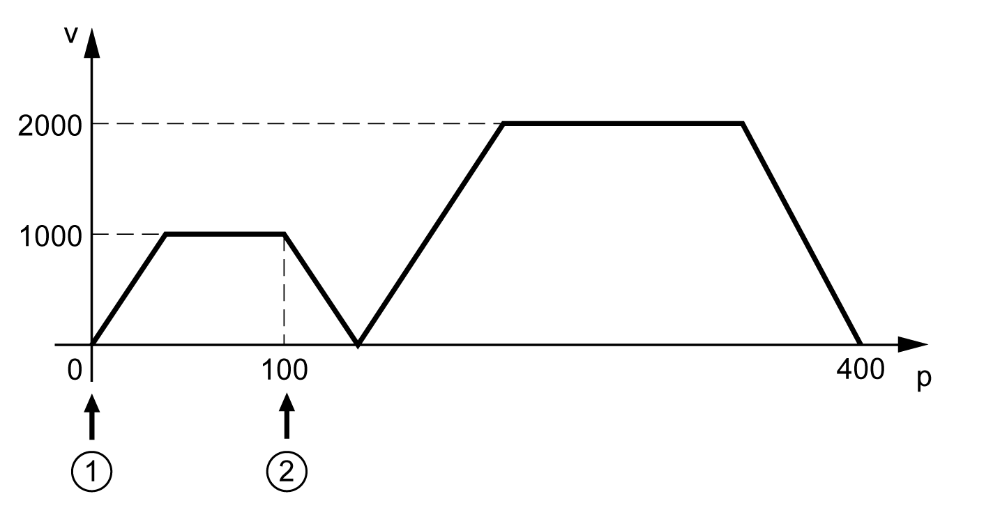

# Transitions Between Function Blocks

This table presents how the execution of a function block (function block 1) can be terminated by another function block (function block 2).

|  |  |  |  |  |  |
| --- | --- | --- | --- | --- | --- |
| **Function block 1** | **Function block 2** | | | | |
| MC\_Jog | MC\_Home | MC\_MoveAbsolute | MC\_MoveAdditive | MC\_MoveRelative |
| MC\_Jog | Immediately | Not permitted | Immediately | Immediately | Immediately |
| MC\_Home | Not permitted | Not permitted | Not permitted | Not permitted | Not permitted |
| MC\_MoveAbsolute | Motor standstill | Not permitted | Immediately | Immediately | Immediately |
| MC\_MoveAdditive | Motor standstill | Not permitted | Immediately | Immediately | Immediately |
| MC\_MoveRelative | Motor standstill | Not permitted | Immediately | Immediately | Immediately |
| MC\_MoveVelocity | Motor standstill | Not permitted | Immediately | Immediately | Immediately |
| MC\_TorqueControl | Motor standstill | Not permitted | Immediately | Immediately | Immediately |
| MC\_Stop | Not permitted | Not permitted | Not permitted | Not permitted | Not permitted |
| MC\_Halt | Motor standstill | Not permitted | Not permitted | Not permitted | Not permitted |

|  |  |  |  |  |
| --- | --- | --- | --- | --- |
| **Function block 1** | **Function block 2** | | | |
| MC\_MoveVelocity | MC\_TorqueControl | MC\_Stop | MC\_Halt |
| MC\_Jog | Immediately | Immediately | Immediately | Immediately |
| MC\_Home | Not permitted | Not permitted | Immediately | Not permitted |
| MC\_MoveAbsolute | Immediately | Immediately | Immediately | Immediately |
| MC\_MoveAdditive | Immediately | Immediately | Immediately | Immediately |
| MC\_MoveRelative | Immediately | Immediately | Immediately | Immediately |
| MC\_MoveVelocity | Immediately | Immediately | Immediately | Immediately |
| MC\_TorqueControl | Immediately | Immediately | Immediately | Immediately |
| MC\_Stop | Not permitted | Not permitted | Immediately | Not permitted |
| MC\_Halt | Not permitted | Not permitted | Immediately | Immediately |

## Immediately

The execution of function block 2 is started on the fly, that is, without delay. The execution of function block 1 is aborted.

|  |  |
| --- | --- |
| Function block 1 (MC\_MoveAbsolute) starts at position 0 | * Position = 100 * Velocity = 1000 |
| Function block 2 (MC\_MoveVelocity) starts at position 60 | Velocity = 2000 |

## Motor Standstill

The execution of function block 2 first decelerates the motor to a standstill with the adjusted deceleration ramp. The execution of function block 1 is aborted thereafter. The movement as per function block 2 starts as soon as the motor has come to a standstill.

|  |  |
| --- | --- |
| Function block 1 (MC\_MoveVelocity) starts at position 0 | Velocity = 1000 |
| Function block 2 (MC\_MoveAbsolute) starts at position 100 | * Position = 400 * Velocity = 2000 |

## Not Permitted

Function block 1 cannot be aborted by the new function block. Function block 2 is not executed.

EIO0000003592.04