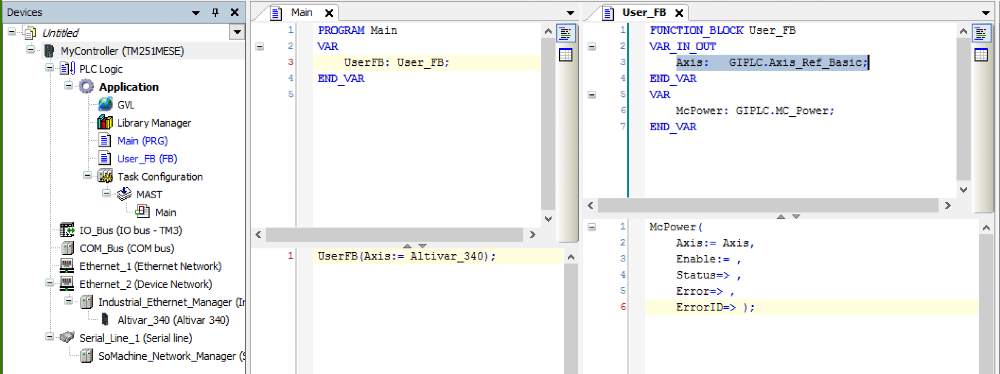

# Library-Specific Data Types

## Vendor-Specific Data Type Axis\_Ref

The function block User\_FB has to provide an axis reference for the function block MC\_Power (Axis) and this axis reference has to be the type Axis\_Ref\_Base. When calling an instance of the function block User\_FB, the Axis\_Ref (Altivar\_340) is passed to the instance of the function block MC\_Power.

The Axis\_Ref provides the timeout properties to modify timeout values.

These properties are accessible using the name of the Axis\_Ref followed by a “.”:

| Property name | Default timeout values (ms) | | | Description |
| --- | --- | --- | --- | --- |
| ATV | ILX | LXM |
| timConnectionTimeOut(1) | 10000 | 10000 | 10000 | Timeout while waiting for the connection to the drive to be established |
| timDiagQuitTimeOut | 2000 | 500 | 500 | Timeout while waiting for the status to be able to execute a “Fault Reset” command |
| timParameterTimeOut | 100 | 100 | 100 | Timeout while waiting for a response after the execution of a read or write command |
| timPowerTimeOut | 3000 | 1000 | 3000 | Timeout while waiting for power stage status enabled/disabled after an enable/disable command |
| timQuickStopTimeOut | 100 | 1000 | 1000 | Timeout while waiting for drive status Quick-Stop after the execution of a Quick-Stop command |
| timResetFaultTimeOut | 2000 | 500 | 500 | Timeout while waiting for error free status of the drive after the execution of a “Fault Reset” command |
| **(1)** Only available for EtherNet/IP devices. | | | | |

For compatibility reasons to the obsolete CANopen libraries, the axis reference function blocks for CANopen have two additional properties uiNetworkNo and uiNodeId. These properties are providing the network number and the node number of the referenced CANopen device and can be used in the application.

## Vendor-Specific Data Type Axis\_Ref\_Base

The data type Axis\_Ref\_Base is a vendor-specific data type and represents a common independent axis. This data type has to be used to pass the Axis\_Ref to user-specific function blocks.

Example:

## Vendor-Specific Data Type ET\_DeviceType

Data type: USINT

| Name | Value | Description |
| --- | --- | --- |
| Altivar320\_EthernetIP | 2 | Altivar drive ATV320 with EtherNet/IP |
| Altivar340\_EthernetIP | 3 | Altivar drive ATV340 with EtherNet/IP |
| Altivar6xx\_EthernetIP | 4 | Altivar drive ATV6•• with EtherNet/IP |
| Altivar9xx\_EthernetIP | 5 | Altivar drive ATV9•• with EtherNet/IP |
| Lexiun32M\_EthernetIP | 6 | Lexium drive LXM32M with EtherNet/IP |
| ILA\_EthernetIP | 7 | Integrated Lexium drive ILA2K with EtherNet/IP |
| ILE\_EthernetIP | 8 | Integrated Lexium drive ILE2K with EtherNet/IP |
| ILS\_EthernetIP | 9 | Integrated Lexium drive ILS2K with EtherNet/IP |
| Altivar320\_ModbusTCP | 22 | Altivar drive ATV320 with Modbus TCP |
| Altivar340\_ModbusTCP | 23 | Altivar drive ATV340 with Modbus TCP |
| Altivar6xx\_ModbusTCP | 24 | Altivar drive ATV6•• with Modbus TCP |
| Altivar9xx\_ModbusTCP | 25 | Altivar drive ATV9•• with Modbus TCP |
| Lexiun32M\_ModbusTCP | 26 | Lexium drive LXM32M with Modbus TCP |
| ILA\_ModbusTCP | 27 | Integrated Lexium drive ILA2T with Modbus TCP |
| ILE\_ModbusTCP | 28 | Integrated Lexium drive ILE2T with Modbus TCP |
| ILS\_ModbusTCP | 29 | Integrated Lexium drive ILS2T with Modbus TCP |
| Altivar320\_CANopen | 40 | Altivar drive ATV320 with CANopen |
| Altivar340\_CANopen | 41 | Altivar drive ATV340 with CANopen |
| Altivar6xx\_CANopen | 42 | Altivar drive ATV6•• with CANopen |
| Altivar9xx\_CANopen | 43 | Altivar drive ATV9•• with CANopen |
| Lexium32M\_CANopen | 44 | Lexium drive LXM32M with CANopen |
| Lexium32A\_CANopen | 45 | Lexium drive LXM32A with CANopen |
| Lexium32i\_CANopen | 46 | Lexium drive LXM32ICAN with CANopen |
| ILA\_CANopen | 47 | Integrated Lexium drive ILA1F with CANopen |
| ILE\_CANopen | 48 | Integrated Lexium drive ILE1F with CANopen |
| ILS\_CANopen | 49 | Integrated Lexium drive ILS1F with CANopen |
| SD328A\_CANopen | 50 | Lexium stepper drive SD328A with CANopen |

## Vendor-Specific Data Type ET\_LexiumHomingMode

Data type: UINT

Specifies the homing method for LXM32A (CANopen), LXM32ICAN (CANopen), LXM32M (CANopen, EtherNet/IP and Modbus TCP), SD328A (CANopen), and Lexium ILA, ILE and ILS integrated drives (EtherNet/IP and Modbus TCP):

| Name | Value | Description |
| --- | --- | --- |
| LIMN\_Indexpuls | 1 | LIMN with index pulse |
| LIMP\_Indexpuls | 2 | LIMP with index pulse |
| REF\_pos\_Indexpuls\_inv\_outside | 7 | REF+ with index pulse, inverted, outside |
| REF\_pos\_Indexpuls\_inv\_inside | 8 | REF+ with index pulse, inverted, inside |
| REF\_pos\_Indexpuls\_ninv\_inside | 9 | REF+ with index pulse, not inverted, inside |
| REF\_pos\_Indexpuls\_ninv\_outside | 10 | REF+ with index pulse, not inverted, outside |
| REF\_neg\_Indexpuls\_inv\_outside | 11 | REF- with index pulse, inverted, outside |
| REF\_neg\_Indexpuls\_inv\_inside | 12 | REF- with index pulse, inverted, inside |
| REF\_neg\_Indexpuls\_ninv\_inside | 13 | REF- with index pulse, not inverted, inside |
| REF\_neg\_Indexpuls\_ninv\_outside | 14 | REF- with index pulse, not inverted, outside |
| LIMN | 17 | LIMN |
| LIMP | 18 | LIMP |
| REF\_pos\_inv\_outside | 23 | REF+, inverted, outside |
| REF\_pos\_inv\_inside | 24 | REF+, inverted, inside |
| REF\_pos\_ninv\_inside | 25 | REF+, not inverted, inside |
| REF\_pos\_ninv\_outside | 26 | REF+, not inverted, outside |
| REF\_neg\_inv\_outside | 27 | REF-, inverted, outside |
| REF\_neg\_inv\_inside | 28 | REF-, inverted, inside |
| REF\_neg\_ninv\_inside | 29 | REF-, not inverted, inside |
| REF\_neg\_ninv\_outside | 30 | REF-, not inverted, outside |
| Indexpuls\_neg | 33 | Index pulse in negative direction |
| Indexpuls\_pos | 34 | Index pulse in positive direction |
| Setposition | 35 | Position setting |

## Vendor-Specific Data Type ET\_LexiumHomingMode\_ILX1

Data type: UINT

Specifies the homing method for Lexium ILA, ILE and ILS integrated drives for CANopen:

| Name | Value | Description |
| --- | --- | --- |
| LIMP | 1 | LIMN |
| LIMN | 2 | LIMP |
| REFZ\_neg | 3 | REF in negative direction |
| REFZ\_pos | 4 | REF in positive direction |
| Indexpuls\_neg | 5 | Index pulse in negative direction (only ILA1F and ILS1F) |
| Indexpuls\_pos | 6 | Index pulse in positive direction (only ILA1F and ILS1F) |
| Block\_neg | 7 | Movement to block in negative direction (only ILE1F) |
| Block\_pos | 8 | Movement to block in positive direction (only ILE1F) |
| REF\_pos\_inv\_outside | 23 | REF+, inverted, outside |
| REF\_pos\_inv\_inside | 24 | REF+, inverted, inside |
| REF\_pos\_ninv\_inside | 25 | REF+, not inverted, inside |
| REF\_pos\_ninv\_outside | 26 | REF+, not inverted, outside |
| REF\_neg\_inv\_outside | 27 | REF-, inverted, outside |
| REF\_neg\_inv\_inside | 28 | REF-, inverted, inside |
| REF\_neg\_ninv\_inside | 29 | REF-, not inverted, inside |
| REF\_neg\_ninv\_outside | 30 | REF-, not inverted, outside |
| Setposition | 35 | Position setting |

## Vendor-Specific Data Type ET\_SetpointSource\_LXM32

The enumeration describes the source of the target value.

Data type: USINT

Values for function block TorqueControl\_LXM32:

| Name | Value | Description |
| --- | --- | --- |
| Value | 0 | Target torque via input Torque |
| AnalogInput | 1 | Target torque via analog input (I/O module) |
| PTIInput | 2 | Target torque via PTI interface |

Values for function block MoveVelocity\_LXM32:

| Name | Value | Description |
| --- | --- | --- |
| Value | 0 | Target velocity via input Velocity |
| AnalogInput | 1 | Target velocity via analog input (I/O module) |

## Vendor-Specific Data Type ET\_SetpointSource\_SD328A

The enumeration describes the source of the target value.

Data type: USINT

Values for function block MoveVelocity\_SD328A:

| Name | Value | Description |
| --- | --- | --- |
| Value | 0 | Target velocity via input Velocity |
| AnalogInput | 1 | Target velocity via analog input |

## Vendor-Specific Data Type ET\_TriggerEdge

The enumeration describes the edge to trigger position capture.

Data type: INT

| Name | Value | Description |
| --- | --- | --- |
| RisingEdge | 1 | Rising edge |
| FallingEdge | 2 | Falling edge |
| BothEdges | 3 | Both rising edge and falling edge(1)(2) |
| **(1)** For SD328A: Not available.  **(2)** For Lexium ILA, ILE and ILS integrated drives: Only with EtherNet/IP and Modbus TCP. | | |

EIO0000003592.04