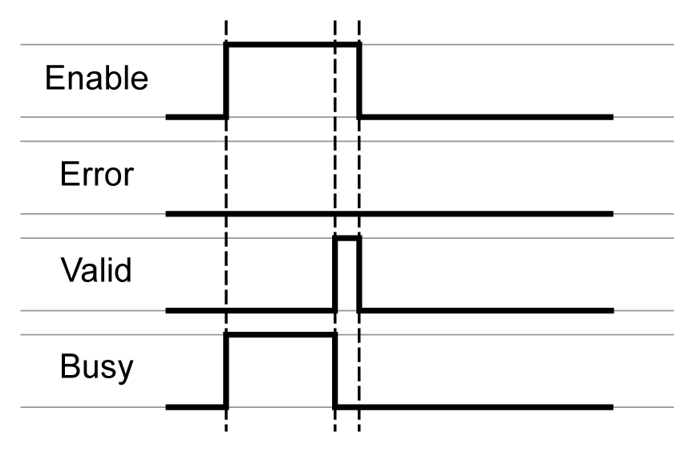
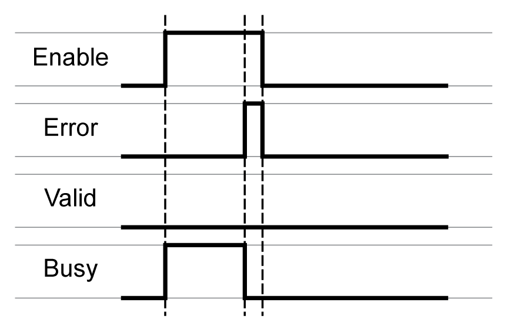
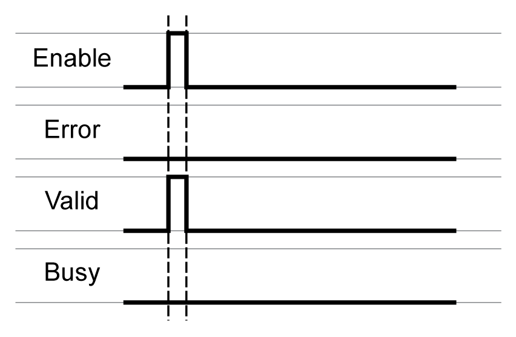
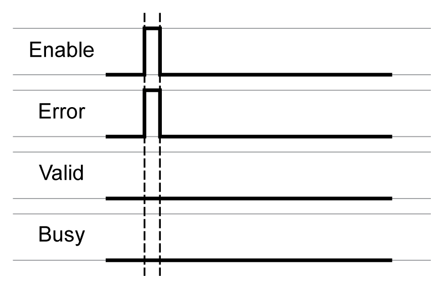
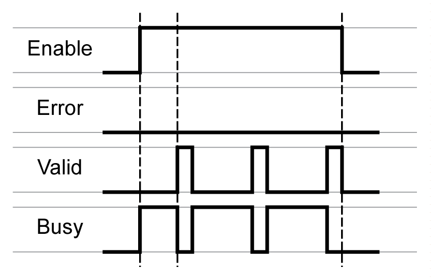
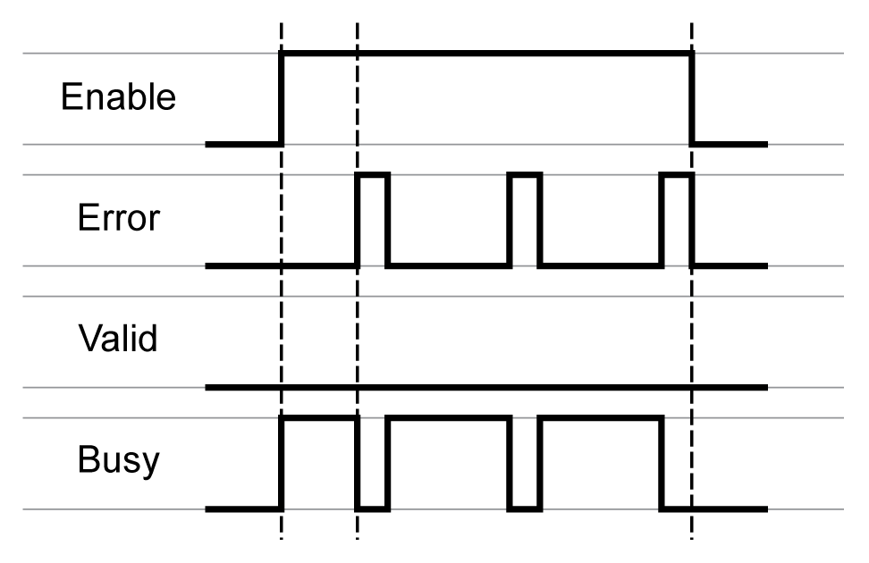
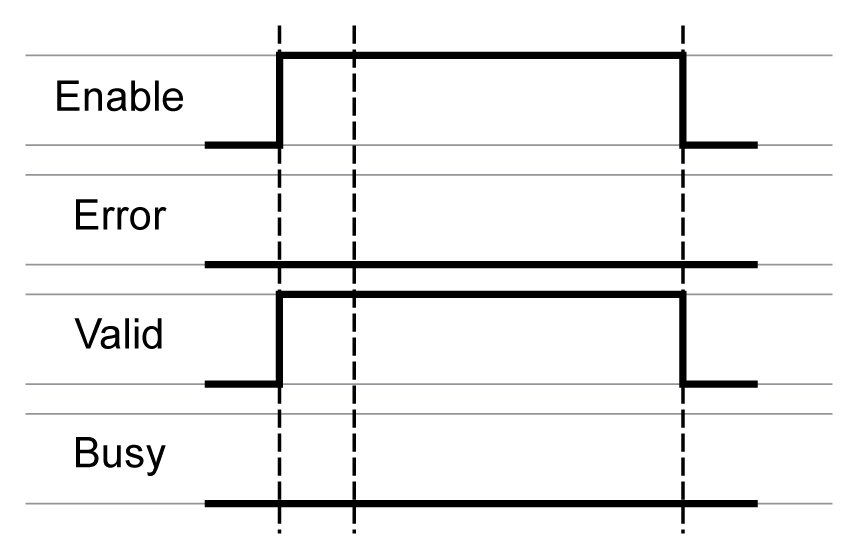
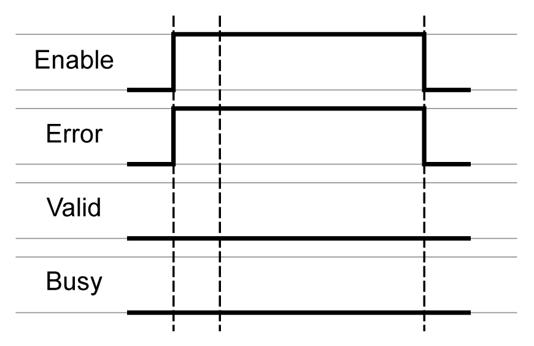

# Behavior of Function Blocks with the Input Enable

## Example 1

Single execution without an error detected (execution requires more than one call).

## Example 2

Single execution with an error detected (execution requires more than one call).

## Example 3

Single execution without an error detected (execution requires only one call).

## Example 4

Single execution with an error detected (execution requires only one call).

## Example 5

Repeated execution without an error detected (execution requires more than one call).

## Example 6

Repeated execution with an error detected (execution requires more than one call).

## Example 7

Repeated execution without an error detected (execution requires only one cycle).

## Example 8

Repeated execution with an error detected (execution requires only one call).

EIO0000003592.04