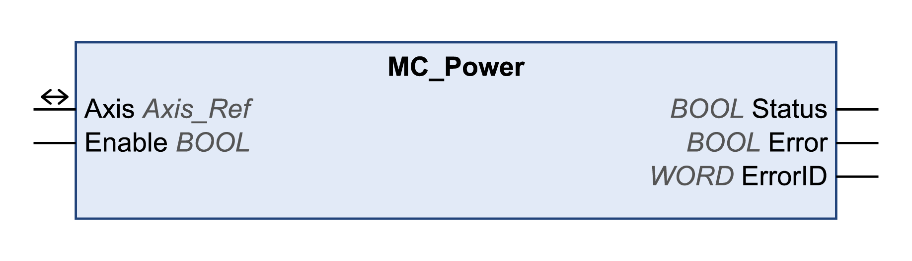

# MC\_Power

## Functional Description

This function block enables or disables the drive power stage.

TRUE at the input Enable enables the power stage. Once the power stage is enabled, the output Status is set.

FALSE at the input Enable disables the power stage. Once the power stage is disabled, the output Status is reset.

If errors are detected during execution, the output Error is set.

The function block must not be used like a general Enable function block. Every time the function block is called the input Enable is compared with the output status. If these values are different a new command is executed, either to switch on the power stage (Enable = TRUE and Status = FALSE) or to switch off the power stage (Enable = FALSE and Status = TRUE). The function has to be called as long as the commanded state of the power stage is achieved or until an error occurs. If a function block error (for example, timeout) occurred, the Error output is set and will be reset again with the next call of the function block.

The function block should not be called cyclically. Call this function block only if it is required to switch off or switch on the power stage.

NOTE: If a timeout error occurred, the diagnostic information PowerTimeout is provided by the MC\_ReadAxisError function block and not by the output ErrorID of the MC\_Power function block.

## Library Name and Namespace

Library name: **GMC Independent PLCopen MC**

Namespace: **GIPLC**

## Graphical Representation

## Inputs

| Input | Data type | Description |
| --- | --- | --- |
| Enable | BOOL | Value range: FALSE, TRUE.  Default value: FALSE.  The input Enable starts or terminates execution of a function block.   * FALSE: Execution of the function block is terminated. The outputs Valid, Busy, and Error are set to FALSE. * TRUE: The function block is being executed. The function block continues executing as long as the input Enable is set to TRUE. |

## Outputs

| Output | Data type | Description |
| --- | --- | --- |
| Status | BOOL | Value range: FALSE, TRUE.  Default value: FALSE.   * FALSE: Power stage is disabled. * TRUE: Power stage is enabled. |
| Error | BOOL | Value range: FALSE, TRUE.  Default value: FALSE.   * FALSE: Execution of the function block is running, no error has been detected. * TRUE: An error has been detected in the execution of the function block. |
| ErrorID | WORD | Returns the value of a diagnostic code. Refer to [Library Diagnostic Codes](D-SE-0057144.html#D-SE-0057144). If the value is 0 and if the output Error of this function block is set to TRUE, then the diagnostic code can be read with the output AxisErrorID of the function block [MC\_ReadAxisError](D-SE-0057184.html#D-SE-0057184). |

## Inputs/Outputs

| Input/Output | Data type | Description |
| --- | --- | --- |
| Axis | Axis\_Ref | Reference to the axis (instance) for which the function block is to be executed (corresponds to the name of the axis). The name of the axis must be defined in the EcoStruxure Machine Expert Devices tree. |

## Notes

If you have activated this function block, simultaneous use of the Control\_ATV function block may lead to unintended behavior.

| WARNING | |
| --- | --- |
|  | UNINTENDED EQUIPMENT OPERATION  * Do not activate the Control\_ATV function block when this function block is active. * Deactivate this function block or allow the function block to terminate before activating the Control\_ATV function block.  Failure to follow these instructions can result in death, serious injury, or equipment damage. |

If a Node Guarding or Heartbeat error is detected, the error memory must be reset by using the function block MC\_Reset before the power stage can be enabled again.

## Additional Information

[PLCopen State Diagram](D-SE-0057168.html#D-SE-0057168)

[Initialization](D-SE-0057537.html#D-SE-0057537)

EIO0000003592.04