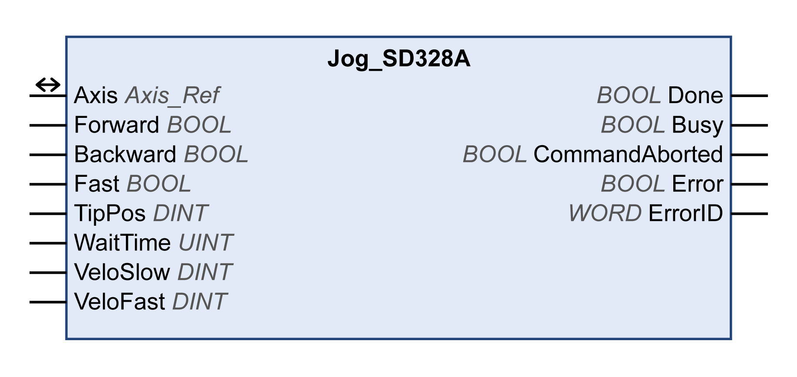

# Jog\_SD328A

## Functional Description

This function block starts the operating mode Jog.

In the operating mode Jog, a movement is started via the inputs Forward and Backward.

If the inputs Forward and Backward are set to FALSE, the operating mode is terminated and the output Done is set to TRUE.

If the inputs Forward and Backward are set to TRUE, the operating mode remains active, the jog movement is stopped and the output Busy remains set to TRUE.

## Library and Namespace

Library name: **GMC Independent Lexium**

Namespace: **GILXM**

## Graphical Representation

## Inputs

| Input | Data type | Description |
| --- | --- | --- |
| Forward | BOOL | Value range: FALSE, TRUE.  Default value: FALSE.   * Forward = FALSE and Backward = FALSE: Movement is terminated. * Forward = TRUE and Backward = FALSE: Movement in positive direction is started. * Forward = FALSE and Backward = TRUE: Movement in negative direction is started. * Forward = TRUE and Backward = TRUE: The operating mode remains active, the jog movement is stopped, and the output Busy remains set to TRUE. |
| Backward | BOOL |
| Fast | BOOL | Value range: FALSE, TRUE.  Default value: FALSE.  The velocity can be modified during the movement.   * FALSE: Movement at the velocity set in VeloSlow. * TRUE: Movement at the velocity set in VeloFast. |
| TipPos | DINT | Value range: 0...2147483647  Default value: 20   * 0: Continuous movement is started immediately. * >0: Value is used for distance to be moved in user-defined units. The movement is stopped, the waiting time WaitTime starts. After the waiting time WaitTime has elapsed, a continuous movement is started. |
| WaitTime | UINT | Value range: 1...32767  Default value: 500  Waiting time in ms. If TipPos is >0, the waiting time WaitTime starts as soon as the adjusted distance has been covered. After the waiting time WaitTime has elapsed, a continuous movement is started. |
| VeloSlow | DINT | Value range: 1...3000  Default value: 60  Velocity in rpm. If Fast = FALSE, the movement is made at this velocity. |
| VeloFast | DINT | Value range: 1...3000  Default value: 180  Velocity in rpm. If Fast = TRUE, the movement is made at this velocity. |

## Outputs

| Output | Data type | Description |
| --- | --- | --- |
| Done | BOOL | Value range: FALSE, TRUE.  Default value: FALSE.   * FALSE: Execution has not been started, or an error has been detected. * TRUE: Execution terminated without an error detected. |
| Busy | BOOL | Value range: FALSE, TRUE.  Default value: FALSE.   * FALSE: Function block is not being executed. * TRUE: Function block is being executed. |
| CommandAborted | BOOL | Value range: FALSE, TRUE.  Default value: FALSE.   * FALSE: Execution has not been aborted. * TRUE: Execution has been aborted by another function block. |
| Error | BOOL | Value range: FALSE, TRUE.  Default value: FALSE.   * FALSE: Execution of the function block is running, no error has been detected. * TRUE: An error has been detected in the execution of the function block. |
| ErrorID | WORD | Returns the value of a diagnostic code. Refer to [Library Diagnostic Codes](D-SE-0057144.html#D-SE-0057144). If the value is 0 and if the output Error of this function block is set to TRUE, then the diagnostic code can be read with the output AxisErrorID of the function block [MC\_ReadAxisError](D-SE-0057184.html#D-SE-0057184). |

## Inputs/Outputs

| Input/Output | Data type | Description |
| --- | --- | --- |
| Axis | Axis\_Ref | Reference to the axis (instance) for which the function block is to be executed (corresponds to the name of the axis). The name of the axis must be defined in the EcoStruxure Machine Expert Devices tree. |

## Additional Information

[Operating Mode Jog](D-SE-0057538.html#D-SE-0057538)

EIO0000003592.04