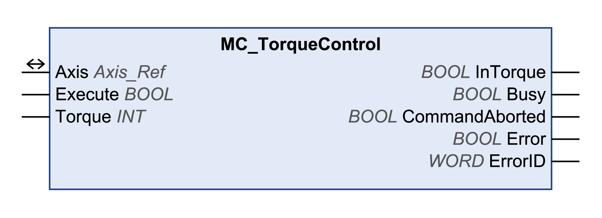

# MC\_TorqueControl

## Functional Description

This function block starts the operating mode Profile Torque. In the operating mode Profile Torque, a movement is made with a target torque. The reference value for the target torque is supplied via the input Torque. When the target torque is reached, the output InTorque is set to TRUE.

## Library and Namespace

Library name: **GMC Independent PLCopen MC**

Namespace: **GIPLC**

## Graphical Representation

## Inputs

| Input | Data type | Description |
| --- | --- | --- |
| Execute | BOOL | Value range: FALSE, TRUE.  Default value: FALSE.  A rising edge of the input Execute starts the function block. The function block continues execution and the output Busy is set to TRUE.  This function block can be restarted while it is executed. The target values are overwritten by the new values at the point in time the rising edge occurs. |
| Torque | INT | Value range: -30000...30000  Default value: 0  Target torque in user-defined units.  The value corresponds to 0.1% of the nominal torque of the motor. Example: Torque = 300 corresponds to 30% of the nominal torque of the motor.  Refer to the drive documentation for an overview of the parameters. |

## Outputs

| Output | Data type | Description |
| --- | --- | --- |
| InTorque | BOOL | Value range: FALSE, TRUE.  Default value: FALSE.   * FALSE: Target torque not reached. * TRUE: Target torque reached. |
| Busy | BOOL | Value range: FALSE, TRUE.  Default value: FALSE.   * FALSE: Function block is not being executed. * TRUE: Function block is being executed.   NOTE: The output Busy remains TRUE even when the target velocity has been reached or Execute becomes FALSE. The output Busy is set to FALSE as soon as another function block such as MC\_Stop is executed. |
| CommandAborted | BOOL | Value range: FALSE, TRUE.  Default value: FALSE.   * FALSE: Execution has not been aborted. * TRUE: Execution has been aborted by another function block. |
| Error | BOOL | Value range: FALSE, TRUE.  Default value: FALSE.   * FALSE: Execution of the function block is running, no error has been detected. * TRUE: An error has been detected in the execution of the function block. |
| ErrorID | WORD | Returns the value of a diagnostic code. Refer to [Library Diagnostic Codes](D-SE-0057144.html#D-SE-0057144). If the value is 0 and if the output Error of this function block is set to TRUE, then the diagnostic code can be read with the output AxisErrorID of the function block [MC\_ReadAxisError](D-SE-0057184.html#D-SE-0057184). |

## Inputs/Outputs

| Input/Output | Data type | Description |
| --- | --- | --- |
| Axis | Axis\_Ref | Reference to the axis (instance) for which the function block is to be executed (corresponds to the name of the axis). The name of the axis must be defined in the EcoStruxure Machine Expert Devices tree. |

## Additional Information

[PLCopen State Diagram](D-SE-0057168.html#D-SE-0057168)

[Transition Between Function Blocks](D-SE-0057142.html#D-SE-0057142)

[Operating Mode Profile Torque](D-SE-0057539.html#D-SE-0057539)

EIO0000003592.04