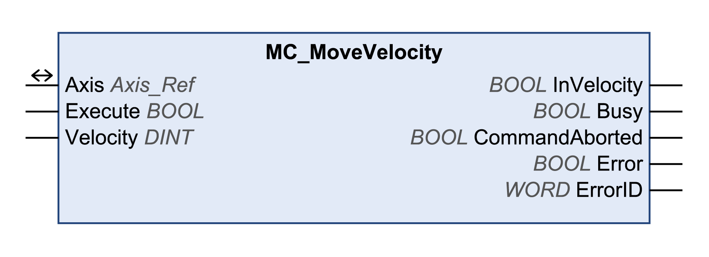

# MC\_MoveVelocity

## Functional Description

This function block starts the operating mode Profile Velocity. In the operating mode Profile Velocity, a movement is made with a target velocity. The reference value for the target velocity is supplied via the input Velocity. When the target velocity is reached, the output InVelocity is set to TRUE.

## Library and Namespace

Library name: **GMC Independent PLCopen MC**

Namespace: **GIPLC**

## Graphical Representation

## Inputs

| Input | Data type | Description |
| --- | --- | --- |
| Execute | BOOL | Value range: FALSE, TRUE.  Default value: FALSE.  A rising edge of the input Execute starts the function block. The function block continues execution and the output Busy is set to TRUE.  This function block can be restarted while it is executed. The target values are overwritten by the new values at the point in time the rising edge occurs. |
| Velocity | DINT | Value range: -2147483648...2147483647  Default value: 0  Target velocity in user-defined units.  NOTE: For Altivar, the values for LowFrequency and HighFrequency are set in the function block SetFrequencyRange\_ATV. If the value for the target velocity Velocity is less than the value for LowFrequency, the movement is made with the velocity value for LowFrequency. No error is detected.  If the value for the target velocity Velocity is greater than the value for HighFrequency, the movement is made with the velocity value for HighFrequency. No error is detected. |

## Outputs

| Output | Data type | Description |
| --- | --- | --- |
| InVelocity | BOOL | Value range: FALSE, TRUE.  Default value: FALSE.   * FALSE: Target value not reached. * TRUE: Target value reached. |
| Busy | BOOL | Value range: FALSE, TRUE.  Default value: FALSE.   * FALSE: Function block is not being executed. * TRUE: Function block is being executed.   NOTE: The output Busy remains TRUE even when the target velocity has been reached or Execute becomes FALSE. The output Busy is set to FALSE as soon as another function block such as MC\_Stop is executed. |
| CommandAborted | BOOL | Value range: FALSE, TRUE.  Default value: FALSE.   * FALSE: Execution has not been aborted. * TRUE: Execution has been aborted by another function block. |
| Error | BOOL | Value range: FALSE, TRUE.  Default value: FALSE.   * FALSE: Execution of the function block is running, no error has been detected. * TRUE: An error has been detected in the execution of the function block. |
| ErrorID | WORD | Returns the value of a diagnostic code. Refer to [Library Diagnostic Codes](D-SE-0057144.html#D-SE-0057144). If the value is 0 and if the output Error of this function block is set to TRUE, then the diagnostic code can be read with the output AxisErrorID of the function block [MC\_ReadAxisError](D-SE-0057184.html#D-SE-0057184). |

## Inputs/Outputs

| Input/Output | Data type | Description |
| --- | --- | --- |
| Axis | Axis\_Ref | Reference to the axis (instance) for which the function block is to be executed (corresponds to the name of the axis). The name of the axis must be defined in the EcoStruxure Machine Expert Devices tree. |

## Notes

If you have activated this function block, simultaneous use of the Control\_ATV function block may lead to unintended behavior.

| WARNING | |
| --- | --- |
|  | UNINTENDED EQUIPMENT OPERATION  * Do not activate the Control\_ATV function block when this function block is active. * Deactivate this function block or allow the function block to terminate before activating the Control\_ATV function block.  Failure to follow these instructions can result in death, serious injury, or equipment damage. |

The output Busy remains TRUE even if the target velocity has been reached or the input Execute is set to FALSE. The output Busy is set to FALSE as soon as another function block such as MC\_Stop is executed.

In the operating mode Profile Velocity, a movement beyond the movement range is possible. In the case of a movement beyond the movement range, the reference point established by homing becomes invalid.

This function block uses library-specific acceleration and deceleration values for LXM32M (EtherNet/IP and Modbus TCP) and for Lexium ILA, ILE and ILS integrated drives (EtherNet/IP only). This means that pre-configured values for these parameters (for example, via the commissioning tool) are overwritten when this function block is executed.

The default acceleration and deceleration values written by this function block are as follows:

* The default values for acceleration are:

  + 600 user-defined units for LXM32M
  + 600 user-defined units for Lexium ILA, ILE and ILS integrated drives
* The default values for deceleration are:

  + 600 user-defined units for LXM32M
  + 750 user-defined units for Lexium ILA, ILE and ILS integrated drives

If you require other acceleration and/or deceleration values, you must use the vendor-specific function blocks to do so. Use the function blocks SetDriveRamp\_LXM32 or SetDriveRamp\_ILX to define the acceleration and deceleration. The function block has to be executed only once if a change of the ramp values is required.

## Additional Information

[PLCopen State Diagram](D-SE-0057168.html#D-SE-0057168)

[Transition Between Function Blocks](D-SE-0057142.html#D-SE-0057142)

[Operating Mode Profile Velocity](D-SE-0057540.html#D-SE-0057540)

EIO0000003592.04