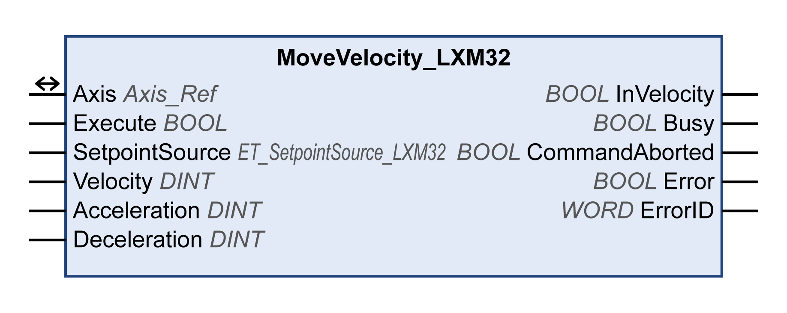

# MoveVelocity\_LXM32

## Functional Description

This function block starts the operating mode Profile Velocity. In the operating mode Profile Velocity, a movement is made with a target velocity. The source for the target velocity is set via the input SetpointSource. When the target velocity is reached, the output InVelocity is set to TRUE.

## Library and Namespace

Library name: **GMC Independent Lexium**

Namespace: **GILXM**

## Graphical Representation

## Inputs

| Input | Data type | Description |
| --- | --- | --- |
| Execute | BOOL | Value range: FALSE, TRUE.  Default value: FALSE.  A rising edge of the input Execute starts the function block. The function block continues execution and the output Busy is set to TRUE.  This function block can be restarted while it is executed. The target values are overwritten by the new values at the point in time the rising edge occurs. |
| SetpointSource | ET\_SetpointSource\_LXM32 | Value range: 0...1  Default value: 0  Source of the target velocity.   * 0 / Value: Target velocity via input Velocity * 1 / AnalogInput: Target velocity via analog input (I/O module)   See also [Vendor-Specific Data Type ET\_SetpointSource\_LXM32](D-SE-0093799.html#D-SE-0093799__D-SE-0093799.4). |
| Velocity | DINT | Value range: -2147483648...2147483647  Default value: 0  Target velocity in user-defined units. |
| Acceleration | DINT | Value range: 1...2147483647  Default value: 600  Acceleration ramp in user-defined units. |
| Deceleration | DINT | Value range: 1...2147483647  Default value: 600  Deceleration ramp in user-defined units. |

## Outputs

| Output | Data type | Description |
| --- | --- | --- |
| InVelocity | BOOL | Value range: FALSE, TRUE.  Default value: FALSE.   * FALSE: Target value not reached. * TRUE: Target value reached. |
| Busy | BOOL | Value range: FALSE, TRUE.  Default value: FALSE.   * FALSE: Function block is not being executed. * TRUE: Function block is being executed.   NOTE: The output Busy remains TRUE even when the target velocity has been reached or Execute becomes FALSE. The output Busy is set to FALSE as soon as another function block such as MC\_Stop is executed. |
| CommandAborted | BOOL | Value range: FALSE, TRUE.  Default value: FALSE.   * FALSE: Execution has not been aborted. * TRUE: Execution has been aborted by another function block. |
| Error | BOOL | Value range: FALSE, TRUE.  Default value: FALSE.   * FALSE: Execution of the function block is running, no error has been detected. * TRUE: An error has been detected in the execution of the function block. |
| ErrorID | WORD | Returns the value of a diagnostic code. Refer to [Library Diagnostic Codes](D-SE-0057144.html#D-SE-0057144). If the value is 0 and if the output Error of this function block is set to TRUE, then the diagnostic code can be read with the output AxisErrorID of the function block [MC\_ReadAxisError](D-SE-0057184.html#D-SE-0057184). |

## Inputs/Outputs

| Input/Output | Data type | Description |
| --- | --- | --- |
| Axis | Axis\_Ref | Reference to the axis (instance) for which the function block is to be executed (corresponds to the name of the axis). The name of the axis must be defined in the EcoStruxure Machine Expert Devices tree. |

## Notes

The output Busy remains TRUE even if the target velocity has been reached or the input Execute is set to FALSE. The output Busy is set to FALSE as soon as another function block such as MC\_Stop is executed.

The inputs Acceleration and Deceleration are only taken into account if you use the fieldbuses EtherNet/IP or Modbus TCP.

## Additional Information

[Operating Mode Profile Velocity](D-SE-0057540.html#D-SE-0057540)

EIO0000003592.04