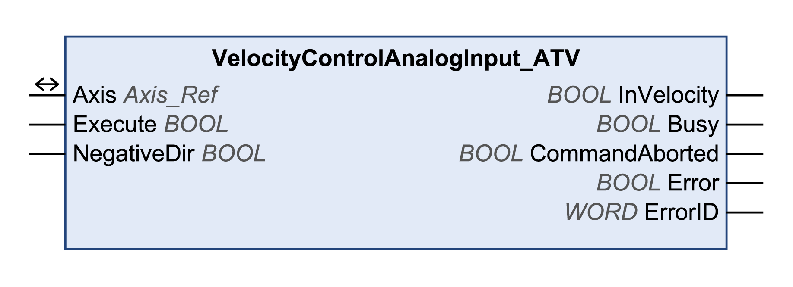

# VelocityControlAnalogInput\_ATV

## Functional Description

This function block uses the reference values supplied by the analog input selected with the function block VelocityControlSelectAI\_ATV.

## Library and Namespace

Library name: **GMC Independent Altivar**

Namespace: **GIATV**

## Graphical Representation

## Inputs

| Input | Data type | Description |
| --- | --- | --- |
| Execute | BOOL | Value range: FALSE, TRUE.  Default value: FALSE.  A rising edge of the input Execute starts the function block. The function block continues execution and the output Busy is set to TRUE.  This function block can be restarted while it is executed. The target values are overwritten by the new values at the point in time the rising edge occurs. |
| NegativeDir | BOOL | Value range: FALSE, TRUE.  Default value: FALSE.   * FALSE: Clockwise rotation. * TRUE: Counter-clockwise rotation. |

## Outputs

| Output | Data type | Description |
| --- | --- | --- |
| InVelocity | BOOL | Value range: FALSE, TRUE.  Default value: FALSE.   * FALSE: The velocity does not correspond to the reference value. * TRUE: The velocity corresponds to the reference value. |
| Busy | BOOL | Value range: FALSE, TRUE.  Default value: FALSE.   * FALSE: Function block is not being executed. * TRUE: Function block is being executed. |
| CommandAborted | BOOL | Value range: FALSE, TRUE.  Default value: FALSE.   * FALSE: Execution has not been aborted. * TRUE: Execution has been aborted by another function block. |
| Error | BOOL | Value range: FALSE, TRUE.  Default value: FALSE.   * FALSE: Execution of the function block is running, no error has been detected. * TRUE: An error has been detected in the execution of the function block. |
| ErrorID | WORD | Returns the value of a diagnostic code. Refer to [Library Diagnostic Codes](D-SE-0057144.html#D-SE-0057144). If the value is 0 and if the output Error of this function block is set to TRUE, then the diagnostic code can be read with the output AxisErrorID of the function block [MC\_ReadAxisError](D-SE-0057184.html#D-SE-0057184). |

## Inputs/Outputs

| Input/Output | Data type | Description |
| --- | --- | --- |
| Axis | Axis\_Ref | Reference to the axis (instance) for which the function block is to be executed (corresponds to the name of the axis). The name of the axis must be defined in the EcoStruxure Machine Expert Devices tree. |

## Notes

If you have activated this function block, simultaneous use of the Control\_ATV function block may lead to unintended behavior.

| WARNING | |
| --- | --- |
|  | UNINTENDED EQUIPMENT OPERATION  * Do not activate the Control\_ATV function block when this function block is active. * Deactivate this function block or allow the function block to terminate before activating the Control\_ATV function block.  Failure to follow these instructions can result in death, serious injury, or equipment damage. |

More information is provided in the following function blocks description: SetFrequencyRange\_ATV and VelocityControlSelectAI\_ATV. If analog voltage levels –10 V...+10 V are used, the direction of movement (rotation) is inversed when the sign changes. If the voltage is 0 V, this may result in jumps in the direction of movement, in the minimum frequency and in jumps at standstill.

## Additional Information

[Operating Mode Profile Velocity](D-SE-0057540.html#D-SE-0057540)

EIO0000003592.04