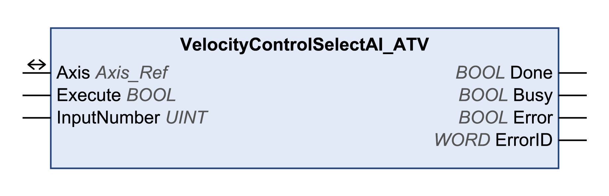

# VelocityControlSelectAI\_ATV

## Functional Description

This function block selects the analog input for supplying the reference value. See also VelocityControlAnalogInput\_ATV.

## Library and Namespace

Library name: **GMC Independent Altivar**

Namespace: **GIATV**

## Graphical Representation

## Inputs

| Input | Data type | Description |
| --- | --- | --- |
| Execute | BOOL | Value range: FALSE, TRUE.  Default value: FALSE.  A rising edge of the input Execute starts the function block. The function block continues execution and the output Busy is set to TRUE.  A rising edge at the input Execute is ignored while the function block is being executed. |
| InputNumber | UINT | Value range: 1...4  Default value: 1  ATV320:   * 1: AI1 * 2: AI2 * 3: AI3   ATV340:   * 1: AI1 * 2: AI2 |

## Outputs

| Output | Data type | Description |
| --- | --- | --- |
| Done | BOOL | Value range: FALSE, TRUE.  Default value: FALSE.   * FALSE: Execution has not been started, or an error has been detected. * TRUE: Execution terminated without an error detected. |
| Busy | BOOL | Value range: FALSE, TRUE.  Default value: FALSE.   * FALSE: Function block is not being executed. * TRUE: Function block is being executed. |
| Error | BOOL | Value range: FALSE, TRUE.  Default value: FALSE.   * FALSE: Execution of the function block is running, no error has been detected. * TRUE: An error has been detected in the execution of the function block. |
| ErrorID | WORD | Returns the value of a diagnostic code. Refer to [Library Diagnostic Codes](D-SE-0057144.html#D-SE-0057144). If the value is 0 and if the output Error of this function block is set to TRUE, then the diagnostic code can be read with the output AxisErrorID of the function block [MC\_ReadAxisError](D-SE-0057184.html#D-SE-0057184). |

## Inputs/Outputs

| Input/Output | Data type | Description |
| --- | --- | --- |
| Axis | Axis\_Ref | Reference to the axis (instance) for which the function block is to be executed (corresponds to the name of the axis). The name of the axis must be defined in the EcoStruxure Machine Expert Devices tree. |

## Notes

If you have activated this function block, simultaneous use of the Control\_ATV function block may lead to unintended behavior.

| WARNING | |
| --- | --- |
|  | UNINTENDED EQUIPMENT OPERATION  * Do not activate the Control\_ATV function block when this function block is active. * Deactivate this function block or allow the function block to terminate before activating the Control\_ATV function block.  Failure to follow these instructions can result in death, serious injury, or equipment damage. |

This function block can only be executed if the drive is in the operating state 3 Switch On Disabled. To transition to this state, disable the power stage with the function block MC\_Power.

## Additional Information

[Operating Mode Profile Velocity](D-SE-0057540.html#D-SE-0057540)

EIO0000003592.04