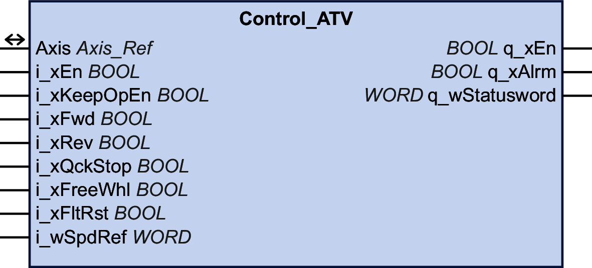
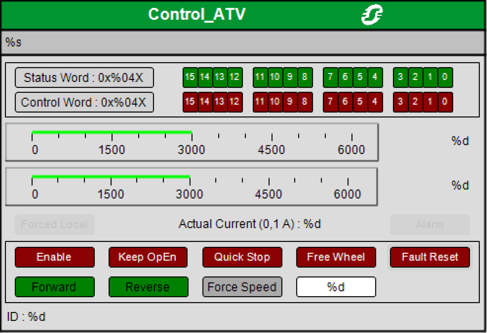

# Control\_ATV

## Functional Description

This function block manages the Controlword, Statusword, reference velocity and the direction of movement for the drive.

This function block requires an [Adaptation of the I/O Mapping](#D-SE-0064598__D-SE-0064598.13).

## Library and Namespace

Library name: **GMC Independent Altivar**

Namespace: **GIATV**

## Graphical Representation

## Inputs

| Input | Data Type | Description |
| --- | --- | --- |
| i\_xEn | BOOL | Value range: FALSE, TRUE.  Default value: FALSE.  Command for activating or deactivating the function block.   * FALSE: Deactivate the function block * TRUE: Activate the function block |
| i\_xKeepOpEn | BOOL | Value range: FALSE, TRUE.  Default value: FALSE.   * FALSE: Power stage is disabled if no command is active. * TRUE: Power stage remains enabled if no command is active. |
| i\_xFwd | BOOL | Value range: FALSE, TRUE.  Default value: FALSE.   * FALSE: Stops a movement in positive direction. * TRUE: If the drive is in the operating state "Switched On" and if there is no local forcing active, a movement is started in negative direction (Reverse) with the velocity reference value i\_wSpdRef.  The command "Reverse" is triggered with a rising edge. The movement stops when the level is FALSE. |
| i\_xRev | BOOL | Value range: FALSE, TRUE.  Default value: FALSE.   * FALSE: Stops a movement in negative direction. * TRUE: If the drive is in the operating state "Switched On" and if there is no local forcing active, a movement is started in positive direction (Forward) with the velocity reference value i\_wSpdRef.  The command "Forward" is triggered with a rising edge. The movement stops when the level is FALSE. |
| i\_xQckStop | BOOL | Value range: FALSE, TRUE.  Default value: FALSE.   * FALSE: If there is a motor movement, the drive triggers a "Quick Stop". * TRUE: No triggering of a "Quick Stop".  After a Quick Stop, the drive automatically switches to the operating state "Switched On" when the actual velocity and the actual current values have reached a value of zero and if the commands Forward and Reverse are both FALSE.  The Quick Stop must be deactivated (set i\_xQckStop to TRUE) to restart the movement. |
| i\_xFreeWhl | BOOL | Value range: FALSE, TRUE.  Default value: FALSE.   * FALSE: If there is a motor movement, the drive triggers a "Free Wheel Stop". * TRUE: No triggering of a "Free Wheel Stop". |
| i\_xFltRst | BOOL | Value range: FALSE, TRUE.  Default value: FALSE.   * FALSE: No triggering of a "Fault Reset". * TRUE: The drive triggers a "Fault Reset".   As long as the input i\_xFltRst is set to TRUE, the inputs i\_xFwd and i\_xRev are not taken into account. |
| i\_wSpdRef | WORD | Value range:  Default value: 0  Reference velocity for the drive. |

## Outputs

| Output | Data Type | Description |
| --- | --- | --- |
| q\_xEn | BOOL | Value range: FALSE, TRUE.  Default value: FALSE.  Function block activated/deactivated. Direct copy from i\_xEn. |
| q\_xAlrm | BOOL | Value range: FALSE, TRUE.  Default value: FALSE.  Is set to FALSE when the function block is deactivated and when the drive transitions to operating state "Switch On Disabled".  Is set to TRUE when the drive detects an error (bit 3 of the status word). |
| q\_wStatusword | WORD | Statusword of the drive. |

## Inputs/Outputs

| Input/Output | Data type | Description |
| --- | --- | --- |
| Axis | Axis\_Ref | Reference to the axis (instance) for which the function block is to be executed (corresponds to the name of the axis). The name of the axis must be defined in the EcoStruxure Machine Expert Devices tree. |

## Notes

If you have activated this function block, simultaneous use of other function blocks of the GMC Independent PLCopen MC and GMC Independent ATV libraries may lead to unintended behavior.

| WARNING | |
| --- | --- |
|  | UNINTENDED EQUIPMENT OPERATION  * Do not activate the Control\_ATV function block unless all  function blocks of the GMC Independent PLCopen MC and GMC Independent ATV libraries are inactive.  * Deactivate the Control\_ATV function block before activating any of the function blocks of the GMC Independent PLCopen MC and GMC Independent ATV libraries.  Failure to follow these instructions can result in death, serious injury, or equipment damage. |

Note the following:

After a "Quick Stop", the operating state "Quick Stop Active" is automatically left when the actual velocity and the actual current values have reached a value of zero and if the commands “Forward” and “Reverse” are both FALSE. To restart the movement, deactivate the Quick Stop (set i\_xQckStop to TRUE).

A "Quick Stop" has a higher priority than a regular stop ("Forward" and "Reverse" set to FALSE).

A "Free Wheel Stop" has a higher priority than a "Quick Stop".

If the drive displays the flashing message **(**COF**)** on the 7-segment display after a download of an application to the drive, a rising edge and then a falling edge are required at the “Fault Reset” input (i\_xFltRst) to restart communication with the drive.

## Adaptation of the I/O Mapping (EtherNet/IP and Modbus TCP)

If you are using EtherNet/IP or Modbus TCP, you need to adjust the I/O mapping of the drive in order to use this function block.

The I/O mapping of the drive can only be adjusted with the DTM commissioning software. See [EcoStruxure Machine Expert - Device Type Manager (DTM) - User Guide](../../../../../api/crossBook?lang=en-US&virtualBookName=TM57DIO&topicID=D_SE_0012082) for additional information on the DTM.

For EtherNet/IP, the library uses the assemblies 100 and 101 and requires the following mapping:

* Assembly 100 (controller to drive):

  + First word: CMD, logic address 8501 (factory setting)
  + Second word: LFRD, logic address 8602 (factory setting)
* Assembly 101 (drive to controller):

  + First word: ETA, logic address 3201 (factory setting)
  + Second word: RFRD, logic address 8604 (factory setting)
  + Third word: LCR, logic address 3204 (needs to be added to the mapping)

For Modbus TCP, the library uses the I/O scanning service and requires the following mapping:

* I/O scanner output setting (controller to drive):

  + Output 1: CMD, logic address 8501 (factory setting)
  + Output 2: LFRD, logic address 8602 (factory setting)
* I/O scanner input setting (drive to controller):

  + Input 1: ETA, logic address 3201 (factory setting)
  + Input 2: RFRD, logic address 8604 (factory setting)
  + Input 3: LCR, logic address 3204 (needs to be added to the mapping)

## Using the Function Block

Starting the function block with the default settings:

| Step | Action |
| --- | --- |
| 1 | Deactivate "Free Wheel": Set i\_xFreeWhl to TRUE. |
| 2 | Deactivate "Quick Stop": Set i\_xQckStop to TRUE. |
| 3 | Activate the function block: Set i\_xEn to TRUE. |
| 4 | Set a reference velocity: Set i\_wSpdRef to a value not equal to zero. |
| 5 | Start a movement in positive ("Forward") or negative ("Reverse") direction: Set i\_xFwd or i\_xRev to TRUE. |

## Visualization

Visualization of function block Control\_ATV:

See Programming with EcoStruxure Machine Expert > Visualization for additional information on the visualization of a function block.

With the above minimum configuration, the visualization of this function block can be used to control the drive. After the I/O mapping of the 5 data specified above, the drive can be started with the following sequence of steps:

| Step | Action |
| --- | --- |
| 1 | Click the button Enable to activate the function block. |
| 2 | Click the button Quick Stop to deactivate "Quick Stop". |
| 3 | Click the button Free Wheel to deactivate "Free Wheel". |
| 4 | Enter a velocity value not equal to zero in revolutions per minute (in the field next to the Force Speed button). |
| 5 | Click the button Force Speed. |
| 6 | Verify that the button Fault Reset is not activated. |
| 7 | Click the button Forward or Reverse: The motor performs a movement in positive or negative direction. |

## Additional Information

[Operating Mode Profile Velocity](D-SE-0057540.html#D-SE-0057540)

EIO0000003592.04