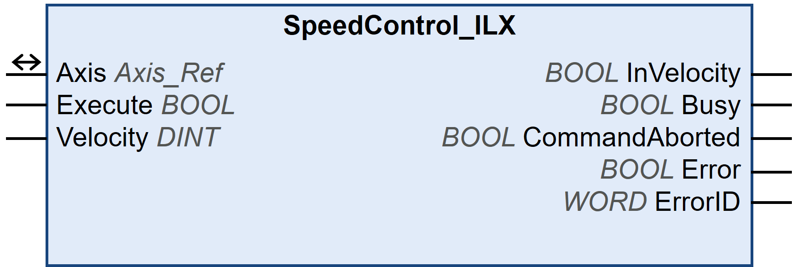

# SpeedControl\_ILX

## Functional Description

This function block starts a continuous controlled motion at a specified velocity with inactive motion profile generator.

This function block is available for:

* Integrated Lexium drive ILA2T with Modbus TCP
* Integrated Lexium drive ILE2T with Modbus TCP
* Integrated Lexium drive ILA2K with EtherNet/IP
* Integrated Lexium drive ILE2K with EtherNet/IP

Refer to the [documentation of the drive](D-SE-0093748.3.html#D-SE-0093748.3__D-SE-0093748.10) for additional information on operating mode Speed Control.

## Library and Namespace

Library name: **GMC Independent Lexium**

Namespace: **GILXM**

## Graphical Representation

## Inputs

| Input | Data type | Description |
| --- | --- | --- |
| Execute | BOOL | Value range: FALSE, TRUE.  Default value: FALSE.  A rising edge of the input Execute starts the function block. The function block continues execution and the output Busy is set to TRUE.  This function block can be restarted while it is executed. The target values are overwritten by the new values at the point in time the rising edge occurs. |
| Velocity | DINT | Value range: -30000...30000  Default value: 0  Target velocity in rpm. |

## Outputs

| Output | Data type | Description |
| --- | --- | --- |
| InVelocity | BOOL | Value range: FALSE, TRUE.  Default value: FALSE.   * FALSE: Function block is not being executed. * TRUE: Function block is being executed. |
| Busy | BOOL | Value range: FALSE, TRUE.  Default value: FALSE.   * FALSE: Function block is not being executed. * TRUE: Function block is being executed.   NOTE: The output Busy remains TRUE even when the target velocity has been reached or Execute becomes FALSE. The output Busy is set to FALSE as soon as another function block such as MC\_Stop is executed. |
| CommandAborted | BOOL | Value range: FALSE, TRUE.  Default value: FALSE.   * FALSE: Execution has not been aborted. * TRUE: Execution has been aborted by another function block. |
| Error | BOOL | Value range: FALSE, TRUE.  Default value: FALSE.   * FALSE: Execution of the function block is running, no error has been detected. * TRUE: An error has been detected in the execution of the function block. |
| ErrorID | WORD | Returns the value of a diagnostic code. Refer to [Library Diagnostic Codes](D-SE-0057144.html#D-SE-0057144). If the value is 0 and if the output Error of this function block is set to TRUE, then the diagnostic code can be read with the output AxisErrorID of the function block [MC\_ReadAxisError](D-SE-0057184.html#D-SE-0057184). |

## Inputs/Outputs

| Input/Output | Data type | Description |
| --- | --- | --- |
| Axis | Axis\_Ref | Reference to the axis (instance) for which the function block is to be executed (corresponds to the name of the axis). The name of the axis must be defined in the EcoStruxure Machine Expert Devices tree. |

## Notes

There is no feedback for reaching the target velocity from the drive. As soon as the function block is being executed, the output InVelocity is set to TRUE. Use the function block [MC\_ReadActualVelocity](D-SE-0057182.html#D-SE-0057182) to read the velocity of the motor.

EIO0000003592.04