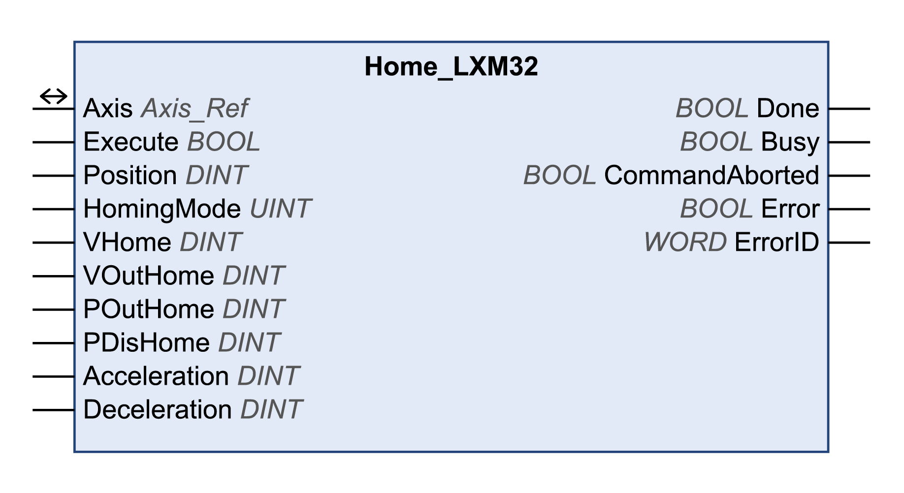

# Home\_LXM32

## Functional Description

This function block configures and starts a reference movement.

## Library and Namespace

Library name: **GMC Independent Lexium**

Namespace: **GILXM**

## Graphical Representation

## Inputs

| Input | Data type | Description |
| --- | --- | --- |
| Execute | BOOL | Value range: FALSE, TRUE.  Default value: FALSE.  A rising edge of the input Execute starts the function block. The function block continues execution and the output Busy is set to TRUE.  A rising edge at the input Execute is not permitted while the function block is being executed. |
| Position | DINT | Value range: -2147483648...2147483647  Default value: 0  Position in user-defined units.  HomingMode 1...34: Position at reference point  HomingMode 35: Position for position setting |
| HomingMode | UINT | Value range: 1...35  Default value: 17  Specifies the homing method   * 1: LIMN with index pulse * 2: LIMP with index pulse * 7: REF+ with index pulse, inverted, outside * 8: REF+ with index pulse, inverted, inside * 9: REF+ with index pulse, not inverted, inside * 10: REF+ with index pulse, not inverted, outside * 11: REF- with index pulse, inverted, outside * 12: REF- with index pulse, inverted, inside * 13: REF- with index pulse, not inverted, inside * 14: REF- with index pulse, not inverted, outside * 17: LIMN * 18: LIMP * 23: REF+, inverted, outside * 24: REF+, inverted, inside * 25: REF+, not inverted, inside * 26: REF+, not inverted, outside * 27: REF-, inverted, outside * 28: REF-, inverted, inside * 29: REF-, not inverted, inside * 30: REF-, not inverted, outside * 33: Index pulse in negative direction * 34: Index pulse in positive direction * 35: Position setting   Refer to [documentation of the drive](D-SE-0093748.3.html#D-SE-0093748.3__D-SE-0093748.10) for a description of the homing method. |
| VHome | DINT | Value range: 1...2147483647  Default value: 60  Target velocity for searching the switch in user-defined units. |
| VOutHome | DINT | Value range: 1...2147483647  Default value: 6  Target velocity for moving away from switch in user-defined units. |
| POutHome | DINT | Value range: 0...2147483647  Default value: 0  Maximum distance for searching the switching point in user-defined units.   * 0: Search distance monitoring disabled * >0: Maximum distance   After detection of the switch, the drive starts to search for the defined switching point. If the defined switching point is not found within the distance defined here, an error is detected and the reference movement is canceled. |
| PDisHome | DINT | Value range: 1...2147483647  Default value: 200  Distance from switching point in user-defined units.  The distance from the switching point is defined as the reference point.  The parameter is only effective during a reference movement without index pulse. |
| Acceleration | DINT | Value range: 1...2147483647  Default value: 600  Acceleration ramp in user-defined units. |
| Deceleration | DINT | Value range: 1...2147483647  Default value: 600  Deceleration ramp in user-defined units. |

## Outputs

| Output | Data type | Description |
| --- | --- | --- |
| Done | BOOL | Value range: FALSE, TRUE.  Default value: FALSE.   * FALSE: Execution has not been started, or an error has been detected. * TRUE: Execution terminated without an error detected. |
| Busy | BOOL | Value range: FALSE, TRUE.  Default value: FALSE.   * FALSE: Function block is not being executed. * TRUE: Function block is being executed. |
| CommandAborted | BOOL | Value range: FALSE, TRUE.  Default value: FALSE.   * FALSE: Execution has not been aborted. * TRUE: Execution has been aborted by another function block. |
| Error | BOOL | Value range: FALSE, TRUE.  Default value: FALSE.   * FALSE: Execution of the function block is running, no error has been detected. * TRUE: An error has been detected in the execution of the function block. |
| ErrorID | WORD | Returns the value of a diagnostic code. Refer to [Library Diagnostic Codes](D-SE-0057144.html#D-SE-0057144). If the value is 0 and if the output Error of this function block is set to TRUE, then the diagnostic code can be read with the output AxisErrorID of the function block [MC\_ReadAxisError](D-SE-0057184.html#D-SE-0057184). |

## Inputs/Outputs

| Input/Output | Data type | Description |
| --- | --- | --- |
| Axis | Axis\_Ref | Reference to the axis (instance) for which the function block is to be executed (corresponds to the name of the axis). The name of the axis must be defined in the EcoStruxure Machine Expert Devices tree. |

## Notes

The inputs Acceleration and Deceleration are only taken into account if you use the fieldbuses EtherNet/IP or Modbus TCP.

## Additional Information

[Operating Mode Homing](D-SE-0057542.html#D-SE-0057542)

EIO0000003592.04