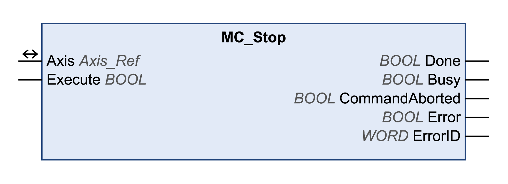

# MC\_Stop

## Functional Description

This function block stops the ongoing movement. The operating mode is aborted by this function block.

The function block MC\_Stop commands a motion stop to the drive. The drive-specific stop parameters like deceleration are provided by the device implementation. Re-executing this function block does not influence the ongoing deceleration.

The stop procedure can be aborted only by disabling the power stage via MC\_Power.

Executing another motion function block while MC\_Stop is busy does not influence the stop procedure. This means that the function block MC\_Stop stays busy and the executed function block ends in a function block error.

As long as the input Execute is TRUE the execution of a motion command is not possible. In this case, executed motion function blocks end in a function block error.

## Library and Namespace

Library name: **GMC Independent PLCopen MC**

Namespace: **GIPLC**

## Graphical Representation

## Inputs

| Input | Data type | Description |
| --- | --- | --- |
| Execute | BOOL | Value range: FALSE, TRUE.  Default value: FALSE.  A rising edge of the input Execute starts the function block. The function block continues execution and the output Busy is set to TRUE.  This function block can be restarted while it is executed. The target values are overwritten by the new values at the point in time the rising edge occurs. |

## Outputs

| Output | Data type | Description |
| --- | --- | --- |
| Done | BOOL | Value range: FALSE, TRUE.  Default value: FALSE.   * FALSE: Execution has not been started, or an error has been detected. * TRUE: Execution terminated without an error detected. |
| Busy | BOOL | Value range: FALSE, TRUE.  Default value: FALSE.   * FALSE: Function block is not being executed. * TRUE: Function block is being executed. |
| CommandAborted | BOOL | Value range: FALSE, TRUE.  Default value: FALSE.   * FALSE: Execution has not been aborted. * TRUE: Execution has been aborted by another function block. |
| Error | BOOL | Value range: FALSE, TRUE.  Default value: FALSE.   * FALSE: Execution of the function block is running, no error has been detected. * TRUE: An error has been detected in the execution of the function block. |
| ErrorID | WORD | Returns the value of a diagnostic code. Refer to [Library Diagnostic Codes](D-SE-0057144.html#D-SE-0057144). If the value is 0 and if the output Error of this function block is set to TRUE, then the diagnostic code can be read with the output AxisErrorID of the function block [MC\_ReadAxisError](D-SE-0057184.html#D-SE-0057184). |

## Inputs/Outputs

| Input/Output | Data type | Description |
| --- | --- | --- |
| Axis | Axis\_Ref | Reference to the axis (instance) for which the function block is to be executed (corresponds to the name of the axis). The name of the axis must be defined in the EcoStruxure Machine Expert Devices tree. |

## Notes

If you have activated this function block, simultaneous use of the Control\_ATV function block may lead to unintended behavior.

| WARNING | |
| --- | --- |
|  | UNINTENDED EQUIPMENT OPERATION  * Do not activate the Control\_ATV function block when this function block is active. * Deactivate this function block or allow the function block to terminate before activating the Control\_ATV function block.  Failure to follow these instructions can result in death, serious injury, or equipment damage. |

The function block can only be interrupted by disabling the power stage via the function block MC\_Power.

As long as the input Execute is TRUE, no other function block except for MC\_Power can be started.

If the operating state Stopping is transitioned to the state ErrorStop because MC\_Stop has detected an error in its execution or the power of the axis was disabled, the axis does not re-enter in the operating state Stopping automatically although the input Execute is TRUE. A new rising edge at the input Execute is required to transfer the axis into the operating state Stopping.

For ATV, the stop method corresponds to the stop configuration (see product manual).

For LXM32 drives, you must use the vendor-specific function block SetStopRamp\_LXM32 to set the deceleration. If you want to modify the deceleration ramp, execute the function block once.

For SD328A drives, there is no specific stop ramp available. Use the function block SetDriveRamp\_SD328A to define the ramp.

For Lexium ILA, ILE and ILS integrated drives, you must use the vendor-specific function block SetStopRamp\_ILX to set the deceleration. If you want to modify the deceleration ramp, execute the function block once.

## Additional Information

[PLCopen State Diagram](D-SE-0057168.html#D-SE-0057168)

[Transition Between Function Blocks](D-SE-0057142.html#D-SE-0057142)

[Stopping](D-SE-0057543.html#D-SE-0057543)

EIO0000003592.04