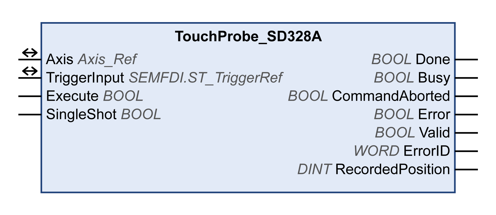

# TouchProbe\_SD328A

## Functional Description

This function block configures and starts position capture.

The function block returns the axis position at the occurrence of a trigger event. The drive trigger parameters are provided by the device implementation.

Executing the function block MC\_AbortTrigger while MC\_TouchProbe is busy aborts the function for the referenced trigger input.

A new rising edge at the input Execute overwrites and restarts the active trigger function.

## Library and Namespace

Library name: **GMC Independent Lexium**

Namespace: **GILXM**

## Graphical Representation

## Inputs

| Input | Data type | Description |
| --- | --- | --- |
| Execute | BOOL | Value range: FALSE, TRUE.  Default value: FALSE.  A rising edge of the input Execute starts the function block. The function block continues execution and the output Busy is set to TRUE.  This function block can be restarted while it is executed. The target values are overwritten by the new values at the point in time the rising edge occurs. |
| SingleShot | BOOL | Value range: FALSE, TRUE.  Default value: TRUE.   * FALSE: Captures continuously. * TRUE: Captures once. |

## Outputs

| Output | Data type | Description |
| --- | --- | --- |
| Done | BOOL | Value range: FALSE, TRUE.  Default value: FALSE.   * FALSE: Execution has not been started, or an error has been detected. * TRUE: Execution terminated without an error detected. |
| Busy | BOOL | Value range: FALSE, TRUE.  Default value: FALSE.   * FALSE: Function block is not being executed. * TRUE: Function block is being executed. |
| CommandAborted | BOOL | Value range: FALSE, TRUE.  Default value: FALSE.   * FALSE: Execution has not been aborted. * TRUE: Execution has been aborted by another function block. |
| Error | BOOL | Value range: FALSE, TRUE.  Default value: FALSE.   * FALSE: Execution of the function block is running, no error has been detected. * TRUE: An error has been detected in the execution of the function block. |
| Valid | BOOL | Value range: FALSE, TRUE.  Default value: FALSE.   * FALSE: Execution has not been started or an error has been detected. The values at the outputs are not valid. * TRUE: Execution has been completed without an error detected. The values at the outputs are valid and can be further processed. |
| ErrorID | WORD | Returns the value of a diagnostic code. Refer to [Library Diagnostic Codes](D-SE-0057144.html#D-SE-0057144). If the value is 0 and if the output Error of this function block is set to TRUE, then the diagnostic code can be read with the output AxisErrorID of the function block [MC\_ReadAxisError](D-SE-0057184.html#D-SE-0057184). |
| RecordedPosition | DINT | Returns the value the axis position at the occurrence of a trigger event.  Value range: -2147483648...2147483647  Default value: 0  Captured motor position in user-defined units. |

## Inputs/Outputs

| Input/Output | Data type | Elements | Data type | Description |
| --- | --- | --- | --- | --- |
| Axis | Axis\_Ref | – | | Reference to the axis (instance) for which the function block is to be executed (corresponds to the name of the axis). The name of the axis must be defined in the EcoStruxure Machine Expert Devices tree. |
| TriggerInput | MC\_Trigger\_Ref | TouchProbeNumber | UINT | Selects the capture unit of the drive. |
| TriggerEdge | ET\_TriggerEdge | Edge to trigger position capture.   * 1 / RisingEdge: Rising edge. * 2 / FallingEdge: Falling edge.   See also [Vendor-Specific Data Type ET\_TriggerEdge](D-SE-0093799.html#D-SE-0093799__D-SE-0093799.8). |

## Notes

Use MC\_AbortTrigger function block to abort TouchProbe\_SD328A function block execution.

## Additional Information

[Position Capture via Signal Input](D-SE-0057544.html#D-SE-0057544)

EIO0000003592.04