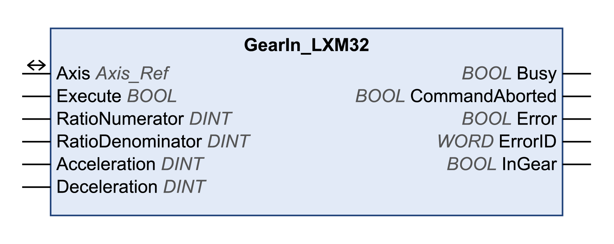

# GearIn\_LXM32

## Functional Description

This function block starts the operating mode Electronic Gear with the method velocity synchronization.

In the operating mode Electronic Gear, movements are carried out according to externally supplied reference value signals. A velocity reference value is calculated on the basis of these external reference values plus an adjustable gear ratio. The reference value signals can be A/B signals, P/D signals or CW/CCW signals.

The movement is made synchronously (velocity synchronicity) with the supplied reference value signals.

Refer to the [documentation of the drive](D-SE-0093748.3.html#D-SE-0093748.3__D-SE-0093748.10) for additional information on error classes.

## Library and Namespace

Library name: **GMC Independent Lexium**

Namespace: **GILXM**

## Graphical Representation

## Inputs

| Input | Data type | Description |
| --- | --- | --- |
| Execute | BOOL | Value range: FALSE, TRUE.  Default value: FALSE.  A rising edge of the input Execute starts the function block. The function block continues execution and the output Busy is set to TRUE.  This function block can be restarted while it is executed. The target values are overwritten by the new values at the point in time the rising edge occurs. |
| RatioNumerator | DINT | Value range: 1...2147483647  Default value: 1  **Gear ratio**: Numerator of gear ratio. |
| RatioDenominator | DINT | Value range: 1...2147483647  Default value: 1  **Gear ratio**: Denominator of gear ratio. |
| Acceleration | DINT | Value range: 1...2147483647  Default value: 600  Acceleration ramp in user-defined units. |
| Deceleration | DINT | Value range: 1...2147483647  Default value: 600  Deceleration ramp in user-defined units. |

## Outputs

| Output | Data type | Description |
| --- | --- | --- |
| Busy | BOOL | Value range: FALSE, TRUE.  Default value: FALSE.   * FALSE: Function block is not being executed. * TRUE: Function block is being executed. |
| CommandAborted | BOOL | Value range: FALSE, TRUE.  Default value: FALSE.   * FALSE: Execution has not been aborted. * TRUE: Execution has been aborted by another function block. |
| Error | BOOL | Value range: FALSE, TRUE.  Default value: FALSE.   * FALSE: Execution of the function block is running, no error has been detected. * TRUE: An error has been detected in the execution of the function block. |
| ErrorID | WORD | Returns the value of a diagnostic code. Refer to [Library Diagnostic Codes](D-SE-0057144.html#D-SE-0057144). If the value is 0 and if the output Error of this function block is set to TRUE, then the diagnostic code can be read with the output AxisErrorID of the function block [MC\_ReadAxisError](D-SE-0057184.html#D-SE-0057184). |
| InGear | BOOL | Value range: FALSE, TRUE.  Default value: FALSE.   * TRUE: If the adjusted gear ratio is reached for the first time. |

## Inputs/Outputs

| Input/Output | Data type | Description |
| --- | --- | --- |
| Axis | Axis\_Ref | Reference to the axis (instance) for which the function block is to be executed (corresponds to the name of the axis). The name of the axis must be defined in the EcoStruxure Machine Expert Devices tree. |

## Notes

This function block requires the parameter **GEARratio** to be 0. This way, RatioNumerator and RatioDenominator are used to calculate the gear ratio.

The enabled direction of movement in the operating mode Electronic Gear is set via the drive parameter **GEARdir\_enabl**.

Refer to the [documentation of the drive](D-SE-0093748.3.html#D-SE-0093748.3__D-SE-0093748.10) for more details.

The operating mode Electronic Gear with the method Position Synchronization is started with the function block GearInPos\_LXM32.

In the operating mode Electronic Gear with the method Velocity Synchronization, a position overtravel does not trigger a detected error. A position overtravel results in a loss of the zero point.

## Additional Information

[Operating Mode Electronic Gear](D-SE-0057545.html#D-SE-0057545)

EIO0000003592.04