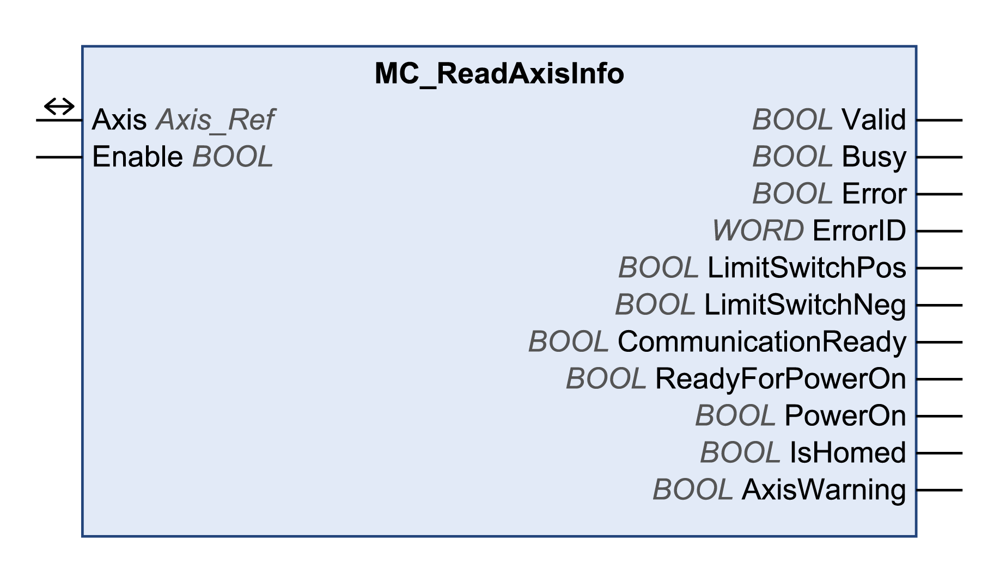

# MC\_ReadAxisInfo

## Functional Description

This function block gets status information on the axis.

## Library and Namespace

Library name: **GMC Independent PLCopen MC**

Namespace: **GIPLC**

## Graphical Representation

## Inputs

| Input | Data type | Description |
| --- | --- | --- |
| Enable | BOOL | Value range: FALSE, TRUE.  Default value: FALSE.  The input Enable starts or terminates execution of a function block.   * FALSE: Execution of the function block is terminated. The outputs Valid, Busy, and Error are set to FALSE. * TRUE: The function block is being executed. The function block continues executing as long as the input Enable is set to TRUE. |

## Outputs

| Output | Data type | Description |
| --- | --- | --- |
| Valid | BOOL | Value range: FALSE, TRUE.  Default value: FALSE.   * FALSE: Execution has not been started or an error has been detected. The values at the outputs are not valid. * TRUE: Execution has been completed without an error detected. The values at the outputs are valid and can be further processed. |
| Busy | BOOL | Value range: FALSE, TRUE.  Default value: FALSE.   * FALSE: Function block is not being executed. * TRUE: Function block is being executed. |
| Error | BOOL | Value range: FALSE, TRUE.  Default value: FALSE.   * FALSE: Execution of the function block is running, no error has been detected. * TRUE: An error has been detected in the execution of the function block. |
| ErrorID | WORD | Returns the value of a diagnostic code. Refer to [Library Diagnostic Codes](D-SE-0057144.html#D-SE-0057144). If the value is 0 and if the output Error of this function block is set to TRUE, then the diagnostic code can be read with the output AxisErrorID of the function block [MC\_ReadAxisError](D-SE-0057184.html#D-SE-0057184). |
| LimitSwitchPos | BOOL | Value range: FALSE, TRUE.   * TRUE: Positive limit switch is triggered. |
| LimitSwitchNeg | BOOL | Value range: FALSE, TRUE.   * TRUE: Negative limit switch is triggered. |
| CommunicationReady | BOOL | Value range: FALSE, TRUE.   * TRUE: Network has been initialized and is ready for communication. |
| ReadyForPowerOn | BOOL | Value range: FALSE, TRUE.   * TRUE: Drive is ready to enable the power stage. |
| PowerOn | BOOL | Value range: FALSE, TRUE.   * TRUE: Power stage is enabled. |
| IsHomed | BOOL | Value range: FALSE, TRUE.   * TRUE: Reference point is valid (axis homed). |
| AxisWarning | BOOL | Value range: FALSE, TRUE.   * TRUE: An alert is active. |

## Inputs/Outputs

| Input/Output | Data type | Description |
| --- | --- | --- |
| Axis | Axis\_Ref | Reference to the axis (instance) for which the function block is to be executed (corresponds to the name of the axis). The name of the axis must be defined in the EcoStruxure Machine Expert Devices tree. |

## Note

The values for the outputs LimitSwitchPos and LimitSwitchNeg are valid depending whether the limit switches are defined in the I/O configuration of the ILX2 and SD328A drives. This I/O configuration is read once when the application is started and every time the power stage is enabled.

Do not modify the I/O configuration between the start of the application and enabling the power stage or it will lead to invalid values of the outputs LimitSwitchPos and LimitSwitchNeg.

Set the I/O configuration before the application is started.

| WARNING | |
| --- | --- |
|  | Unintended equipment operation  Only modify the I/O configuration while the power stage is disabled.  Failure to follow these instructions can result in death, serious injury, or equipment damage. |

## Additional Information

[Reading a Parameter](D-SE-0057547.html#D-SE-0057547)

EIO0000003592.04