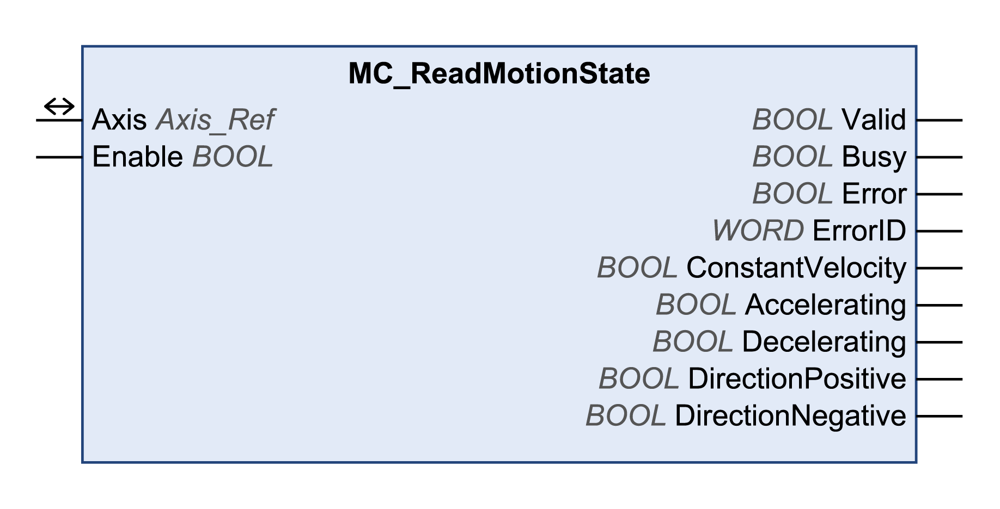

# MC\_ReadMotionState

## Functional Description

This function block provides the status information on the ongoing movement.

## Library and Namespace

Library name: **GMC Independent PLCopen MC**

Namespace: **GIPLC**

## Graphical Representation

## Inputs

| Input | Data type | Description |
| --- | --- | --- |
| Enable | BOOL | Value range: FALSE, TRUE.  Default value: FALSE.  The input Enable starts or terminates execution of a function block.   * FALSE: Execution of the function block is terminated. The outputs Valid, Busy, and Error are set to FALSE. * TRUE: The function block is being executed. The function block continues executing as long as the input Enable is set to TRUE. |

## Outputs

| Output | Data type | Description |
| --- | --- | --- |
| Valid | BOOL | Value range: FALSE, TRUE.  Default value: FALSE.   * FALSE: Execution has not been started or an error has been detected. The values at the outputs are not valid. * TRUE: Execution has been completed without an error detected. The values at the outputs are valid and can be further processed. |
| Busy | BOOL | Value range: FALSE, TRUE.  Default value: FALSE.   * FALSE: Function block is not being executed. * TRUE: Function block is being executed. |
| Error | BOOL | Value range: FALSE, TRUE.  Default value: FALSE.   * FALSE: Execution of the function block is running, no error has been detected. * TRUE: An error has been detected in the execution of the function block. |
| ErrorID | WORD | Returns the value of a diagnostic code. Refer to [Library Diagnostic Codes](D-SE-0057144.html#D-SE-0057144). If the value is 0 and if the output Error of this function block is set to TRUE, then the diagnostic code can be read with the output AxisErrorID of the function block [MC\_ReadAxisError](D-SE-0057184.html#D-SE-0057184). |
| ConstantVelocity | BOOL | Value range: FALSE, TRUE.  Default value: FALSE.   * TRUE: A movement at a constant velocity is performed. |
| Accelerating | BOOL | Value range: FALSE, TRUE.  Default value: FALSE.   * TRUE: The motor accelerates. |
| Decelerating | BOOL | Value range: FALSE, TRUE.  Default value: FALSE.   * TRUE: The motor decelerates. |
| DirectionPositive | BOOL | Value range: FALSE, TRUE.  Default value: FALSE.   * TRUE: The motor shaft rotates in positive direction. |
| DirectionNegative | BOOL | Value range: FALSE, TRUE.  Default value: FALSE.   * TRUE: The motor shaft rotates in negative direction. |

## Inputs/Outputs

| Input/Output | Data type | Description |
| --- | --- | --- |
| Axis | Axis\_Ref | Reference to the axis (instance) for which the function block is to be executed (corresponds to the name of the axis). The name of the axis must be defined in the EcoStruxure Machine Expert Devices tree. |

## Additional Information

[Reading a Parameter](D-SE-0057547.html#D-SE-0057547)

EIO0000003592.04