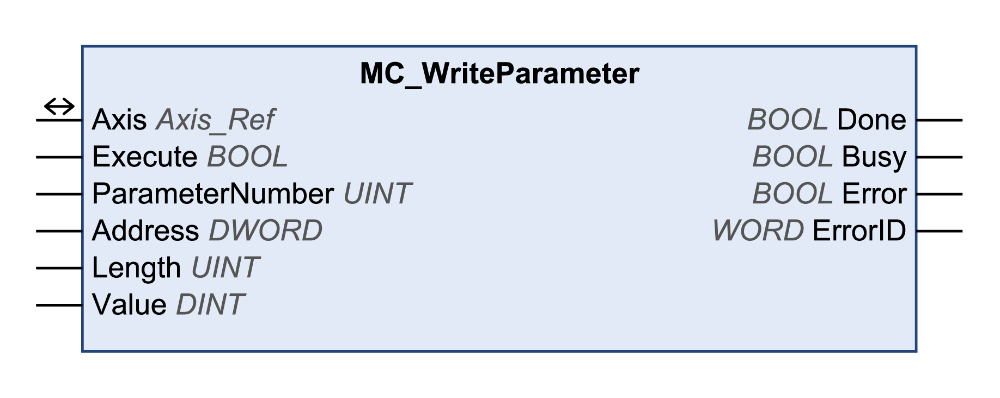

# MC\_WriteParameter

## Functional Description

This function block writes a value to a specific parameter.

## Library and Namespace

Library name: **GMC Independent PLCopen MC**

Namespace: **GIPLC**

## Graphical Representation

## Inputs

| Input | Data type | Description |
| --- | --- | --- |
| Execute | BOOL | Value range: FALSE, TRUE.  Default value: FALSE.  A rising edge of the input Execute starts the function block. The function block continues execution and the output Busy is set to TRUE.  A rising edge at the input Execute is ignored while the function block is being executed. |
| ParameterNumber | INT | Value range: 0...65535  ATV:   * 1000: Selection via input Address.   LXM32:   * 2: Positive position limit of software limit switch. **MON\_swLimP** * 3: Negative position limit of software limit switch. **MON\_swLimN** * 4: Monitoring of the positive software limit switch. (Activated: Bit 0 = 0. Deactivated: Bit 0 = 1). **MON\_SW\_Limits** * 5: Monitoring of the negative software limit switch. (Activated: Bit 0 = 0. Deactivated: Bit 0 = 1). **MON\_SW\_Limits** * 1000: Selection via input Address.   Lexium ILA, ILE and ILS integrated drives (EtherNet/IP and Modbus TCP):   * 2: Positive position limit of software limit switch. **SPVswLimPusr** * 3: Negative position limit of software limit switch. **SPVswLimNusr** * 4: Monitoring of the positive software limit switch. (Activated: Bit 0 = 0. Deactivated: Bit 0 = 1). **SPV\_SW\_Limits** * 5: Monitoring of the negative software limit switch. (Activated: Bit 0 = 0. Deactivated: Bit 0 = 1). **SPV\_SW\_Limits** * 1000: Selection via input Address.   Lexium ILA, ILE and ILS integrated drives (CANopen):   * 1000: Selection via input Address. |
| Address | DWORD | Address of the parameter to be written.  Fieldbus address (examples):  CANopen: Index: 2038h, Subindex: 05h -> 00203805h  Ethernet/IP: Class: 8Ch, Instance: 01h, Attribute: 05h -> 008C0105h  Modbus TCP: Logic/Modbus address: 219Ch -> 0000219Ch  Refer to the [documentation of the drive](D-SE-0093748.3.html#D-SE-0093748.3__D-SE-0093748.10) for a list of the parameters with the corresponding address of the parameters.  Can only be used if the input ParameterNumber = 1000. |
| Length | UINT | Value range: 1...4  Length of the parameter to be written in bytes.  Refer to the [documentation of the drive](D-SE-0093748.3.html#D-SE-0093748.3__D-SE-0093748.10) for a list of the parameters with the corresponding length of the parameters. |
| Value | DINT | Value range: -2147483648...2147483647  Default value: 0  Value to be written to the parameter.  The units of the values depend on the parameter. |

## Outputs

| Output | Data type | Description |
| --- | --- | --- |
| Done | BOOL | Value range: FALSE, TRUE.  Default value: FALSE.   * FALSE: Execution has not been started, or an error has been detected. * TRUE: Execution terminated without an error detected. |
| Busy | BOOL | Value range: FALSE, TRUE.  Default value: FALSE.   * FALSE: Function block is not being executed. * TRUE: Function block is being executed. |
| Error | BOOL | Value range: FALSE, TRUE.  Default value: FALSE.   * FALSE: Execution of the function block is running, no error has been detected. * TRUE: An error has been detected in the execution of the function block. |
| ErrorID | WORD | Returns the value of a diagnostic code. Refer to [Library Diagnostic Codes](D-SE-0057144.html#D-SE-0057144). If the value is 0 and if the output Error of this function block is set to TRUE, then the diagnostic code can be read with the output AxisErrorID of the function block [MC\_ReadAxisError](D-SE-0057184.html#D-SE-0057184). |

## Inputs/Outputs

| Input/Output | Data type | Description |
| --- | --- | --- |
| Axis | Axis\_Ref | Reference to the axis (instance) for which the function block is to be executed (corresponds to the name of the axis). The name of the axis must be defined in the EcoStruxure Machine Expert Devices tree. |

## Notes

If the inputs ParameterNumber, Address, Length or Value are modified while Busy is TRUE, the new values are not used until the function block is executed again.

## Additional Information

[Writing a Parameter](D-SE-0057548.html#D-SE-0057548)

EIO0000003592.04