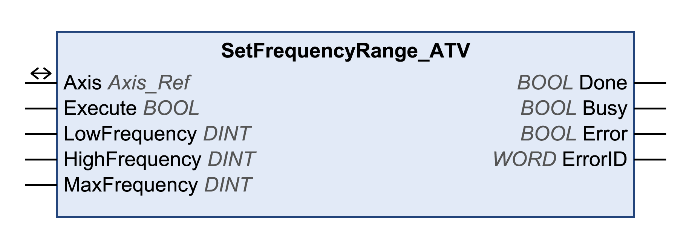

# SetFrequencyRange\_ATV

## Functional Description

This function block configures the frequency ranges of the drive for the function blocks MC\_MoveVelocity and MC\_Jog. If the frequency (speed of rotation) becomes inferior to the value in LowFrequency, the drive uses the frequency specified in LowFrequency without triggering an error message. If the frequency (speed of rotation) exceeds the value in HighFrequency, the drive uses the frequency specified in HighFrequency without triggering an error message.

## Library and Namespace

Library name: **GMC Independent Altivar**

Namespace: **GIATV**

## Graphical Representation

## Inputs

| Input | Data type | Description |
| --- | --- | --- |
| Execute | BOOL | Value range: FALSE, TRUE.  Default value: FALSE.  A rising edge of the input Execute starts the function block. The function block continues execution and the output Busy is set to TRUE.  A rising edge at the input Execute is ignored while the function block is being executed. |
| LowFrequency | DINT | Value range: 0...HighFrequency  Default value: 0  Unit: 0.1 Hz  Motor frequency at minimum reference value.  NOTE: If the value of LowFrequency exceeds the value of HighFrequency, the value of HighFrequency is used. |
| HighFrequency | DINT | Value range: LowFrequency...MaxFrequency  Default value: 500  Unit: 0.1 Hz  Motor frequency at maximum reference value.  NOTE: If the value of HighFrequency exceeds the value of MaxFrequency, the value of MaxFrequency is used. |
| MaxFrequency | DINT | Value range: 100...5000/10000 (refer to the product manual)  Default value: 600  Unit: 0.1 Hz  Maximum permissible motor frequency.  Adapt the value to the motor and the mechanical situation. |

## Outputs

| Output | Data type | Description |
| --- | --- | --- |
| Done | BOOL | Value range: FALSE, TRUE.  Default value: FALSE.   * FALSE: Execution has not been started, or an error has been detected. * TRUE: Execution terminated without an error detected. |
| Busy | BOOL | Value range: FALSE, TRUE.  Default value: FALSE.   * FALSE: Function block is not being executed. * TRUE: Function block is being executed. |
| Error | BOOL | Value range: FALSE, TRUE.  Default value: FALSE.   * FALSE: Execution of the function block is running, no error has been detected. * TRUE: An error has been detected in the execution of the function block. |
| ErrorID | WORD | Returns the value of a diagnostic code. Refer to [Library Diagnostic Codes](D-SE-0057144.html#D-SE-0057144). If the value is 0 and if the output Error of this function block is set to TRUE, then the diagnostic code can be read with the output AxisErrorID of the function block [MC\_ReadAxisError](D-SE-0057184.html#D-SE-0057184). |

## Inputs/Outputs

| Input/Output | Data type | Description |
| --- | --- | --- |
| Axis | Axis\_Ref | Reference to the axis (instance) for which the function block is to be executed (corresponds to the name of the axis). The name of the axis must be defined in the EcoStruxure Machine Expert Devices tree. |

## Notes

The function block can only be executed in the PLCopen state Disabled (operating state 3 Switch On Disabled of drive). To transition to this state, disable the power stage with the function block MC\_Power.

## Additional Information

[Writing a Parameter](D-SE-0057548.html#D-SE-0057548)

EIO0000003592.04