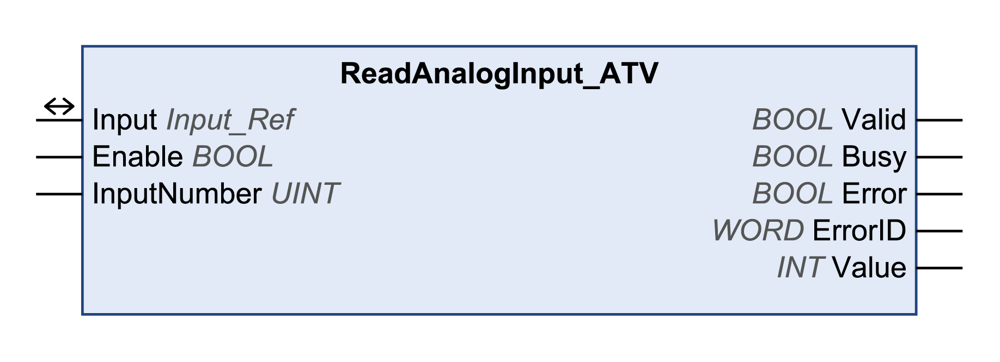

# ReadAnalogInput\_ATV

## Functional Description

This function block reads the value of an analog input.

## Library and Namespace

Library name: **GMC Independent Altivar**

Namespace: **GIATV**

## Graphical Representation

## Inputs

| Input | Data type | Description |
| --- | --- | --- |
| Enable | BOOL | Value range: FALSE, TRUE.  Default value: FALSE.  The input Enable starts or terminates execution of a function block.   * FALSE: Execution of the function block is terminated. The outputs Valid, Busy, and Error are set to FALSE. * TRUE: The function block is being executed. The function block continues executing as long as the input Enable is set to TRUE. |
| InputNumber | UINT | Default value: 1  ATV320:  Value range: 1...3   * 1: AI1 * 2: AI2 * 3: AI3   ATV340/ATV6••/ATV9••:  Value range: 1...5   * 1: AI1 * 2: AI2 * 3: AI3 * 4: AI4 (with expansion card) * 5: AI5 (with expansion card) |

## Outputs

| Output | Data type | Description |
| --- | --- | --- |
| Valid | BOOL | Value range: FALSE, TRUE.  Default value: FALSE.   * FALSE: Execution has not been started or an error has been detected. The values at the outputs are not valid. * TRUE: Execution has been completed without an error detected. The values at the outputs are valid and can be further processed. |
| Busy | BOOL | Value range: FALSE, TRUE.  Default value: FALSE.   * FALSE: Function block is not being executed. * TRUE: Function block is being executed. |
| Error | BOOL | Value range: FALSE, TRUE.  Default value: FALSE.   * FALSE: Execution of the function block is running, no error has been detected. * TRUE: An error has been detected in the execution of the function block. |
| ErrorID | WORD | Returns the value of a diagnostic code. Refer to [Library Diagnostic Codes](D-SE-0057144.html#D-SE-0057144). If the value is 0 and if the output Error of this function block is set to TRUE, then the diagnostic code can be read with the output AxisErrorID of the function block [MC\_ReadAxisError](D-SE-0057184.html#D-SE-0057184). |
| Value | INT | Default value: 0  Corresponds to the input voltage in mV or the input current in 0.001 mA increments at the selected analog input. |

## Inputs/Outputs

| Input/Output | Data type | Description |
| --- | --- | --- |
| Input | Input\_Ref | Input is a special data type for digital and analog inputs (if available). The data type corresponds to the axis reference from the device configuration (instance) to which the inputs belong (similar to Axis). In the case of function blocks provided for reading analog and digital inputs, Input replaces the input Axis. |

## Additional Information

[Inputs and Outputs](D-SE-0057549.html#D-SE-0057549)

EIO0000003592.04