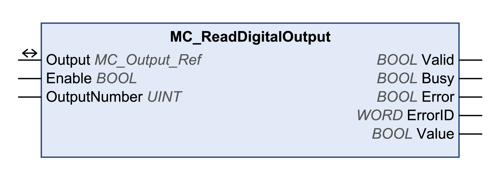

# MC\_ReadDigitalOutput

## Functional Description

This function block reads the state of a digital output.

## Library and Namespace

Library name: **GMC Independent PLCopen MC**

Namespace: **GIPLC**

## Graphical Representation

## Inputs

| Input | Data type | Description |
| --- | --- | --- |
| Enable | BOOL | Value range: FALSE, TRUE.  Default value: FALSE.  The input Enable starts or terminates execution of a function block.   * FALSE: Execution of the function block is terminated. The outputs Valid, Busy, and Error are set to FALSE. * TRUE: The function block is being executed. The function block continues executing as long as the input Enable is set to TRUE. |
| OutputNumber | UINT | Default value: 1  ATV320:  Value range: 1...3   * 1: Relay1 * 2: Relay2 * 3: LO1   ATV340/ATV6••/ATV9••:  Value range: 1...10   * 1: Relay1 * 2: Relay2 * 3: Relay3 * 4: Relay4 (with expansion card) * 5: Relay5 (with expansion card) * 6: Relay6 (with expansion card) * 7: DQ1 (only ATV340 and ATV9••) * 8: DQ2 (only ATV340) * 9: DQ11 (with expansion card) * 10: DQ12 (with expansion card)   LXM32A/LXM32ICAN:  Value range: 1...2   * 1: DQ0 * 2: DQ1   LXM32M:  Value range: 1...5   * 1: DQ0 * 2: DQ1 * 3: DQ2 * 4: DQ10 (with IOM1 module) * 5: DQ11 (with IOM1 module)   SD328A:  Value range: 1...2   * 1: LO1\_OUT * 2: LO2\_OUT   Lexium ILA, ILE and ILS integrated drives:  Value range: 1...4   * 1: LIO1 (EtherNet/IP, Modbus TCP), IO0 (CANopen) * ... * 4: LIO4 (EtherNet/IP, Modbus TCP), IO3 (CANopen) |

## Outputs

| Output | Data type | Description |
| --- | --- | --- |
| Valid | BOOL | Value range: FALSE, TRUE.  Default value: FALSE.   * FALSE: Execution has not been started or an error has been detected. The values at the outputs are not valid. * TRUE: Execution has been completed without an error detected. The values at the outputs are valid and can be further processed. |
| Busy | BOOL | Value range: FALSE, TRUE.  Default value: FALSE.   * FALSE: Function block is not being executed. * TRUE: Function block is being executed. |
| Error | BOOL | Value range: FALSE, TRUE.  Default value: FALSE.   * FALSE: Execution of the function block is running, no error has been detected. * TRUE: An error has been detected in the execution of the function block. |
| ErrorID | WORD | Returns the value of a diagnostic code. Refer to [Library Diagnostic Codes](D-SE-0057144.html#D-SE-0057144). If the value is 0 and if the output Error of this function block is set to TRUE, then the diagnostic code can be read with the output AxisErrorID of the function block [MC\_ReadAxisError](D-SE-0057184.html#D-SE-0057184). |
| Value | BOOL | Value range: FALSE, TRUE.  Default value: FALSE.   * FALSE: Level at selected input is 0 V. * TRUE: Level at selected input is 24 V. |

## Inputs/Outputs

| Input/Output | Data type | Description |
| --- | --- | --- |
| Output | MC\_Output\_Ref | Output is a special data type for digital and analog outputs (if available). The data type corresponds to the axis reference from the device configuration (instance) to which the outputs belong (similar to Axis). In the case of function blocks provided for writing and reading digital inputs, Output replaces the output Axis. |

## Additional Information

[Inputs and Outputs](D-SE-0057549.html#D-SE-0057549)

EIO0000003592.04