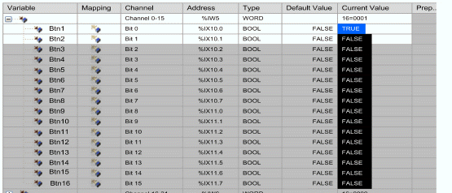

# Validation Procedure

Validation Procedure

To validate, proceed as follows:

1.Click the Modbus Master I/O Mapping tab.

2.Connect and login to the controller.

3.Press one of the Harmony XB5R push-buttons and observe the change of state in the current value field.

NOTE: For more information refer to the ZBRN documentation.

The following figure shows the related values for the Harmony XB5R push-buttons within the variable list:

