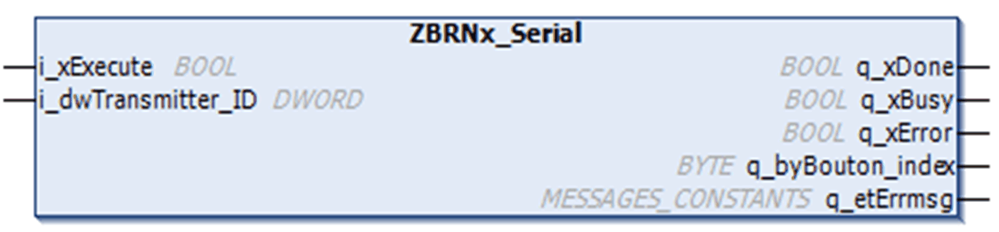
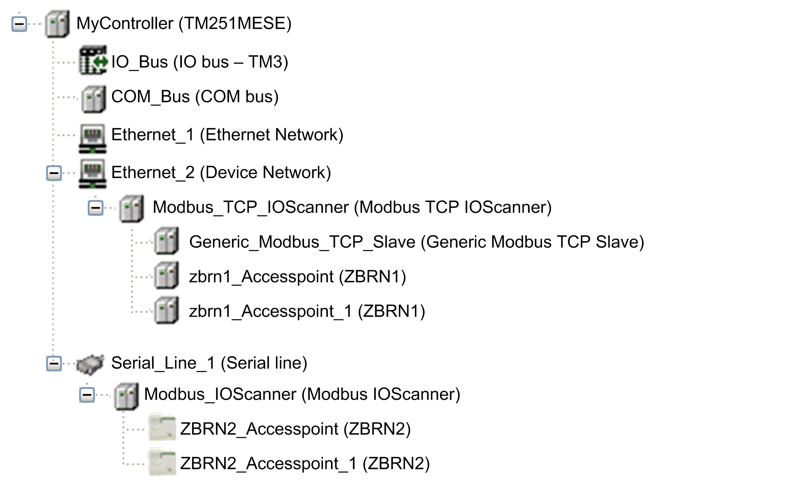

# Function Block Description

Function Block Description

The function blocks ZBRNx\_Serial and ZBRNx\_TCP get information to identify buttons linked to the ZBRN module. Therefore, a [MAST](../glossary/glossary.htm#XREF_D_SE_0024697_150) task must include a [POU](../glossary/glossary.htm#XREF_D_SE_0024697_158) (Program Organization Unit) that instantiates the required function block.

For Modbus serial:

For Modbus TCP:

The following graphic shows the function block from library repository:

The graphic shows the devices in use with instances of each type:

