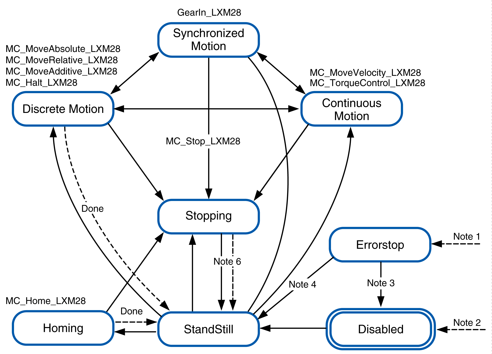

# PLCopen State Diagram

PLCopen State Diagram

The state diagram represents the axis in terms of PLCopen. At any given point in time, the axis is in exactly one state. If a function block is executed or an error is detected, this may cause a state transition. The function block MC\_ReadStatus\_LXM28 delivers the status of the axis.

Note 1   An error has been detected. (Transition from any state).

Note 2   The input Enable of the function block MC\_Power\_LXM28 is set to FALSE and no error has been detected (transition from any state).

Note 3   MC\_Reset\_LXM28 and MC\_Power\_LXM28.Status = FALSE

Note 4   MC\_Reset\_LXM28 and MC\_Power\_LXM28.Status = TRUE and MC\_Power\_LXM28.Enable = TRUE

Note 5   MC\_Power\_LXM28.Enable = TRUE and MC\_Power\_LXM28.Status = TRUE

Note 6   MC\_Stop\_LXM28.Done = TRUE and MC\_Stop\_LXM28.Execute = FALSE

EIO0000002329.02

© 2019 Schneider Electric. All rights reserved.