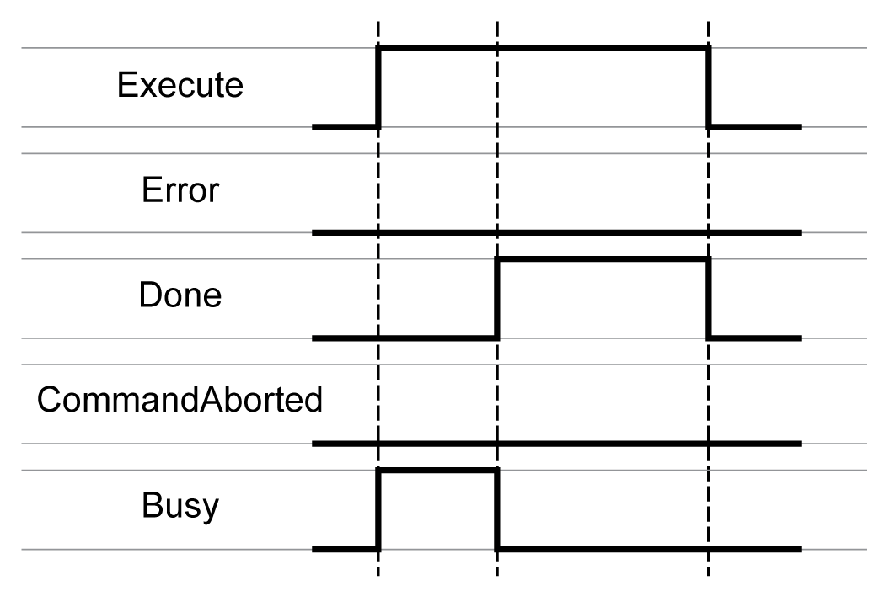
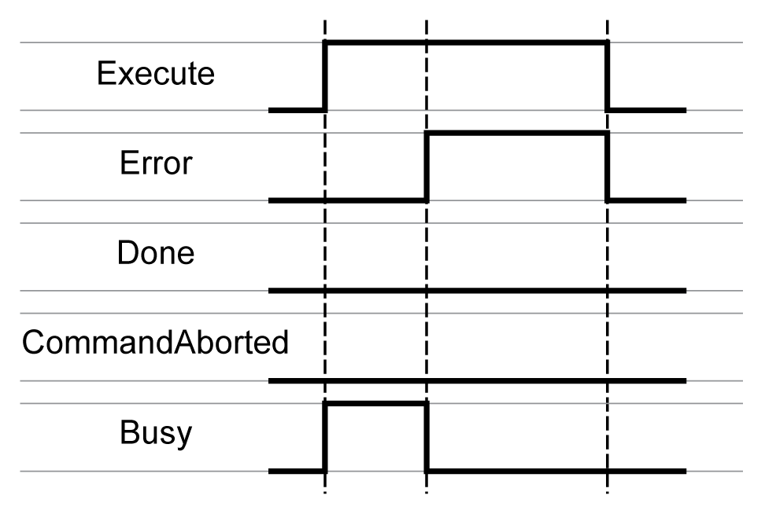
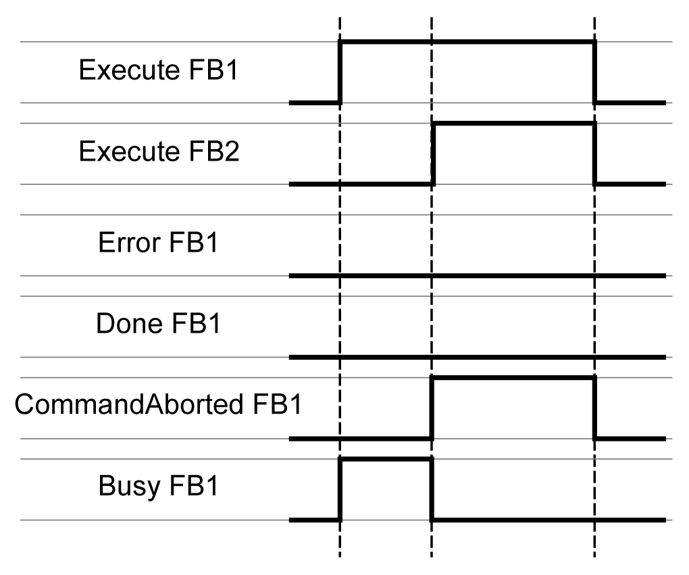
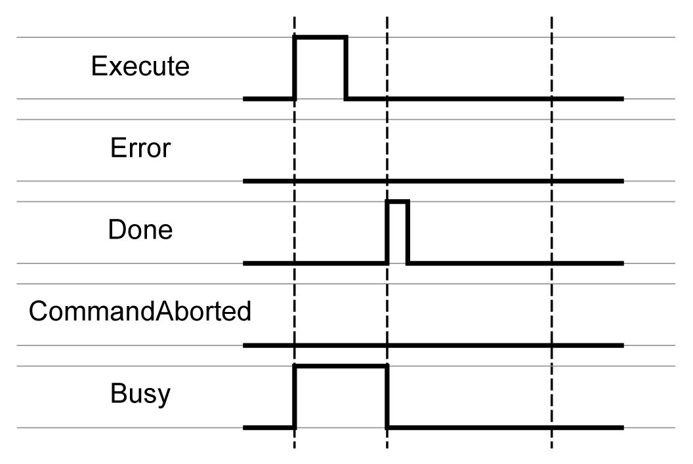

# Behavior of Function Blocks with the Input Execute

## Example 1

Execution terminated without an error detected.

## Example 2

Execution terminated with an error detected.

## Example 3

Execution aborted because another motion function block has been started.

## Example 4

If the input Execute is set to FALSE during a cycle, the function block execution is not terminated; the output Done is set to TRUE only for one cycle.

EIO0000003871.08