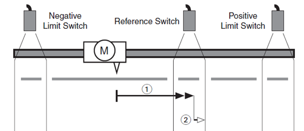
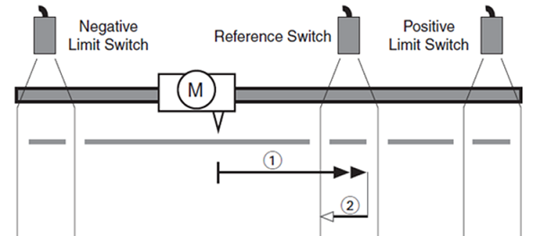
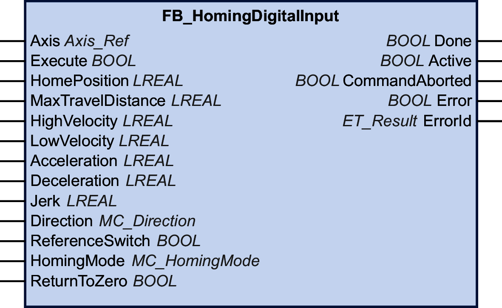

# FB\_HomingDigitalInput

## Functional Description

This function block allows you to home a drive to a reference switch. This type of homing is controlled by the controller (refer to [MC\_Home](D-SE-0094568.html) for drive-controlled homing).

The homing movement is started (inputs Acceleration and Jerk) to a specified velocity (input HighVelocity) in the direction set at the input Direction.

The input MaxTravelDistance is used to specify a maximum distance for the homing movement. If the reference switch is not detected within this distance, the execution of the function block is aborted with a detected error.

When the rising edge of the reference switch is detected, the velocity is set to the input LowVelocity (deceleration as specified at the input Deceleration). The direction of this second movement depends on the value at the input HomingMode (either reversed direction or same direction). When the falling edge of the reference switch is detected, the input HomePosition is set to the position value of the axis and the axis stops following the deceleration specified at the input Deceleration. The standstill position is different from the HomePosition by the distance covered during the deceleration.

Depending on the value of the input ReturnToZero, a movement to the zero point is performed (TRUE).

When the execution of the function block is started, the axis property IsHomed is set to FALSE. Once the input HomePosition has been set to the axis position, the axis property IsHomed is set to TRUE.

If a hardware limit switch is triggered during the homing movement, the execution of the function block is aborted with a detected error (DriveInError).

You can neither start the function block as a buffered function block nor execute a buffered function block after executing the function block.

The function block can only be started when the axis is in the PLCopen operating state StandStill. Permissible PLCopen operating states after execution of the function block are Stopping, ErrorStop or StandStill.

Example 1:

Input settings:

* Direction: PositiveDirection
* ReturnToZero: False
* HomingMode: FastNoReverseSlowSetpositionStop

Movements:

* 1: Movement with HighVelocity to rising edge of reference switch and subsequent deceleration to LowVelocity.
* 2: Movement in same direction with LowVelocity to falling edge of the reference switch. The HomePosition is set.

If the falling edge is detected, but the velocity value is still greater than the value at the input LowVelocity (that means that the distance between the rising edge and the falling edge is not sufficient to decelerate from HighVelocity to LowVelocity), a movement in the opposite direction in search of the rising edge is started once the deceleration to LowVelocity has been completed. When the rising edge is detected, the direction of movement is again reversed and the movement is continued until the falling edge is detected. The HomePosition is set.

Example 2:

Input settings:

* Direction: PositiveDirection
* ReturnToZero: False
* HomingMode: FastReverseSlowSetpositionStop

Movements:

* 1: Movement with HighVelocity to rising edge of reference switch and subsequent deceleration to LowVelocity.
* 2: Reverse movement with LowVelocity. The HomePosition is set.

## Graphical Representation

## Inputs

| Input | Data type | Description |
| --- | --- | --- |
| Axis | Axis\_Ref | Reference to the axis for which the function block is to be executed.  If the function block is started for a feedback axis, the execution of the function block is aborted with a detected error (NotSupportedWithFeedbackAxis). |
| Execute | BOOL | Value range: FALSE, TRUE.  Default value: FALSE.  A rising edge of the input Execute starts the function block. The function block continues execution and the output Busy is set to TRUE.  A rising edge at the input Execute is ignored while the function block is being executed.  If you try to execute the function block while a different function block is being executed, an error is detected (AxisNotInStandstill). |
| HomePosition | LREAL | Value range: LREAL value  Default value: 0  Position in user-defined units that is set as axis position when the falling edge of the reference switch signal is detected at LowVelocity.  If the value is set to a value outside of the modulo range of a modulo axis, an error is detected (PositionOutsideModulo).  If the value is set to a value outside of the permissible movement range of a linear axis, an error is detected (HomePositionOutsideLimits). |
| MaxTravelDistance | LREAL | Value range: Positive or negative LREAL value  Default value: 0  Maximum distance in user-defined units of the movement for searching for the rising edge of the reference switch signal.  Behavior:   * Value 0: The execution of the function block is aborted with a detected error (InvalidMaxTravelDistance). * Value greater than 0: Sets the maximum movement distance covered by the homing movement. If the rising edge of the reference switch signal is not detected within this distance, the execution of the function block is aborted with a detected error (MaxTravelDistanceExceeded). * Value less than 0: Disables monitoring of the maximum movement distance. |
| HighVelocity | LREAL | Value range: Positive LREAL value  Default value: 0  Value of the velocity in user-defined units for the homing movement towards the reference switch until the signal is detected.  If the value is not a positive LREAL value, the execution of the function block is aborted with a detected error (NonPositiveHomingVelocity). |
| LowVelocity | LREAL | Value range: Positive LREAL value  Default value: 0  Value of the velocity in user-defined units  for the movement away from the reference switch after the rising edge is detected.  If the value is not a positive LREAL value, the execution of the function block is aborted with a detected error (NonPositiveHomingVelocity). |
| Acceleration | LREAL | Value range: Positive LREAL value  Default value: 0  Value of the acceleration in user-defined units for the homing movement towards the reference switch (HighVelocity) and for the movement away from the reference switch (LowVelocity).  If the value is zero or negative, the execution of the function block is aborted with a detected error (AccelerationOutOfRange). |
| Deceleration | LREAL | Value range: Positive LREAL value  Default value: 0  Value of the deceleration in user-defined units for the homing movement after the signal of the reference switch has been detected (HighVelocity) and for the movement away from the reference switch (LowVelocity).  If the value is zero or negative, the execution of the function block is aborted with a detected error (DecelerationOutOfRange). |
| Jerk | LREAL | Value range: Positive LREAL value  Default value: 0   * Positive values: Jerk limit (in units/s3) (maximum jerk with which the acceleration is modified). * Zero: Jerk limit disabled. The acceleration jumps from zero to maximum acceleration (infinite jerk). |
| Direction | [MC\_Direction](D-SE-0094936.html#D-SE-0094936__D-SE-0094936.3) | Default value: PositiveDirection  Direction of the homing movement.  Possible values:   * Value PositiveDirection * Value NegativeDirection   If the value is invalid, the execution of the function block is aborted with a detected error (DirectionInvalid).  See [MC\_Direction](D-SE-0094936.html#D-SE-0094936__D-SE-0094936.3) for a description of the values. |
| ReferenceSwitch | BOOL | Value range: FALSE, TRUE.  Default value: FALSE. This input indicates whether the homing movement has reached the reference switch. TRUE: The homing movement has reached the reference switch.  FALSE: The homing movement has not reached the reference switch. |
| HomingMode | [MC\_HomingMode](D-SE-0094936.html#D-SE-0094936__DataTypeMC_HomingMode-859EA2DD) | This data type is an alias of the enumeration ET\_HomingMode of the MotionInterface library. It lets you specify whether or not the slow movement with LowVelocity after the fast movement with HighVelocity is performed with reversed direction.  Possible values:   * Value FastReverseSlowSetpositionStop * Value FastNoReverseSlowSetpositionStop |
| ReturnToZero | BOOL | Value range: FALSE, TRUE.  Default value: FALSE.  TRUE: After the home position has been set, the movement is continued to the zero position 0 at HighVelocity (corresponding to a movement with MC\_MoveAbsolute to the position 0.0).  NOTE: If the function block MC\_SetPosition is executed with ReturnToZero set to TRUE, the movement to the zero point as originally calculated is continued.  FALSE: No movement is performed after the home position has been set.  The PLCopen operating state remains Homing as long as the return to zero movement lasts. |

## Outputs

| Output | Data type | Description |
| --- | --- | --- |
| Done | BOOL | Value range: FALSE, TRUE.  Default value: FALSE.   * FALSE: Execution has not been finished, or an error has been detected. * TRUE: Execution terminated without an error detected. |
| Active | BOOL | Value range: FALSE, TRUE.  Default value: FALSE.   * FALSE: The function block does not control the movement of the axis. * TRUE: The function block controls the movement of the axis. |
| CommandAborted | BOOL | Value range: FALSE, TRUE.  Default value: FALSE.   * FALSE: Execution has not been aborted. * TRUE: Execution has been aborted by another function block. |
| Error | BOOL | Value range: FALSE, TRUE.  Default value: FALSE.   * FALSE: Function block is being executed, no error has been detected during execution. * TRUE: An error has been detected in the execution of the function block. |
| ErrorID | [ET\_Result](ET_Result-GeneralInformation-13E75E6E.html#ET_Result-GeneralInformation-13E75E6E) | This enumeration provides diagnostics information. |

EIO0000003871.08