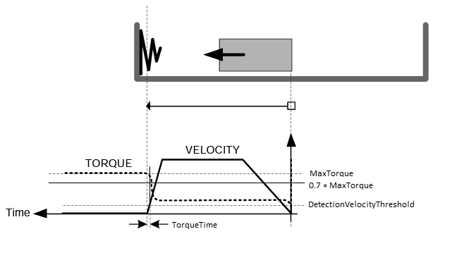
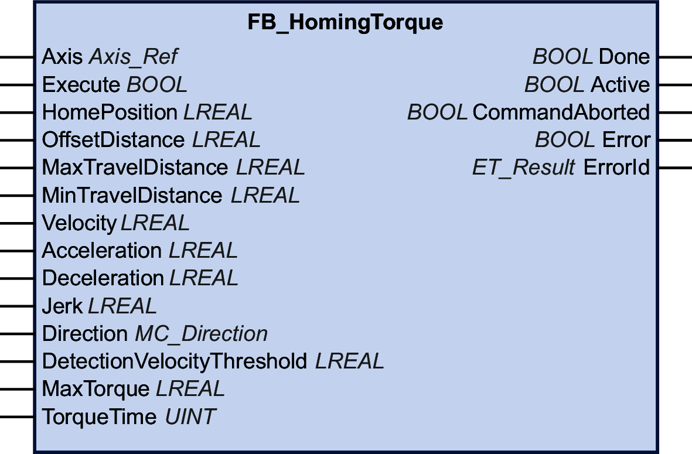

# FB\_HomingTorque

## Functional Description

This function block allows you to home a drive using a movement to a physical object that blocks the movement to determine the zero point. This type of homing is controlled by the controller (refer to [MC\_Home](D-SE-0094568.html) for drive-controlled homing). This type of homing is typically used to home the arms of delta robots.

The function block FB\_HomingTorque modifies the values of the drive parameters CTRL\_I\_max and MON\_p\_dif\_load for homing, and restores the values to the original values after homing. If the communication between the controller and the drive is interrupted during homing (for example, power outage, interruption of physical connection), the original values of these parameters are not restored.

| WARNING | |
| --- | --- |
|  | UNINTENDED EQUIPMENT OPERATION  Before operating the equipment in any way whatsoever, verify that the drive parameters CTRL\_I\_max and MON\_p\_dif\_load are set to the correct values if the communication between the controller and the drive was interrupted during homing, or if you suspect that the communication may have been interrupted during homing.  Failure to follow these instructions can result in death, serious injury, or equipment damage. |

Depending on the torque limit (input MaxTorque), the velocity (input Velocity) and the time for which the torque is maintained (input TorqueTime), the physical object (block) used for homing may not be able to withstand the forces. If the torque limit is excessive, this may also cause the motor, the encoder and other components to become inoperative.

Disabling monitoring of the minimum movement distance can lead to unintended equipment operation.

| WARNING | |
| --- | --- |
|  | UNINTENDED EQUIPMENT OPERATION  * Verify that the mechanical design of your machine is suitable for the values set at the inputs MaxTorque and TorqueTime. * Verify that the values set at the inputs MaxTorque and TorqueTime do not exceed the limits specified in the documentation for the motor and the other equipment used in your machine. * Verify that an offset movement is performed by setting the input OffsetDistance to a value greater than 0 in order to move the axis away from the physical object (block). * Verify that monitoring of the minimum movement distance is enabled by setting the input MinTravelDistance to a value greater than 0.  Failure to follow these instructions can result in death, serious injury, or equipment damage. |

The homing movement is started (inputs Acceleration and Jerk) to a specified velocity (input Velocity) in the direction set at the input Direction.

The torque for homing is limited to the value set at the input MaxTorque.

The value at the input DetectionVelocityThreshold specifies the limit value of the velocity when the torque limit at the input MaxTorque is reached.

The condition for the detection of the mechanical object that blocks the movement (block condition) is fulfilled if the torque is greater than 70 % of the value at the input MaxTorque and the velocity is less than the value at the input DetectionVelocityThreshold.

If the block condition is fulfilled for the time specified at the input TorqueTime, drive parameters CTRL\_I\_max and MON\_p\_dif\_load are restored to their original values. After that, the offset movement in opposite direction as specified at the input OffsetDistance is started.

After completion of the offset movement, the input HomePosition is set.

The following example illustrates the interdependencies of the values DetectionVelocityThreshold, MaxTorque and TorqueTime:

NOTE: If you use a “soft” block like a spring as in this example, the accuracy of the HomePosition may be lower.

The input MaxTravelDistance is used to specify the maximum distance for the homing movement. If the block condition is not fulfilled within this distance, the execution of the function block is aborted with a detected error.

The input MinTravelDistance is used to specify a minimum distance for the homing movement. The minimum distance is considered to have been covered if the axis performs a movement by the specified distance value in the specified direction and if the difference between the reference position and the actual position is less than the 10 % of the value at the input MinTravelDistance. If the minimum distance is not reached, a Halt of the drive is triggered (bit 13 of drive control word is reset to 0). After completion of the Halt, a movement is performed back to the position where the function block was first executed. The minimum distance may not be reached if the torque value set at the input MaxTorque is insufficient for the homing movement.

When the execution of the function block is started, the axis property IsHomed is set to FALSE. Once the input HomePosition has been set to the axis position, the axis property IsHomed is set to TRUE.

The Sercos IDN P-0-3030.0.36 (actual torque value) must be mapped before the function block can be used.

You can neither start the function block as a buffered function block nor execute a buffered function block after executing the function block.

The function block can only be started when the axis is in the PLCopen operating state StandStill. Permissible PLCopen operating states after execution of the function block are Stopping, ErrorStop or StandStill.

The function block is only available for LXM32S drives.

## Graphical Representation

## Inputs

| Input | Data type | Description |
| --- | --- | --- |
| Axis | Axis\_Ref | Reference to the axis for which the function block is to be executed.  If the function block is started for a feedback axis, the execution of the function block is aborted with a detected error (NotSupportedWithFeedbackAxis) . |
| Execute | BOOL | Value range: FALSE, TRUE.  Default value: FALSE.  A rising edge of the input Execute starts the function block. The function block continues execution and the output Busy is set to TRUE.  A rising edge at the input Execute is ignored while the function block is being executed. |
| HomePosition | LREAL | Value range: LREAL value  Default value: 0  Position in user-defined units that is set after the offset movement from the block after the block condition (inputs MaxTorque and DetectionVelocityThreshold) is fulfilled and the torque time (input TorqueTime) has elapsed. |
| OffsetDistance | LREAL | Value range: Positive LREAL value  Default value: 0  Movement in user-defined units in the opposite direction, which is performed after the block condition (inputs MaxTorque and DetectionVelocityThreshold) is fulfilled and the torque time (input TorqueTime) has elapsed. |
| MaxTravelDistance | LREAL | Value range: Positive or negative LREAL value  Default value: 0  Maximum distance in user-defined units of the movement to detect fulfillment of the block condition.  Behavior:   * Value 0: The execution of the function block is aborted with a detected error (InvalidMaxTravelDistance). * Value greater than 0: Sets the maximum movement distance covered by the homing movement. If the block condition is not fulfilled within this distance, the execution of the function block is aborted with a detected error (MaxTravelDistanceExceeded). * Value less than 0: Disables monitoring of the maximum movement distance. |
| MinTravelDistance | LREAL | Value range: Positive or negative LREAL value  Default value: 0  Minimum distance in user-defined units to be covered before detection of fulfillment of the block condition is started.  If the value is greater than the value at the input MaxTravelDistance , the execution of the function block is aborted with a detected error (MinTravelDistanceIsNotLowerThanMaxTravelDistance).  If the minimum distance specified is not reached, the execution of the function block is aborted with a detected error (MinTravelDistanceNotReached). A Halt of the drive is triggered (bit 13 of drive control word is reset to 0). |
| Velocity | LREAL | Value range: Positive LREAL value  Default value: 0  Value of the velocity in user-defined units for the homing movement.  If the value is negative or zero, the execution of the function block is aborted with a detected error (NonPositiveHomingVelocity). |
| Acceleration | LREAL | Value range: Positive LREAL value  Default value: 0  Value of the acceleration in user-defined units for the homing movement.  If the value is zero or negative, the execution of the function block is aborted with a detected error (AccelerationOutOfRange). |
| Deceleration | LREAL | Value range: Positive LREAL value  Default value: 0  Value of the deceleration in user-defined units for the homing movement.  If the value is zero, the execution of the function block is aborted with a detected error (DecelerationOutOfRange). |
| Jerk | LREAL | Value range: Positive LREAL value  Default value: 0   * Positive values: Jerk limit (in units/s3) (maximum jerk with which the acceleration is modified). * Zero: Jerk limit disabled. The acceleration jumps from zero to maximum acceleration (infinite jerk). |
| Direction | [MC\_Direction](D-SE-0094936.html#D-SE-0094936__D-SE-0094936.3) | Default value: PositiveDirection  Direction of the homing movement.  Possible values:   * Value PositiveDirection * Value NegativeDirection   If the value is invalid, the execution of the function block is aborted with a detected error (DirectionInvalid).  See [MC\_Direction](D-SE-0094936.html#D-SE-0094936__D-SE-0094936.3) for a description of the values. |
| DetectionVelocityThreshold | LREAL | Value range: Positive LREAL value  Default value: 0  Limit value of the velocity in user-defined units for detecting the fulfillment of the block condition, that is, the actual torque is greater than 70 % of the value at the input MaxTorque and the velocity is less than the value at this input.  If the value is not a positive LREAL value, the execution of the function block is aborted with a detected error (NonPositiveDetectionVelocityThreshold). |
| MaxTorque | LREAL | Value range: LREAL value  This value specifies the torque limit in Nm for detecting the fulfillment of the block condition, that is, the torque is greater than 70 % of the value at this input and the velocity is less than the value at the input DetectionVelocityThreshold. If the value is negative, the execution of the function block is aborted with a detected error (MaxTorqueInvalid). If the value is 0, there is no torque limit. |
| TorqueTime | UINT | Value range: UINT value  Default value: 0  Minimum duration in milliseconds for which the block condition has to be fulfilled, that is, the torque remains greater than 70 % of the value at the input MaxTorque and the velocity remains less than the value at the input DetectionVelocityThreshold for the duration specified at this input. |

## Outputs

| Output | Data type | Description |
| --- | --- | --- |
| Done | BOOL | Value range: FALSE, TRUE.  Default value: FALSE.   * FALSE: Execution has not been finished, or an error has been detected. * TRUE: Execution terminated without an error detected. |
| Active | BOOL | Value range: FALSE, TRUE.  Default value: FALSE.   * FALSE: The function block does not control the movement of the axis. * TRUE: The function block controls the movement of the axis. |
| CommandAborted | BOOL | Value range: FALSE, TRUE.  Default value: FALSE.   * FALSE: Execution has not been aborted. * TRUE: Execution has been aborted by another function block. |
| Error | BOOL | Value range: FALSE, TRUE.  Default value: FALSE.   * FALSE: Function block is being executed, no error has been detected during execution. * TRUE: An error has been detected in the execution of the function block. |
| ErrorID | [ET\_Result](ET_Result-GeneralInformation-13E75E6E.html#ET_Result-GeneralInformation-13E75E6E) | This enumeration provides diagnostics information. |

EIO0000003871.08