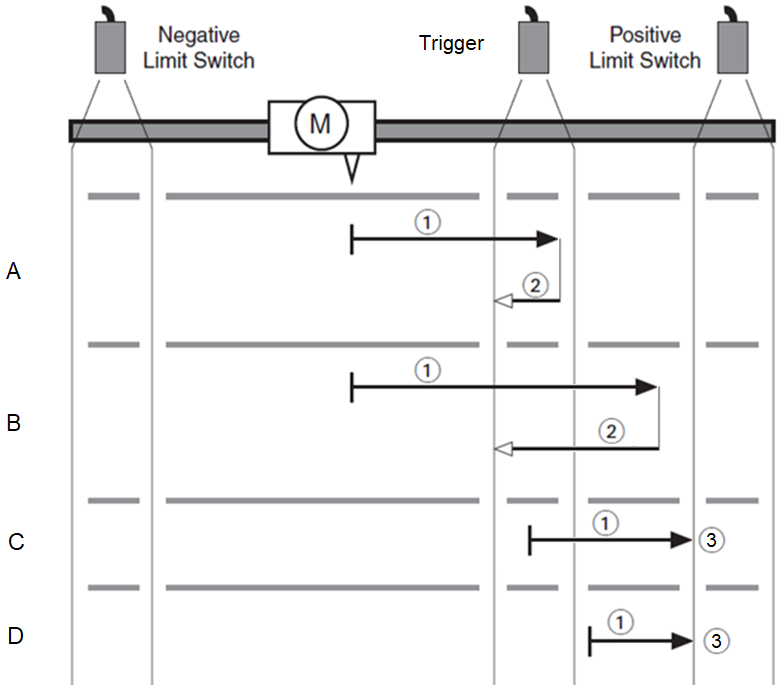
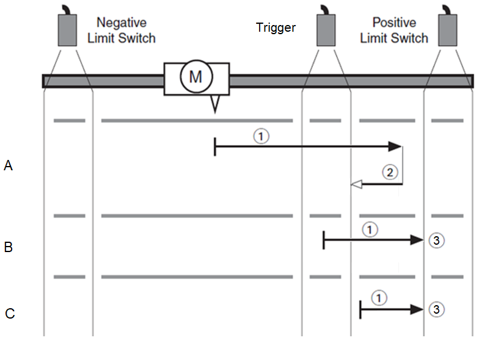
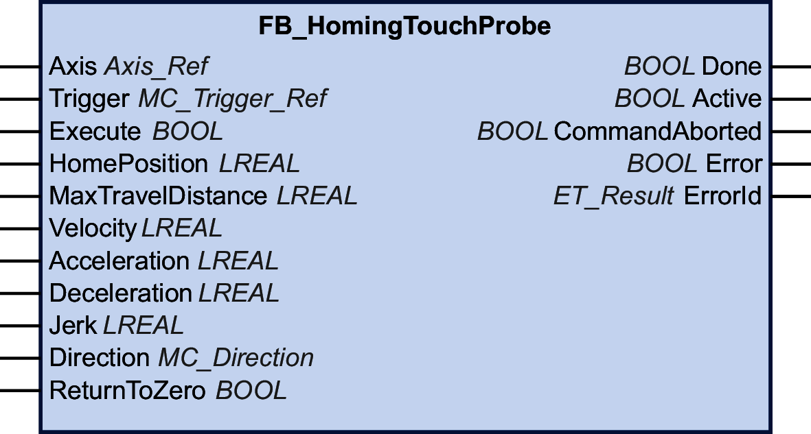

# FB\_HomingTouchProbe

## Functional Description

This function block allows you to home a drive to the position capture value of a touchprobe. This type of homing is controlled by the controller (refer to [MC\_Home](D-SE-0094568.html) for drive-controlled homing).

The input Trigger specifies the edge of the capture signal to be detected (falling edge or rising edge). The direction of the homing movement is set at the input Direction. The input MaxTravelDistance is used to specify a maximum distance for the homing movement. If the edge of the capture signal is not detected within this distance, the execution of the function block is aborted with a detected error.

The homing movement is started (inputs Acceleration and Jerk) to a constant velocity (input Velocity) in the direction set at the input Direction.

When the specified edge of the capture signal is detected, the corresponding position value is set as the home position. The movement decelerates with the deceleration value set at the input Deceleration.

Depending on the value of the input ReturnToZero, the movement either stops (FALSE) or is continued to the zero point (TRUE).

**Example 1 with the following input settings:**

* Direction: PositiveDirection
* Trigger: RisingEdge

Movements:

| Item | Movement |
| --- | --- |
| 1 | Homing movement (searching for edge of position capture signal). |
| 2 | Movement to zero point (if ReturnToZero is set to TRUE). |
| 3 | Movement to limit switch (homing not successful). |

Scenarios:

| Item | Scenario |
| --- | --- |
| A | The homing movement is performed with a low value at the input Velocity (1). The rising edge is detected and the movement stops. After the homing movement, a movement to zero is performed (2). |
| B | The homing movement is performed with a high value at the input Velocity (1). The rising edge is detected and the movement stops. After the homing movement, a movement to zero is performed (2). |
| C | The homing movement is started after the rising edge and before the falling edge (1), that is, on the trigger. The movement is stopped by the limit switch (3). Homing was not successful because the homing movement cannot be started at a position between the rising edge and the falling edge. |
| D | The homing movement is started after the falling edge (1). The movement is stopped by the limit switch (3). Homing was not successful. |

**Example 2 with the following input settings:**

* Direction: PositiveDirection
* Trigger: FallingEdge

Movements:

| Item | Movement |
| --- | --- |
| 1 | Homing movement (searching for edge of position capture signal). |
| 2 | Movement to zero point (if ReturnToZero is set to TRUE). |
| 3 | Movement to limit switch (homing not successful). |

Scenarios:

| Item | Scenario |
| --- | --- |
| A | The homing movement is performed (1). The falling edge is detected and the movement stops. After the homing movement, a movement to zero is performed (2). |
| B | The homing movement is started between the rising edge and the falling edge (1), that is, on the trigger. The movement is stopped by the limit switch (3). Homing was not successful because the homing movement cannot be started at a position between the rising edge and the falling edge. |
| C | The homing movement is started after the falling edge (1). The movement is stopped by the limit switch (3). Homing was not successful. |

The edge of the position capture signal is detected via IDNs in the library. This implies a delay which depends on how often the function block has to be called to be completed. If the input ReturnToZero is set to FALSE, the delay corresponds to the distance to the touchprobe after the output Done of the function block is set to TRUE.

When the execution of the function block is started, the axis property IsHomed is set to FALSE. Once the input HomePosition has been set to the axis position, the axis property IsHomed is set to TRUE.

If a hardware limit switch is triggered during the homing movement, the execution of the function block is aborted with a detected error (DriveInError).

You can neither start the function block as a buffered function block nor execute a buffered function block after executing the function block.

The function block can only be started when the axis is in the PLCopen operating state StandStill. Permissible PLCopen operating states after execution of the function block are Stopping, ErrorStop or StandStill.

## Graphical Representation

## Inputs

| Input | Data type | Description |
| --- | --- | --- |
| Axis | Axis\_Ref | Reference to the axis for which the function block is to be executed. |
| Trigger | [MC\_Trigger\_Ref](D-SE-0094936.html#D-SE-0094936__D-SE-0094936.5) | Reference to the position capture source of the drive for which the function block is to be executed. The function block detects the specified edge of the capture signal and homes the axis to this position value.  Possible values:   * Value FallingEdge * Value RisingEdge   If the value is invalid, the execution of the function block is aborted with a detected error (InvalidCaptureSource).  If the specified position capture source is in use when the function block is started, the execution of the function block is aborted with a detected error (CaptureSourceAlreadyInUse).  If the specified edge for the position capture signal is invalid, the execution of the function block is aborted with a detected error (InvalidCaptureEdge).  If the trigger is aborted by the function block MC\_AbortTrigger, the execution of the function block is aborted with a detected error (TriggerExternalAborted). |
| Execute | BOOL | Value range: FALSE, TRUE.  Default value: FALSE.  A rising edge of the input Execute starts the function block. The function block continues execution and the output Busy is set to TRUE.  A rising edge at the input Execute is ignored while the function block is being executed. |
| HomePosition | LREAL | Value range: LREAL value  Default value: 0  Position in user-defined units that is set as home position when the specified edge of the capture signal is detected.  If the value is set to a value outside of the modulo range of a modulo axis, an error is detected (PositionOutsideModulo).  If the value is set to a value outside of the permissible movement range of a linear axis, an error is detected (HomePositionOutsideLimits).  NOTE: After homing, the axis position is not identical to the detected home position due to the deceleration to a standstill (input Deceleration after the edge of the position capture signal has been detected during the homing movement at constant velocity (Velocity)). |
| MaxTravelDistance | LREAL | Value range: Positive or negative LREAL value  Default value: 0  Maximum distance in user-defined units of the movement for searching for the edge of the capture signal.  Behavior:   * Value 0: The execution of the function block is aborted with a detected error (InvalidMaxTravelDistance). * Value greater than 0: Sets the maximum movement distance covered by the homing movement. If the edge of the capture signal is not detected within this distance, the execution of the function block is aborted with a detected error (MaxTravelDistanceExceeded). * Value less than 0: Disables monitoring of the maximum movement distance. |
| Velocity | LREAL | Value range: Positive LREAL value  Default value: 0  Value of the velocity in user-defined units  for the homing movement at constant velocity.  If the value is negative or zero, the execution of the function block is aborted with a detected error (NonPositiveHomingVelocity). |
| Acceleration | LREAL | Value range: Positive LREAL value  Default value: 0  Value of the acceleration in user-defined units for the homing movement at constant velocity.  If the value is negative or zero, the execution of the function block is aborted with a detected error (AccelerationOutOfRange). |
| Deceleration | LREAL | Value range: Positive LREAL value  Default value: 0  Value of the deceleration in user-defined units for the homing movement after the edge of the capture signal has been detected.  If the value is negative or zero, the execution of the function block is aborted with a detected error (DecelerationOutOfRange). |
| Jerk | LREAL | Value range: Positive LREAL value  Default value: 0   * Positive values: Jerk limit (in units/s3) (maximum jerk with which the acceleration is modified). * Zero: Jerk limit disabled. The acceleration jumps from zero to maximum acceleration (infinite jerk). |
| Direction | [MC\_Direction](D-SE-0094936.html#D-SE-0094936__D-SE-0094936.3) | Default value: PositiveDirection  Direction of the homing movement.  Possible values:   * Value PositiveDirection * Value NegativeDirection   If the value is invalid, the execution of the function block is aborted with a detected error (DirectionInvalid).  See [MC\_Direction](D-SE-0094936.html#D-SE-0094936__D-SE-0094936.3) for a description of the values. |
| ReturnToZero | BOOL | Value range: FALSE, TRUE.  Default value: FALSE.  TRUE: After the home position has been set, the movement is continued to the zero position (corresponding to a movement with MC\_MoveAbsolute to the position 0.0).  NOTE: If the function block MC\_SetPosition is executed with ReturnToZero set to TRUE, the movement to the zero point as originally calculated is continued.  FALSE: No movement is performed after the home position has been set.  The PLCopen operating state remains Homing as long as the return to zero movement lasts. |

## Outputs

| Output | Data type | Description |
| --- | --- | --- |
| Done | BOOL | Value range: FALSE, TRUE.  Default value: FALSE.   * FALSE: Execution has not been finished, or an error has been detected. * TRUE: Execution terminated without an error detected. |
| Active | BOOL | Value range: FALSE, TRUE.  Default value: FALSE.   * FALSE: The function block does not control the movement of the axis. * TRUE: The function block controls the movement of the axis. |
| CommandAborted | BOOL | Value range: FALSE, TRUE.  Default value: FALSE.   * FALSE: Execution has not been aborted. * TRUE: Execution has been aborted by another function block. |
| Error | BOOL | Value range: FALSE, TRUE.  Default value: FALSE.   * FALSE: Function block is being executed, no error has been detected during execution. * TRUE: An error has been detected in the execution of the function block. |
| ErrorID | [ET\_Result](ET_Result-GeneralInformation-13E75E6E.html#ET_Result-GeneralInformation-13E75E6E) | This enumeration provides diagnostics information. |

EIO0000003871.08