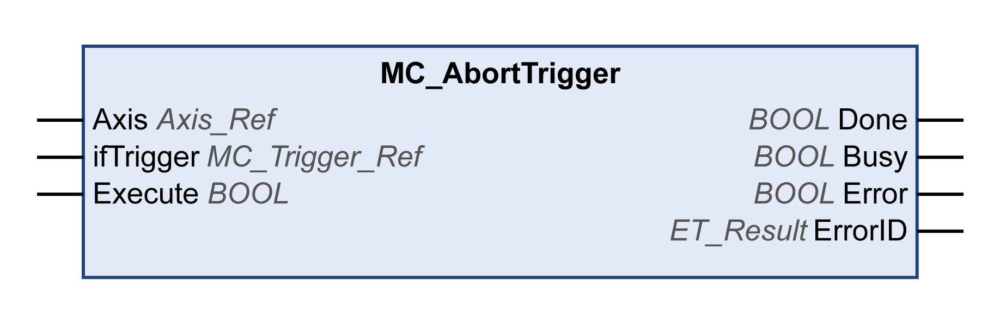

# MC\_AbortTrigger

## Functional Description

This function block terminates position capture.

## Graphical Representation

## Inputs

| Input | Data type | Description |
| --- | --- | --- |
| Axis | Axis\_Ref | Reference to the axis for which the function block is to be executed. |
| ifTrigger | MC\_Trigger\_Ref | Edge to trigger position capture.  Refer to MC\_Trigger\_Ref for a description. |
| Execute | BOOL | Value range: FALSE, TRUE.  Default value: FALSE.  A rising edge of the input Execute starts the function block. The function block continues execution and the output Busy is set to TRUE.  A rising edge at the input Execute is ignored while the function block is being executed. |

## Outputs

| Output | Data type | Description |
| --- | --- | --- |
| Done | BOOL | Value range: FALSE, TRUE.  Default value: FALSE.   * FALSE: Execution has not been finished, or an error has been detected. * TRUE: Execution terminated without an error detected. |
| Busy | BOOL | Value range: FALSE, TRUE.  Default value: FALSE.   * FALSE: Function block is not being executed. * TRUE: Function block is being executed. |
| Error | BOOL | Value range: FALSE, TRUE.  Default value: FALSE.   * FALSE: Function block is being executed, no error has been detected during execution. * TRUE: An error has been detected in the execution of the function block. |
| ErrorID | [ET\_Result](ET_Result-GeneralInformation-13E75E6E.html#ET_Result-GeneralInformation-13E75E6E) | This enumeration provides diagnostics information. |

EIO0000003871.08