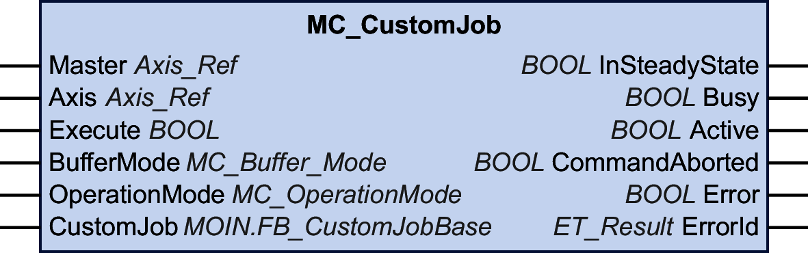

# MC\_CustomJob

## Functional Description

This function block allows you to control an axis by a custom algorithm that calculates cyclic set position, velocity, and acceleration of the axis.

The function block created by you in order to program a motion profile has to extend FB\_CustomJobBase of the MotionInterface library. Then the function block is provided at the input CustomJob.

## Graphical Representation

## Inputs

| Input | Data type | Description |
| --- | --- | --- |
| Master | Axis\_Ref | Reference to the axis for which the function block is to be executed.  Can be left unassigned if the custom job (provided at input CustomJob) does not use a master axis.  If an axis is assigned, the callback to the user function block to define the motion profile gets the movement values of the master axis. Otherwise, the movement values of the master axis are given as zero. |
| Axis | Axis\_Ref | Reference to the axis for which the function block is to be executed. |
| Execute | BOOL | Value range: FALSE, TRUE.  Default value: FALSE.  A rising edge of the input Execute starts the function block. The function block continues execution and the output Busy is set to TRUE.  This function block can be restarted while it is executed. The target values are overwritten by the new values at the point in time the rising edge occurs. |
| BufferMode | [MC\_Buffer\_Mode](D-SE-0094936.html#D-SE-0094936__D-SE-0094936.4) | The target values (position, velocity, acceleration) of the axis are overwritten by the new values in the motion task cycle when the function block gets active on the axis.  Default value: Aborting  Buffer mode.  Possible values:   * Value Aborting * Value Buffered   See MC\_Buffer\_Mode for a description of the values. |
| OperationMode | [MC\_OperationMode](D-SE-0094936.html#D-SE-0094936__D-SE-0094936.13) | Operating mode for function block  Default value: Position |
| CustomJob | MOIN.FB\_CustomJobBase | An instance of a user-created function block type which must be derived from FB\_CustomJobBase. The function block instance can be parameterized with additional parameters (for example,. target position, velocity, acceleration, jerk, etc.) according to the requirements of the algorithm used by the custom job.  Override the following methods:   * CalculateMovement * Prepare * ResetJob   Do not override the other methods of this function block. |

## Outputs

| Output | Data type | Description |
| --- | --- | --- |
| InSteadyState | BOOL | Value range: FALSE, TRUE.  Default value: FALSE, as reported by the custom job   * FALSE: Steady state has not yet been reached or an error has been detected. * TRUE: Steady-state reached. This way, the custom job signals that a buffered job can become active. |
| Busy | BOOL | Value range: FALSE, TRUE.  Default value: FALSE, as reported by the custom job   * FALSE: Function block is not being executed. * TRUE: Function block is being executed. |
| Active | BOOL | Value range: FALSE, TRUE.  Default value: FALSE.   * FALSE: The function block does not control the movement of the axis. * TRUE: The function block controls the movement of the axis. |
| CommandAborted | BOOL | Value range: FALSE, TRUE.  Default value: FALSE.   * FALSE: Execution has not been aborted. * TRUE: Execution has been aborted by another function block. |
| Error | BOOL | Value range: FALSE, TRUE.  Default value: FALSE.   * FALSE: Function block is being executed, no error has been detected during execution. * TRUE: An error has been detected in the execution of the function block. |
| ErrorID | [ET\_Result](ET_Result-GeneralInformation-13E75E6E.html#ET_Result-GeneralInformation-13E75E6E) | This enumeration provides diagnostics information. |

If you use the function block MC\_SetPosition with a function block MC\_CustomJob, this can result in position jumps if you do not consider the offset position in your position calculation.

| WARNING | |
| --- | --- |
|  | UNINTENDED EQUIPMENT OPERATION  Do not use the function block MC\_SetPosition with a function block MC\_CustomJob without adjusting the offset position  Failure to follow these instructions can result in death, serious injury, or equipment damage. |

To avoid any potential position jumps, base the calculation of the axis position for the next cycle on the last physical position (as per Axis.RefPosition) of the axis, or otherwise verify that the offset position is correctly considered in your position calculation.

If you use the function block MC\_CustomJob with a modulo axis, the position generated via the method CalculateMovement is modulo-corrected if a modulo overflow occurs. This correction is based on saving the modulo offset in MC\_CustomJob. This implies that if the calculation is based on the last reference position (as per Axis.RefPosition), the position for the next cycle drifts by the magnitude of the modulo jump.

| WARNING | |
| --- | --- |
|  | UNINTENDED EQUIPMENT OPERATION  Verify that all effects of modulo jumps are correctly considered in your position calculation if you use the function block MC\_CustomJob with a modulo axis.  Failure to follow these instructions can result in death, serious injury, or equipment damage. |

## Notes

If an axis is provided for the input Master, the new target values or reference values for the master axis for the running real-time cycle are calculated before MC\_CustomJob is triggered. Therefore, the custom job implementation gets up-to-date (newly calculated from the real-time cycle) values from the master axis when it is called to calculate its values for the subordinate axis.

If the operating mode is set to Velocity via the input OperationMode and if the drive is not able to operate in the operating mode Cyclic Synchronous Velocity, the function block MC\_CustomJob detects an error. The axis is not affected.

EIO0000003871.08