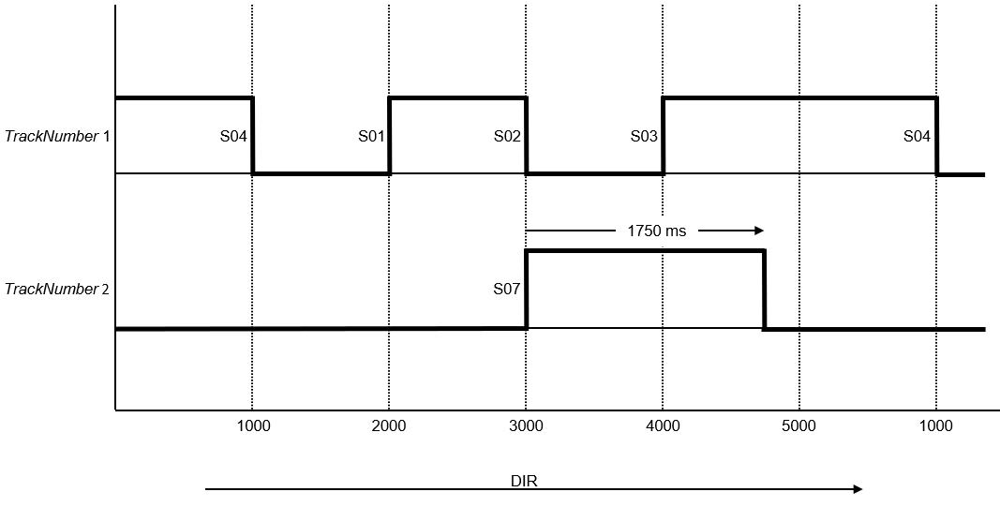
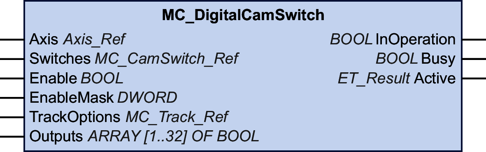

# MC\_DigitalCamSwitch

## Functional Description

This function block is a digital analogy to a cam switch unit on a mechanical shaft or rail. The function block provides up to 32 tracks. Once a predetermined position is reached, a logical and/or physical output is triggered.

The tracks are represented as an array of 32 boolean values. A total of up to 255 switching events can be arranged on these tracks.

In MC\_CamSwitch\_Ref (which is an alias of the structure ST\_CamSwitch\_Ref of the MotionInterface library), you set the number of switching events (NumberOfSwitches) and a pointer to an array of switching events (ST\_CamSwitch). The value for the parameter NumberOfSwitches must be equal to the number of entries ST\_CamSwitch in the array.

A switching event is represented by the structure ST\_CamSwitch of the MotionInterface library.

The function block MC\_DigitalCamSwitch cannot verify the correctness of the parameter NumberOfSwitches and the correctness of the individual switching events in the array of switching events defined with entries of the structure ST\_CamSwitch.

| WARNING | |
| --- | --- |
|  | UNINTENDED EQUIPMENT OPERATION  * Verify that the value of the parameter NumberOfSwitches is equal to the number of array entries containing switching events defined with ST\_CamSwitch. * Verify that the parameterization of each switching event defined with ST\_CamSwitch is correct.  Failure to follow these instructions can result in death, serious injury, or equipment damage. |

The parameter TrackNumber of the structure ST\_CamSwitch specifies the number of the track; that is, the output. The maximum value is 32.

The parameter Position of the structure ST\_CamSwitch specifies the position of the track at which the switching event is to be triggered in user-defined units.

The parameter AxisDirection of the structure ST\_CamSwitch specifies the direction of movement in which the switching event is to be triggered. The corresponding enumeration ET\_AxisDirection provides three values:

* Both (0): The switching event is triggered during movements in both directions of movement.
* Positive (1): The switching event is only triggered during movements in positive direction of movement.
* Negative (2): The switching event is only triggered during movements in negative direction of movement.

The parameter CamSwitchMode of the structure ST\_CamSwitch specifies the type of switching for the switching event to be triggered. The corresponding enumeration ET\_CamSwitchMode provides four values:

* On (0): The output is set to ON when the specified position is reached.
* Off (1): The output is set to OFF when the specified position is reached.
* Invert (2): The output is toggled when the specified position is reached.
* TimeBased (3): The output is set to ON for the period of time specified with the parameter Duration.

The input TrackOptions of the function block lets you specify a compensation time for triggering the switching events via MC\_Track\_Ref (which is an alias of the structure ST\_Track\_Ref of the MotionInterface library). Each element of the array for the structure ST\_Track\_Ref specifies the compensation time for the corresponding track. An element of the array has two values:

* OnCompensation: Specifies the compensation time in seconds when the output is set to ON.
* OffCompensation: Specifies the compensation time in seconds when the output is set to OFF.

You can use positive and negative values for the compensation time to allow for positive or negative compensation. If CamSwitchMode is Invert, only the value for OnCompensation is used, regardless of the previous state of the output. If CamSwitchMode is TimeBased, only the value for OnCompensation is used (the output remains ON for the time specified for the switching event with the parameter Duration. The compensation (new trigger position) depends on the acceleration and the velocity at the time of calculation: ((new trigger position + compensation time) \* velocity) + (0.5 \* acceleration \* compensation time2). In the case of a modulo axis, the new trigger position of a switching event may be in the next modulo period. If the new trigger position of a switching event is above two modulo periods, the error EdgePositionOutOfTwoModuloRanges is detected.

The input EnableMask of the function block allows you to specify the tracks to be controlled by the function block. With the default value FFFFFFFF hex, the tracks are controlled by the function block. If the value for EnableMask is modified during runtime, the tracks for which EnableMask is 0 are not reset, but the tracks are no longer controlled by the function block.

Example with seven switching events on two tracks on a modulo axis as defined by the structures ST\_CamSwitch\_Ref and ST\_CamSwitch:

|  |  |  |  |  |  |
| --- | --- | --- | --- | --- | --- |
| Switching event | TrackNumber | CamSwitchMode | Position | AxisDirection | Duration |
| S01 | 1 | 0 (On) | 2000 | 1 (Positive) | - |
| S02 | 1 | 1 (Off) | 3000 | 1 (Positive) | - |
| S03 | 1 | 0 (On) | 4000 | 1 (Positive) | - |
| S04 | 1 | 1 (Off) | 1000 | 1 (Positive) | - |
| S05 | 2 | 0 (On) | 2500 | 2 (Negative) | - |
| S06 | 2 | 1 (Off) | 3200 | 2 (Negative) | - |
| S07 | 2 | 3 (TimeBased) | 3000 | 0 (Both) | 1750 ms |

Graphical representation of the example:

The direction of movement is positive as indicated by the arrow.

Switching events S01, S02, S03 and S04 are assigned to track 1 with the parameter TrackNumber; that is, they act on output 1. Switching events S05, S06 and S07) are assigned to track 2 with the parameter TrackNumber; that is, they act on output 2.

Switching event S01 is triggered at position 2000 (CamSwitchMode = On). Switching event S02 is triggered at position 3000 (CamSwitchMode = Off).

Switching event S03 is triggered at position 4000 (CamSwitchMode = On). Modulo jumps do not have an impact on outputs. Output 1 remains On until the next switching event, regardless of a modulo jump that may occur in the meantime. Switching event S04 is triggered at position 1000 (CamSwitchMode = Off).

The parameter AxisDirection of switching events S05 and S06 is set to 2 (Negative) so these switching events are not triggered with the positive direction of movement in the example.

Switching event S07 is triggered at position 3000 (CamSwitchMode = TimeBased and remains on for a duration of 1750 ms as set with the parameter Duration.

## Graphical Representation

## Inputs

| Input | Data type | Description |
| --- | --- | --- |
| Axis | Axis\_Ref | Reference to the axis for which the function block is to be executed. |
| Switches | [MC\_CamSwitch\_Ref](D-SE-0094936.html#D-SE-0094936__DataTypeMC_CamSwitch_Ref-CBAE6F42) | MC\_CamSwitch\_Ref (which is an alias of the structure ST\_CamSwitch\_Ref of the MotionInterface library) lets you set the number of switching events (NumberOfSwitches) and a pointer to an array of switching events (ST\_CamSwitch). The maximum number of switching events is 255. |
| Enable | BOOL | Value range: FALSE, TRUE.  Default value: FALSE.  The input Enable starts or terminates execution of a function block.   * FALSE: Execution of the function block is terminated. The outputs Valid, Busy, and Error are set to FALSE. * TRUE: The function block is being executed. The function block continues executing as long as the input Enable is set to TRUE. |
| EnableMask | DWORD | Default value: FFFFFFFF hex  This input specifies the tracks to be controlled by the function block. With the default value, all tracks are controlled by the function block. If the value for EnableMask is modified during runtime, the tracks for which EnableMask is 0 are not reset, but the tracks are no longer controlled by the function block. |
| TrackOptions | [MC\_Track\_Ref](D-SE-0094936.html#D-SE-0094936__DataTypeMC_Track_Ref-CBAF1FC1) | This input specifies a compensation time for triggering the switching events assigned to a track via MC\_Track\_Ref (which is an alias of the structure ST\_Track\_Ref of the MotionInterface library). |

## Outputs

| Output | Data type | Description |
| --- | --- | --- |
| InOperation | BOOL | Value range: FALSE, TRUE.  Default value: FALSE.   * FALSE: The function block does not calculate and the switching events are not considered. * TRUE: The function block calculates and the switching events are considered. |
| Error | BOOL | Value range: FALSE, TRUE.  Default value: FALSE.   * FALSE: Function block is being executed, no error has been detected during execution. * TRUE: An error has been detected in the execution of the function block. |
| ErrorID | [ET\_Result](ET_Result-GeneralInformation-13E75E6E.html#ET_Result-GeneralInformation-13E75E6E) | This enumeration provides diagnostics information. |

## Inputs/Outputs

| Input/output | Data type | Description |
| --- | --- | --- |
| Outputs | ARRAY [1..32] OF BOOL | The array at this input/output specifies the tracks. |

EIO0000003871.08