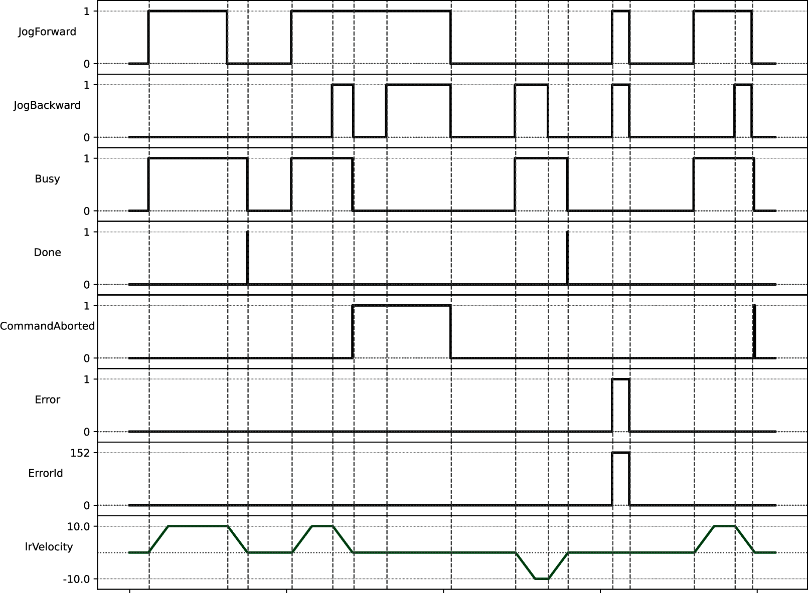
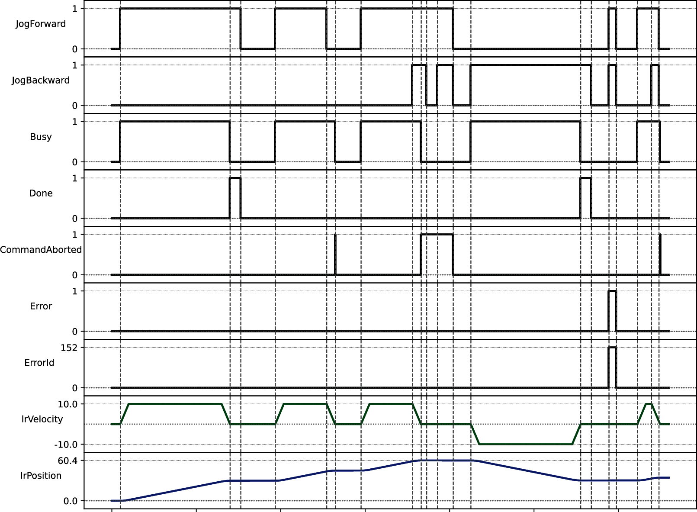
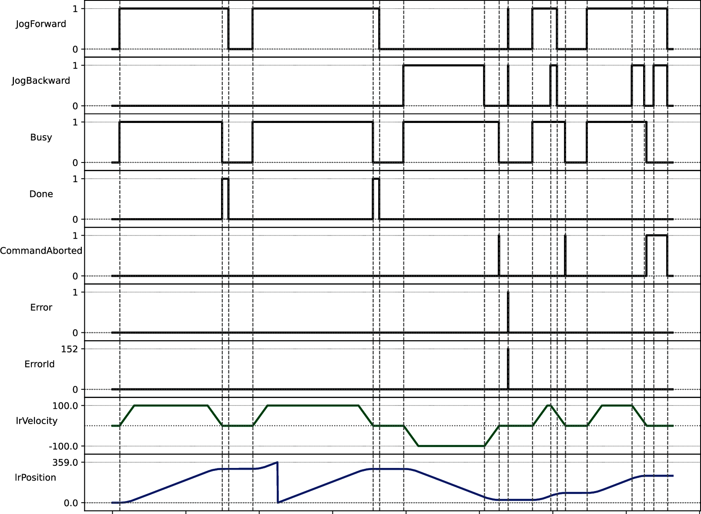

# MC\_Jog

## Functional Description

This function block lets you perform jog movements. The value at the input JogType determines the type of jog movement to be performed:

* Velocity
* PositionOffset
* Position

Before a jog movement can be started, the value at the inputs JogForward and JogBackward must be FALSE.

To start a jog movement, set the value at either the input JogForward or the input JogBackward to TRUE. The jog movement starts with the values supplied via the inputs Position, Velocity, Acceleration, Deceleration and Jerk, depending on the selected jog type.

During jog movements, the PLCopen state of the axis is ContinuousMotion.

The velocity can be modified during a jog movement.

**Jog type Velocity**

This jog type performs a jog movement with the velocity specified for the input Velocity (similar to MC\_MoveVelocity). Permissible values for the input Velocity are LREAL values.

Signal diagram for jog type Velocity:

**Jog type PositionOffset**

This jog type performs a jog movement from the present position by a distance specified at the input Position (similar to MC\_MoveRelative). Permissible values for the input Velocity are positive LREAL values and zero.

If an attempt is made to start a jog movement of this type with a negative velocity value, an error is detected. If the velocity value is set to a negative value during a jog movement of this type, the function block treats the value as zero.

Signal diagram for jog type PositionOffset:

**Jog type Position**

This jog type performs a movement to the position specified for the input Position (similar to MC\_MoveAbsolute). Permissible values for the input Velocity are positive LREAL values and zero.

If a jog movement with this jog type is started and the value at the input JogForward is TRUE, but the specified position value is less than the present position, an error is detected (WrongJogDirection). If a jog movement with this jog type is started and the value at the input JogBackward is TRUE, but the specified position value is greater than the present position, an error is detected (WrongJogDirection).

If the axis is a modulo axis, a new movement can be started from the position value, the movement covers a distance of one modulo range until the same position value is reached again. This is different from MC\_MoveAbsolute.

If an attempt is made to start a jog movement of this type with a negative velocity value, an error is detected. If the velocity value is set to a negative value during a jog movement of this type, the function block treats the value as zero.

Signal diagram for jog type Position:

NOTE:

If both inputs JogForward and JogBackward are set to TRUE, the following applies, depending on whether a jog movement is active or not:

* No active jog movement: the jog movement does not start (detected error WrongJogDirection).
* Jog movement active: the jog movement is stopped with the specified deceleration ramp and the output CommandAborted is set to TRUE once the movement has come to a stop.

## Inputs

| Input | Data type | Description |
| --- | --- | --- |
| Axis | Axis\_Ref | Reference to the axis for which the function block is to be executed. |
| JogForward | BOOL | Specifies the direction of the jog movement. |
| JogBackward | BOOL | Specifies the direction of the jog movement. |
| JogType | MC\_JogType | Specifies the type of the jog movement.  Possible values:   * Velocity * Position * PositionOffset |
| Position | LREAL | Value range: Positive LREAL value  Default value: 0  Target position absolute in user-defined units. |
| Velocity | LREAL | Value range with JogType Velocity: LREAL value  Value range with JogType Position and PositionOffset: Positive LREAL value and zero  Default value: 0  Target velocity in user-defined units. |
| Acceleration | LREAL | Value range: A positive LREAL value  Default value: 0  Acceleration in user-defined units. |
| Deceleration | LREAL | Value range: A positive LREAL value  Default value: 0  Deceleration in user-defined units. |
| Jerk | LREAL | Value range: A positive LREAL value and zero   * Positive values: Jerk limit (in units/s3) (maximum jerk with which the acceleration is modified). * Zero: Jerk limit disabled. The acceleration jumps from zero to maximum acceleration (infinite jerk).   Default value: 0 |

## Outputs

| Output | Data type | Description |
| --- | --- | --- |
| Done | BOOL | Value range: FALSE, TRUE.  Default value: FALSE.   * FALSE: Execution has not been finished, or an error has been detected. * TRUE: Execution terminated without an error detected. |
| Busy | BOOL | Value range: FALSE, TRUE.  Default value: FALSE.   * FALSE: Function block is not being executed. * TRUE: Function block is being executed. |
| CommandAborted | BOOL | Value range: FALSE, TRUE.  Default value: FALSE.   * FALSE: Execution has not been aborted. * TRUE: Execution has been aborted by another function block. |
| Error | BOOL | Value range: FALSE, TRUE.  Default value: FALSE.   * FALSE: Function block is being executed, no error has been detected during execution. * TRUE: An error has been detected in the execution of the function block. |
| ErrorID | [ET\_Result](ET_Result-GeneralInformation-13E75E6E.html#ET_Result-GeneralInformation-13E75E6E) | This enumeration provides diagnostics information. |

EIO0000003871.08