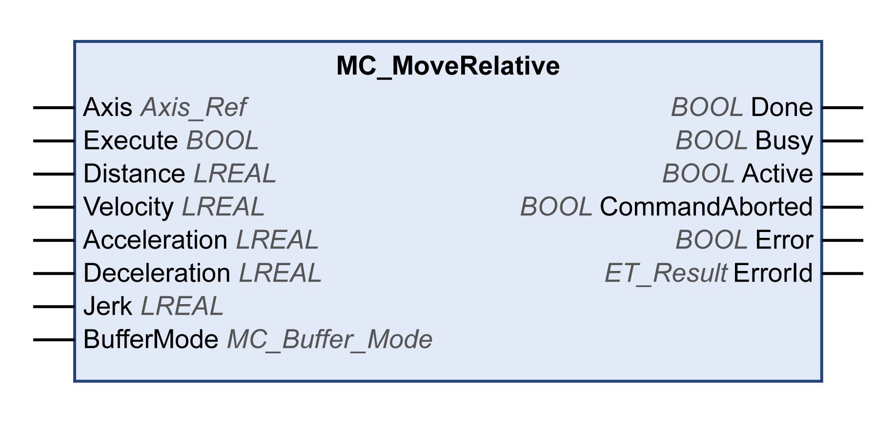

# MC\_MoveRelative

## Functional Description

This function block performs a movement with a specified distance with reference to the position.

## Graphical Representation

## Inputs

| Input | Data type | Description |
| --- | --- | --- |
| Axis | Axis\_Ref | Reference to the axis for which the function block is to be executed. |
| Execute | BOOL | Value range: FALSE, TRUE.  Default value: FALSE.  A rising edge of the input Execute starts the function block. The function block continues execution and the output Busy is set to TRUE.  This function block can be restarted while it is executed. The target values are overwritten by the new values at the point in time the rising edge occurs. |
| Distance | LREAL | Value range: LREAL value  Default value: 0.  Target position relative with reference to the position. |
| Velocity | LREAL | Value range: A positive LREAL value  Default value: 0  Target velocity in user-defined units. |
| Acceleration | LREAL | Value range: A positive LREAL value  Default value: 0  Acceleration in user-defined units. |
| Deceleration | LREAL | Value range: A positive LREAL value  Default value: 0  Deceleration in user-defined units. |
| Jerk | LREAL | Value range: A positive LREAL value and zero   * Positive values: Jerk limit (in units/s3) (maximum jerk with which the acceleration is modified). * Zero: Jerk limit disabled. The acceleration jumps from zero to maximum acceleration (infinite jerk).   Default value: 0 |
| BufferMode | [MC\_Buffer\_Mode](D-SE-0094936.html#D-SE-0094936__D-SE-0094936.4) | Default value: Aborting  Buffer mode.  Possible values:   * Value Aborting * Value Buffered * Value BlendingLow * Value BlendingPrevious * Value BlendingNext * Value BlendingHigh   See MC\_Buffer\_Mode for a description of the values. |

## Outputs

| Output | Data type | Description |
| --- | --- | --- |
| Done | BOOL | Value range: FALSE, TRUE.  Default value: FALSE.   * FALSE: Execution has not been finished, or an error has been detected. * TRUE: Execution terminated without an error detected. |
| Busy | BOOL | Value range: FALSE, TRUE.  Default value: FALSE.   * FALSE: Function block is not being executed. * TRUE: Function block is being executed. |
| Active | BOOL | Value range: FALSE, TRUE.  Default value: FALSE.   * FALSE: The function block does not control the movement of the axis. * TRUE: The function block controls the movement of the axis. |
| CommandAborted | BOOL | Value range: FALSE, TRUE.  Default value: FALSE.   * FALSE: Execution has not been aborted. * TRUE: Execution has been aborted by another function block. |
| Error | BOOL | Value range: FALSE, TRUE.  Default value: FALSE.   * FALSE: Function block is being executed, no error has been detected during execution. * TRUE: An error has been detected in the execution of the function block. |
| ErrorID | [ET\_Result](ET_Result-GeneralInformation-13E75E6E.html#ET_Result-GeneralInformation-13E75E6E) | This enumeration provides diagnostics information. |

## Additional Information

[PLCopen State Diagram](D-SE-0086553.html#D-SE-0086553)

EIO0000003871.08