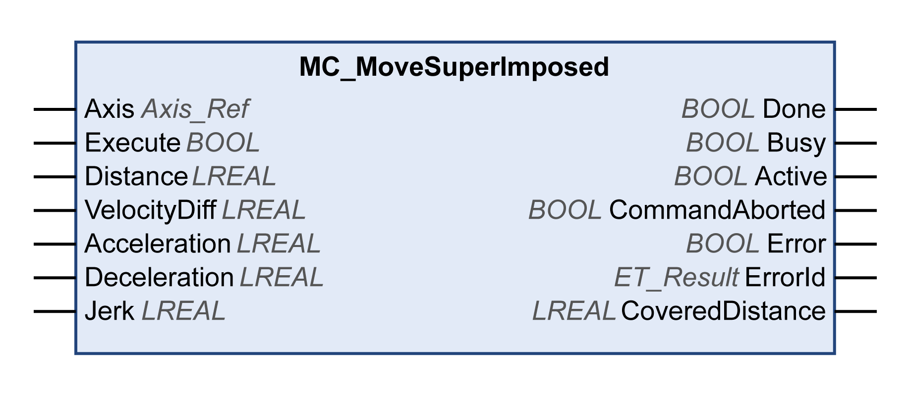

# MC\_MoveSuperImposed

## Functional Description

This function block performs a superimposed movement with a specified position offset with reference to the position of an ongoing movement.

The function block can be used to add an offset movement based on the measurements of an encoder or other sensor, for example, to compensate for size differences of irregularly shaped objects on a belt.

If a new function block MC\_MoveSuperImposed is started while another function block MC\_MoveSuperImposed  is still running, the running function block is aborted and the new one started. The underlying motion command is not aborted.

If the underlying function block is aborted by another function block, for example, MC\_Stop, the superimposed movement is aborted as well.

The output CoveredDistance indicates the distance moved.

## Graphical Representation

## Inputs

| Input | Data type | Description |
| --- | --- | --- |
| Axis | Axis\_Ref | Reference to the axis for which the function block is to be executed. |
| Execute | BOOL | Value range: FALSE, TRUE.  Default value: FALSE.  A rising edge of the input Execute starts the function block. The function block continues execution and the output Busy is set to TRUE.  This function block can be restarted while it is executed. The target values are overwritten by the new values at the point in time the rising edge occurs. |
| Distance | LREAL | Value range: LREAL value  Default value: 0  Additional distance to be superimposed in user-defined units. |
| VelocityDiff | LREAL | Value range: A positive LREAL value  Default value: 0  Value of the velocity difference of the additional movement in user-defined units. |
| Acceleration | LREAL | Value range: A positive LREAL value  Default value: 0  Acceleration in user-defined units. |
| Deceleration | LREAL | Value range: A positive LREAL value  Default value: 0  Deceleration in user-defined units. |
| Jerk | LREAL | Value range: A positive LREAL value and zero   * Positive values: Jerk limit (in units/s3) (maximum jerk with which the acceleration is modified). * Zero: Jerk limit disabled. The acceleration jumps from zero to maximum acceleration (infinite jerk).   Default value: 0 |

## Outputs

| Output | Data type | Description |
| --- | --- | --- |
| Done | BOOL | Value range: FALSE, TRUE.  Default value: FALSE.   * FALSE: Execution has not been finished, or an error has been detected. * TRUE: Execution terminated without an error detected. |
| Busy | BOOL | Value range: FALSE, TRUE.  Default value: FALSE.   * FALSE: Function block is not being executed. * TRUE: Function block is being executed.   NOTE: The output Busy remains TRUE even when the target velocity has been reached or Execute becomes FALSE. The output Busy is set to FALSE as soon as another function block such as MC\_Stop is executed. |
| Active | BOOL | Value range: FALSE, TRUE.  Default value: FALSE.   * FALSE: The function block does not control the movement of the axis. * TRUE: The function block controls the movement of the axis. |
| CommandAborted | BOOL | Value range: FALSE, TRUE.  Default value: FALSE.   * FALSE: Execution has not been aborted. * TRUE: Execution has been aborted by another function block. |
| Error | BOOL | Value range: FALSE, TRUE.  Default value: FALSE.   * FALSE: Function block is being executed, no error has been detected during execution. * TRUE: An error has been detected in the execution of the function block. |
| ErrorID | [ET\_Result](ET_Result-GeneralInformation-13E75E6E.html#ET_Result-GeneralInformation-13E75E6E) | This enumeration provides diagnostics information. |
| CoveredDistance | LREAL | Value range: LREAL value  Default value: 0  Indicates the distance moved in user-defined units. |

## Notes

Setting the input Distance to 0 halts the superimposed movements without halting the underlying movement (acts like the function block MC\_HaltSuperimposed which is not separately implemented in the library).

Starting a function block MC\_MoveAdditive while a function block MC\_MoveSuperImposed  is running results in a detected error.

The implementation of the function block MC\_MoveSuperimposed complies with the specifications of PLCopen Motion Control Part 1, Version 2.0. It differs from the SoftMotion SM3\_Basic library (refer to [Specific Information on Individual Function Blocks](D-SE-0096706.html#D-SE-0096706__D-SE-0096706.8)).

EIO0000003871.08