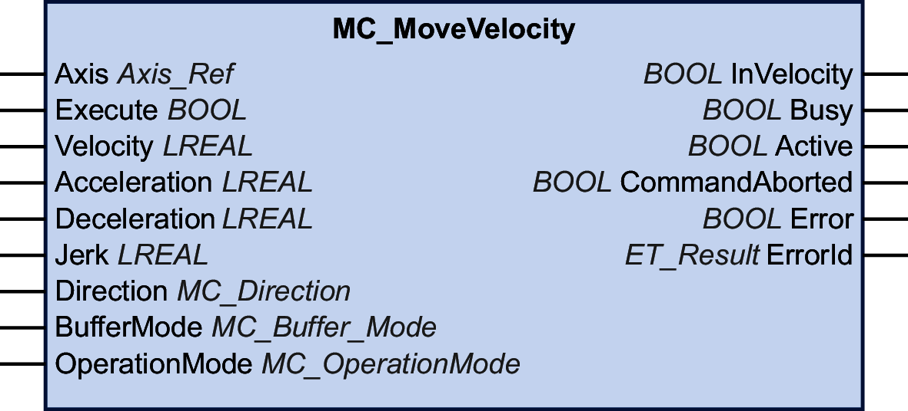

# MC\_MoveVelocity

## Functional Description

This function block performs a movement with a specified target velocity.

## Graphical Representation

## Inputs

| Input | Data type | Description |
| --- | --- | --- |
| Axis | Axis\_Ref | Reference to the axis for which the function block is to be executed. |
| Execute | BOOL | Value range: FALSE, TRUE.  Default value: FALSE.  A rising edge of the input Execute starts the function block. The function block continues execution and the output Busy is set to TRUE.  This function block can be restarted while it is executed. The target values are overwritten by the new values at the point in time the rising edge occurs. |
| Velocity | LREAL | Value range: LREAL value  Default value: 0  Target velocity in user-defined units. Negative values for the target velocity invert the direction of the movement. |
| Acceleration | LREAL | Value range: A positive LREAL value  Default value: 0  Acceleration in user-defined units.  The value at this input is used to reach the specified target velocity (acceleration). |
| Deceleration | LREAL | Value range: A positive LREAL value  Deceleration in user-defined units.  Default value: -1  NOTE: If the default value of -1 presented at the input Deceleration is used as a signal that the parameter has not been modified and therefore, the value at the input Acceleration is also used for the deceleration. |
| Jerk | LREAL | Value range: A positive LREAL value and zero   * Positive values: Jerk limit (in units/s3) (maximum jerk with which the acceleration is modified). * Zero: Jerk limit disabled. The acceleration jumps from zero to maximum acceleration (infinite jerk).   Default value: 0 |
| Direction | [MC\_Direction](D-SE-0094936.html#D-SE-0094936__D-SE-0094936.3) | Default value: PositiveDirection  Direction of movement.  Possible values:   * Value PositiveDirection * Value NegativeDirection   See [MC\_Direction](D-SE-0094936.html#D-SE-0094936__D-SE-0094936.3) for a description of the values. |
| BufferMode | [MC\_Buffer\_Mode](D-SE-0094936.html#D-SE-0094936__D-SE-0094936.4) | Default value: Aborting  Buffer mode.  Possible values:   * Value Aborting * Value Buffered * Value BlendingLow * Value BlendingPrevious * Value BlendingNext * Value BlendingHigh   See [MC\_Buffer\_Mode](D-SE-0094936.html#D-SE-0094936__D-SE-0094936.4) for a description of the values. |
| OperationMode | [MC\_OperationMode](D-SE-0094936.html#D-SE-0094936__D-SE-0094936.13) | Operating mode of the function block  Default value: Position  Possible values:   * Value Position * Value Velocity   See [MC\_OperationMode](D-SE-0094936.html#D-SE-0094936__D-SE-0094936.13) for a description of the values. |

## Outputs

| Output | Data type | Description |
| --- | --- | --- |
| InVelocity | BOOL | Value range: FALSE, TRUE.  Default value: FALSE.   * FALSE: Target value not reached. * TRUE: Target value reached. |
| Busy | BOOL | Value range: FALSE, TRUE.  Default value: FALSE.   * FALSE: Function block is not being executed. * TRUE: Function block is being executed.   NOTE: The output Busy remains TRUE even when the target velocity has been reached or Execute becomes FALSE. The output Busy is set to FALSE as soon as another function block such as MC\_Stop is executed. |
| Active | BOOL | Value range: FALSE, TRUE.  Default value: FALSE.   * FALSE: The function block does not control the movement of the axis. * TRUE: The function block controls the movement of the axis. |
| CommandAborted | BOOL | Value range: FALSE, TRUE.  Default value: FALSE.   * FALSE: Execution has not been aborted. * TRUE: Execution has been aborted by another function block. |
| Error | BOOL | Value range: FALSE, TRUE.  Default value: FALSE.   * FALSE: Function block is being executed, no error has been detected during execution. * TRUE: An error has been detected in the execution of the function block. |
| ErrorID | [ET\_Result](ET_Result-GeneralInformation-13E75E6E.html#ET_Result-GeneralInformation-13E75E6E) | This enumeration provides diagnostics information. |

## Notes

The output Busy remains TRUE even if the target velocity has been reached or the input Execute is set to FALSE. The output Busy is set to FALSE as soon as another function block such as MC\_Stop is executed.

If you use MC\_MoveVelocity to move an axis continuously in the same direction and if the input OperationMode is set to Position, define this axis as modulo axis. Refer to [Movement Range and Position Calculation With Floating-Point Numbers](D-SE-0096412.html#D-SE-0096412__D-SE-0096412.6) for additional information.

The function block can be used with two different operating modes. See data type [MC\_OperationMode](D-SE-0094936.html#D-SE-0094936__D-SE-0094936.13) for details.

## Additional Information

[PLCopen State Diagram](D-SE-0086553.html#D-SE-0086553)

EIO0000003871.08