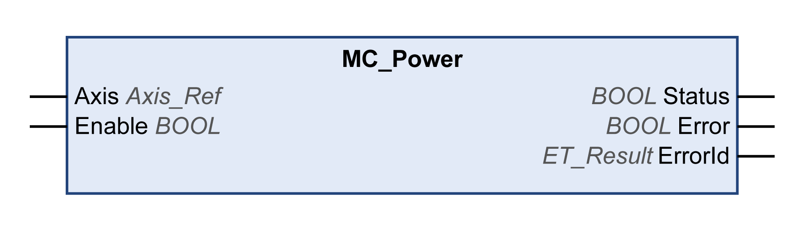

# MC\_Power

## Functional Description

This function block enables or disables the power stage of the drive.

TRUE at the input Enable enables the power stage. Once the power stage is enabled, the output Status is set.

FALSE at the input Enable disables the power stage. Once the power stage is disabled, the output Status is reset.

If errors are detected during execution, the output Error is set.

Whenever the function block is called, the input Enable is compared to the output Status. If these values are different, a new command is executed, either to enable the power stage (Enable = TRUE and Status = FALSE) or to disable the power stage (Enable = FALSE and Status = TRUE). The function must be called as long as the requested state of the power stage is reached or until an error is detected. If a function block error (for example, time-out) is detected, the Error output is set. The output is reset with the next call of the function block if the cause of the detected error has been removed and acknowledged with MC\_Reset.

If the power stage is not enabled within a timeout of 3000 ms, an error is detected. In such a case, remove the cause of the error and trigger MC\_Power. You can use the functions FC\_SetPowerEnableTimeout and FC\_GetPowerEnableTimeout of the SercosMaster library to modify the default timeout value of 3000 ms and to read the timeout value.

Call this function block cyclically, for example, in order to detect errors of the axis.

Use only a single instance of this function block per axis.

## Graphical Representation

## Inputs

| Input | Data type | Description |
| --- | --- | --- |
| Axis | Axis\_Ref | Reference to the axis for which the function block is to be executed. |
| Enable | BOOL | Value range: FALSE, TRUE.  Default value: FALSE.  The input enables or disables the power stage of the drive:   * FALSE: Disable the power stage. * TRUE: Enable the power stage. |

## Outputs

| Output | Data type | Description |
| --- | --- | --- |
| Status | BOOL | Value range: FALSE, TRUE.  Default value: FALSE.   * FALSE: Power stage is disabled. * TRUE: Power stage is enabled. |
| Error | BOOL | Value range: FALSE, TRUE.  Default value: FALSE.   * FALSE: Function block is being executed, no error has been detected during execution. * TRUE: An error has been detected in the execution of the function block. |
| ErrorID | [ET\_Result](ET_Result-GeneralInformation-13E75E6E.html#ET_Result-GeneralInformation-13E75E6E) | This enumeration provides diagnostics information. |

## Additional Information

[PLCopen State Diagram](D-SE-0086553.html#D-SE-0086553)

EIO0000003871.08