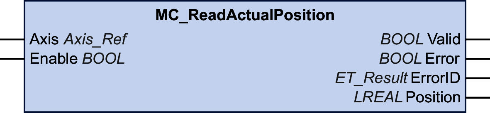

# MC\_ReadActualPosition

## Functional Description

This function block returns the position in user-defined units.

For a simulated drive, the output ET\_Result is set to NoActualValuesWithSimulatedDrive.

## Graphical Representation

## Inputs

| Input | Data type | Description |
| --- | --- | --- |
| Axis | Axis\_Ref | Reference to the axis for which the function block is to be executed. |
| Enable | BOOL | Value range: FALSE, TRUE.  Default value: FALSE.  The input Enable starts or terminates execution of a function block.   * FALSE: Execution of the function block is terminated. The outputs Valid, Busy, and Error are set to FALSE. * TRUE: The function block is being executed. The function block continues executing as long as the input Enable is set to TRUE.   The input Enable starts or terminates execution of a function block.   * FALSE: Execution of the function block is terminated. The outputs Valid and Error are set to FALSE. * TRUE: The function block is being executed. The function block continues executing as long as the input Enable is set to TRUE. |

## Outputs

| Output | Data type | Description |
| --- | --- | --- |
| Valid | BOOL | Value range: FALSE, TRUE.  Default value: FALSE.   * TRUE: The value at the output Position is valid. * FALSE: The value at the output Position is invalid. |
| Error | BOOL | Value range: FALSE, TRUE.  Default value: FALSE.   * FALSE: Function block is being executed, no error has been detected during execution. * TRUE: An error has been detected in the execution of the function block. |
| ErrorID | [ET\_Result](ET_Result-GeneralInformation-13E75E6E.html#ET_Result-GeneralInformation-13E75E6E) | This enumeration provides diagnostics information. |
| Position | LREAL | Position in user-defined units. |

EIO0000003871.08