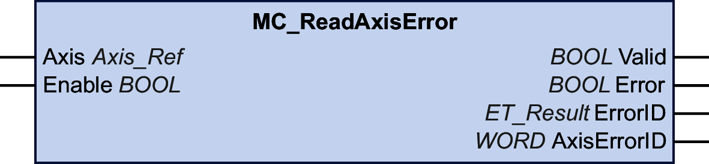

# MC\_ReadAxisError

## Functional Description

This function block returns information on detected axis errors and detected drive errors.

Detected drive errors are read from the Sercos IDN S-0-0390 (diagnostic number). The drive used must support this IDN for manufacturer-specific drive errors to be indicated. If detected drive errors are to be indicated, you must map this IDN in the cyclic data.

If you do not map the IDN and a drive error is detected, the output AxisErrorID of the function block is set to 35 (this corresponds to the value DriveInError of the enumeration ET\_Result).

Bits 0 to 15 of the diagnostic number represent manufacturer-specific drive errors. Values below 4096 (1000 hex) represent detected axis errors, values above 4096 represent detected drive errors.

If an error is detected reading the IDN, the output AxisErrorID of the function block is set to 65535 (FFFF hex).

## Graphical Representation

## Inputs

| Input | Data type | Description |
| --- | --- | --- |
| Axis | Axis\_Ref | Reference to the axis for which the function block is to be executed. |
| Enable | BOOL | Value range: FALSE, TRUE.  Default value: FALSE.  The input Enable starts or terminates execution of a function block.   * FALSE: Execution of the function block is terminated. The outputs Valid and Error are set to FALSE. * TRUE: The function block is being executed. The function block continues executing as long as the input Enable is set to TRUE. |

## Outputs

| Output | Data type | Description |
| --- | --- | --- |
| Valid | BOOL | Value range: FALSE, TRUE.  Default value: FALSE.   * TRUE: The value at the output AxisErrorID is valid. * FALSE: The value at the output AxisErrorID is invalid. |
| Error | BOOL | Value range: FALSE, TRUE.  Default value: FALSE.   * FALSE: Function block is being executed, no error has been detected during execution. * TRUE: An error has been detected in the execution of the function block. |
| ErrorID | [ET\_Result](ET_Result-GeneralInformation-13E75E6E.html#ET_Result-GeneralInformation-13E75E6E) | This enumeration provides diagnostics information. |
| AxisErrorID | WORD | Value of the axis error property. Values below 4096 (1000 hex) represent detected axis errors, values above 4096 represent manufacturer-specific detected drive errors.  If the Sercos IDN S-0-0390 is not mapped and a drive error is detected, this output is set to 35 (this corresponds to the value DriveInError of the enumeration ET\_Result). |

EIO0000003871.08