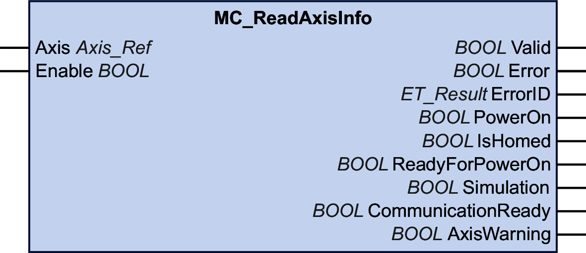

# MC\_ReadAxisInfo

## Functional Description

This function block returns detailed status information on the connected axis such as the operating state of the drive and status information.

## Graphical Representation

## Inputs

| Input | Data type | Description |
| --- | --- | --- |
| Axis | Axis\_Ref | Reference to the axis for which the function block is to be executed. |
| Enable | BOOL | Value range: FALSE, TRUE.  Default value: FALSE.  The input Enable starts or terminates execution of a function block.   * FALSE: Execution of the function block is terminated. The outputs Valid, Busy, and Error are set to FALSE. * TRUE: The function block is being executed. The function block continues executing as long as the input Enable is set to TRUE. |

## Outputs

| Output | Data type | Description |
| --- | --- | --- |
| Valid | BOOL | Value range: FALSE, TRUE.  Default value: FALSE.   * TRUE: The values at the outputs PowerOn, IsHomed, ReadyForPowerOn, CommunicationReady, PowerOn and AxisWarning are valid. * FALSE: One of the values at the outputs PowerOn, IsHomed, ReadyForPowerOn, CommunicationReady, PowerOn or AxisWarning is invalid. |
| Error | BOOL | Value range: FALSE, TRUE.  Default value: FALSE.   * FALSE: Function block is being executed, no error has been detected during execution. * TRUE: An error has been detected in the execution of the function block. |
| ErrorID | [ET\_Result](ET_Result-GeneralInformation-13E75E6E.html#ET_Result-GeneralInformation-13E75E6E) | This enumeration provides diagnostics information. |
| PowerOn | BOOL | Value range: FALSE, TRUE.  Default value: FALSE.   * TRUE: The power stage of the drive is enabled. * FALSE: The power stage of the drive is not enabled.   NOTE: In the case of a simulated drive, the drive behaves as if its power stage had been enabled. In the case of a virtual axis, the axis behaves as if power had been applied. |
| IsHomed | BOOL | Value range: FALSE, TRUE.  Default value: FALSE.   * TRUE: The axis is homed. * FALSE: The axis is not homed. |
| ReadyForPowerOn | BOOL | Value range: FALSE, TRUE.  Default value: FALSE.   * TRUE: The power stage of the drive is ready to be enabled. Status word of the drive (Sercos IDN S-0-0135): Bit 13 is 0, bit 14 is 0, bit 15 is 1. * FALSE: The power stage of the drive is not ready to be enabled. The bits of the status word of the drive do not have the values required for the power stage to be ready to be enabled. |
| Simulation | BOOL | Value range: FALSE, TRUE.  Default value: FALSE.   * TRUE: The axis is simulated. * FALSE: The axis is not simulated. |
| CommunicationReady | BOOL | Value range: FALSE, TRUE.  Default value: FALSE.   * TRUE: The axis is ready for communication. * FALSE: The axis is not ready for communication.   For a simulated drive, the value is TRUE if Sercos is in communication phase 4. For a virtual drive, the value is TRUE. |
| AxisWarning | BOOL | Value range: FALSE, TRUE.  Default value: FALSE.   * TRUE: An error of class 0 has been detected for the drive. Bit 12 of the status word of the drive (Sercos IDN S-0-0135) is 1. * FALSE: No error of class 0 has been detected for the drive. Bit 12 of the status word of the drive (Sercos IDN S-0-0135) is 0. |

EIO0000003871.08