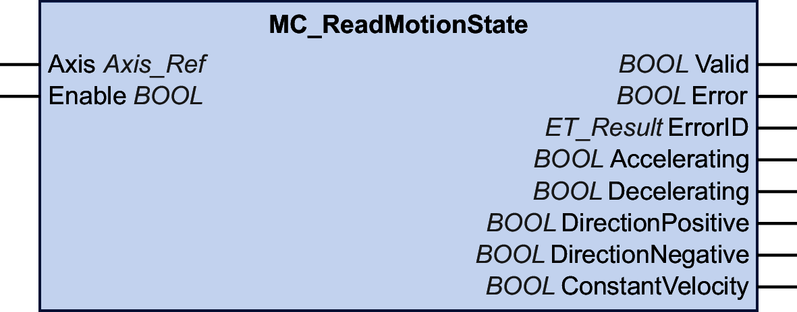

# MC\_ReadMotionState

## Functional Description

This function block returns detailed status information on the movement of the connected axis.

## Graphical Representation

## Inputs

| Input | Data type | Description |
| --- | --- | --- |
| Axis | Axis\_Ref | Reference to the axis for which the function block is to be executed. |
| Enable | BOOL | Value range: FALSE, TRUE.  Default value: FALSE.  The input Enable starts or terminates execution of a function block.   * FALSE: Execution of the function block is terminated. The outputs Valid, Busy, and Error are set to FALSE. * TRUE: The function block is being executed. The function block continues executing as long as the input Enable is set to TRUE. |

## Outputs

| Output | Data type | Description |
| --- | --- | --- |
| Valid | BOOL | Value range: FALSE, TRUE.  Default value: FALSE.   * TRUE: The values at the outputs Accelerating, Deceleraing, DirectionPositive, DirectionNegative and ConstantVelocity are valid. * FALSE: One of the values at the outputs Accelerating, Deceleraing, DirectionPositive, DirectionNegative or ConstantVelocity is invalid. |
| Error | BOOL | Value range: FALSE, TRUE.  Default value: FALSE.   * FALSE: Function block is being executed, no error has been detected during execution. * TRUE: An error has been detected in the execution of the function block. |
| ErrorID | [ET\_Result](ET_Result-GeneralInformation-13E75E6E.html#ET_Result-GeneralInformation-13E75E6E) | This enumeration provides diagnostics information. |
| Accelerating | BOOL | Value range: FALSE, TRUE.  Default value: FALSE.   * TRUE: The value of the absolute velocity increases. * FALSE: The value of the absolute velocity does not increase. |
| Decelerating | BOOL | Value range: FALSE, TRUE.  Default value: FALSE.   * TRUE: The value of the absolute velocity decreases. * FALSE: The value of the absolute velocity does not decrease. |
| DirectionPositive | BOOL | Value range: FALSE, TRUE.  Default value: FALSE.   * TRUE: The value of the position increases. * FALSE: The value of the position does not increase. |
| DirectionNegative | BOOL | Value range: FALSE, TRUE.  Default value: FALSE.   * TRUE: The value of the position decreases. * FALSE: The value of the position does not decrease. |
| ConstantVelocity | BOOL | Value range: FALSE, TRUE.  Default value: FALSE.   * TRUE: The value of the velocity is constant and the value of lrAcceleration is equal to zero. * FALSE: The value of the velocity is not constant and the value of lrAcceleration is not equal to zero. |

EIO0000003871.08