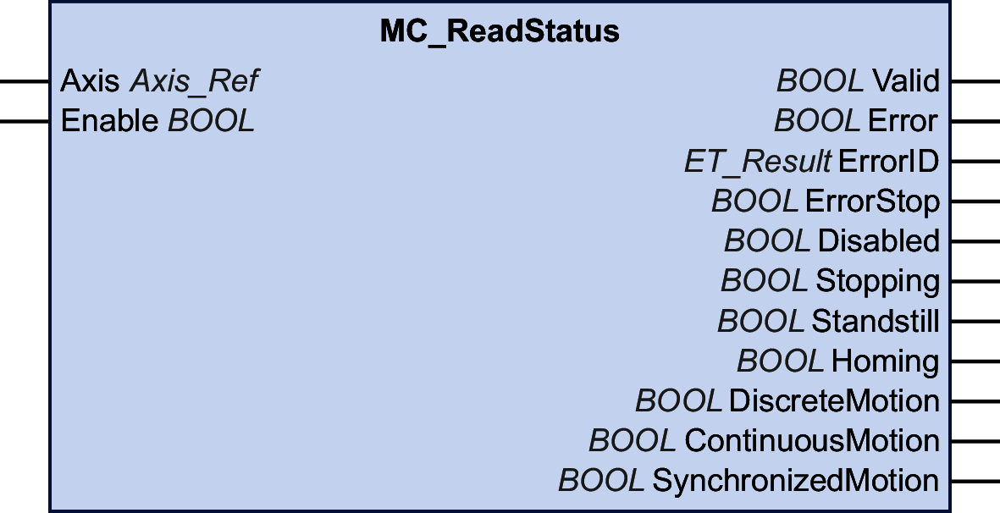

# MC\_ReadStatus

## Functional Description

This function block provides information on the PLCopen operating state of the connected axis.

## Graphical Representation

## Inputs

| Input | Data type | Description |
| --- | --- | --- |
| Axis | Axis\_Ref | Reference to the axis for which the function block is to be executed. |
| Enable | BOOL | Value range: FALSE, TRUE.  Default value: FALSE.  The input Enable starts or terminates execution of a function block.   * FALSE: Execution of the function block is terminated. The outputs Valid, Busy, and Error are set to FALSE. * TRUE: The function block is being executed. The function block continues executing as long as the input Enable is set to TRUE. |

## Outputs

| Output | Data type | Description |
| --- | --- | --- |
| Valid | BOOL | Value range: FALSE, TRUE.  Default value: FALSE.   * TRUE: The values at the outputs ErrorStop, Disabled, Stopping, Standstill, Homing, DiscreteMotion, ContinuousMotion and SynchronizedMotion are valid. * FALSE: One of the values at the outputs ErrorStop, Disabled, Stopping, Standstill, Homing, DiscreteMotion, ContinuousMotion and SynchronizedMotion is invalid. |
| Error | BOOL | Value range: FALSE, TRUE.  Default value: FALSE.   * FALSE: Function block is being executed, no error has been detected during execution. * TRUE: An error has been detected in the execution of the function block. |
| ErrorID | [ET\_Result](ET_Result-GeneralInformation-13E75E6E.html#ET_Result-GeneralInformation-13E75E6E) | This enumeration provides diagnostics information. |
| ErrorStop | BOOL | Value range: FALSE, TRUE.  Default value: FALSE.   * TRUE: The axis is in the PLCopen operating state ErrorStop. * FALSE: The axis is not in the PLCopen operating state ErrorStop. |
| Disabled | BOOL | Value range: FALSE, TRUE.  Default value: FALSE.   * TRUE: The axis is in the PLCopen operating state Disabled. * FALSE: The axis is not in the PLCopen operating state Disabled. |
| Stopping | BOOL | Value range: FALSE, TRUE.  Default value: FALSE.   * TRUE: The axis is in the PLCopen operating state Stopping. * FALSE: The axis is not in the PLCopen operating state Stopping. |
| Standstill | BOOL | Value range: FALSE, TRUE.  Default value: FALSE.   * TRUE: The axis is in the PLCopen operating state Standstill. * FALSE: The axis is not in the PLCopen operating state Standstill. |
| Homing | BOOL | Value range: FALSE, TRUE.  Default value: FALSE.   * TRUE: The axis is in the PLCopen operating state Homing. * FALSE: The axis is not in the PLCopen operating state Homing. |
| DiscreteMotion | BOOL | Value range: FALSE, TRUE.  Default value: FALSE.   * TRUE: The axis is in the PLCopen operating state DiscreteMotion. * FALSE: The axis is not in the PLCopen operating state DiscreteMotion. |
| ContinuousMotion | BOOL | Value range: FALSE, TRUE.  Default value: FALSE.   * TRUE: The axis is in the PLCopen operating state ContinuousMotion. * FALSE: The axis is not in the PLCopen operating state ContinuousMotion. |
| SynchronizedMotion | BOOL | Value range: FALSE, TRUE.  Default value: FALSE.   * TRUE: The axis is in the PLCopen operating state SynchronizedMotion. * FALSE: The axis is not in the PLCopen operating state SynchronizedMotion. |

NOTE: Refer to [PLCopen State Diagram](D-SE-0086553.html) for additional information.

EIO0000003871.08