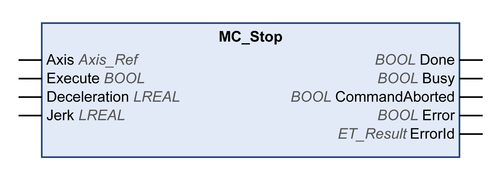

# MC\_Stop

## Functional Description

The function block MC\_Stop triggers a stop of the drive. The stop is performed with the values of the inputs Deceleration and Jerk. No parameters of the drive are used, subject to the following exceptions:

* If the function block is used in the operating mode Cyclic Synchronous Torque to abort a function block [MC\_TorqueControl](MC_TorqueControl-126233DE.html), the values of the inputs Deceleration and Jerk are ignored and the stop is performed with the maximum current specified via the corresponding drive parameter. For details, refer to the user guide of the drive.
* If the function block is used for an LXM32S drive to abort a function block [MC\_Home](D-SE-0094568.html), the values of the inputs Deceleration and Jerk are ignored and the stop is performed with the values set for the drive parameter LIM\_HaltReaction. For details, refer to the user guide of the drive.

When this function block is executed, the axis transitions to the PLCopen operating state Stopping and remains in this operating state as long as the input Execute is TRUE. As long as the axis is in this operating state, no other function block can be executed.

After successful completion of the function block, the axis transitions to the operating state StandStill. After a stop in the operating mode Cyclic Synchronous Torque, the operating mode is set to Position (refer to data type [MC\_OperationMode](D-SE-0094936.html#D-SE-0094936__D-SE-0094936.13) for details).

A running function block MC\_Stop can be aborted with a new function block MC\_Stop. In this case, the values of the inputs Deceleration and Jerk of the new function block are applied.

This way, a function block MC\_Stop can be re-executed with modified values for the inputs Deceleration and Jerk.

## Graphical Representation

## Inputs

| Input | Data type | Description |
| --- | --- | --- |
| Axis | Axis\_Ref | Reference to the axis for which the function block is to be executed. |
| Execute | BOOL | Value range: FALSE, TRUE.  Default value: FALSE.  A rising edge of the input Execute starts the function block. The function block continues execution and the output Busy is set to TRUE.  This function block can be restarted while it is executed. The target values are overwritten by the new values at the point in time the rising edge occurs. |
| Deceleration | LREAL | Value range: A positive LREAL value  Default value: 0  Deceleration in user-defined units. |
| Jerk | LREAL | Value range: A positive LREAL value and zero   * Positive values: Jerk limit (in units/s3) (maximum jerk with which the acceleration is modified). * Zero: Jerk limit disabled. The acceleration jumps from zero to maximum acceleration (infinite jerk).   Default value: 0 |

## Outputs

| Output | Data type | Description |
| --- | --- | --- |
| Done | BOOL | Value range: FALSE, TRUE.  Default value: FALSE.   * FALSE: Execution has not been finished, or an error has been detected. * TRUE: Execution terminated without an error detected. |
| Busy | BOOL | Value range: FALSE, TRUE.  Default value: FALSE.   * FALSE: Function block is not being executed. * TRUE: Function block is being executed. |
| CommandAborted | BOOL | Value range: FALSE, TRUE.  Default value: FALSE.   * FALSE: Execution has not been aborted. * TRUE: Execution has been aborted by another function block. |
| Error | BOOL | Value range: FALSE, TRUE.  Default value: FALSE.   * FALSE: Function block is being executed, no error has been detected during execution. * TRUE: An error has been detected in the execution of the function block. |
| ErrorID | [ET\_Result](ET_Result-GeneralInformation-13E75E6E.html#ET_Result-GeneralInformation-13E75E6E) | This enumeration provides diagnostics information. |

## Notes

As long as the input Execute is TRUE, no other function block except for MC\_Power can be started.

If an attempt is made to start a second function block MC\_Stop while another function block MC\_Stop is running, the output Error of the second MC\_Stop is set to TRUE and the axis continues to decelerate with the settings of the first MC\_Stop.

## Additional Information

[PLCopen State Diagram](D-SE-0086553.html#D-SE-0086553)

EIO0000003871.08