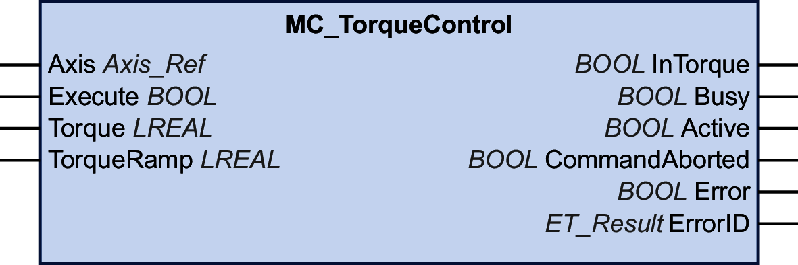

# MC\_TorqueControl

## Functional Description

This function block allows you to operate a drive in the operating mode Cyclic Synchronous Torque (CST).

In the operating mode Cyclic Synchronous Torque, movements are made with a specified target torque. The target torque in Nm is provided via the input Torque. The permissible torque range at this input is -30 times the continuous stall torque (M\_M\_0\_) to +30 times the continuous stall torque of the motor connected to the drive. Negative values start a movement in negative direction of movement.

The continuous stall torque is a motor-specific value. During phasing-up (transition to Communication Phase 2), the system determines the continuous stall torque value via the parameter P-3013-0-22. When the function block is started (value at the input Execute is set to TRUE), the system verifies that the torque value at the input Torque is valid.

The input TorqueRamp allows you to specify a torque ramp in Nm/s. If the value at the input TorqueRamp is 0, the torque specified via the input Torque is generated immediately without a torque ramp.

The output InTorque is set to TRUE once the specified target torque is reached.

The function block can be started when the axis is in the operating state StandStill.

The function block can be aborted in three ways:

* By another function block MC\_TorqueControl
* By disabling the power stage of the drive via the function block [MC\_Power](D-SE-0086556.html)
* Via the function block [MC\_Stop](D-SE-0086562.html)

If the requested operating mode is not confirmed by the drive within 30 Sercos cycles, an error is detected (output Error of the requesting function block is set to TRUE).

## Graphical Representation

## Inputs

| Input | Data type | Description |
| --- | --- | --- |
| Axis | Axis\_Ref | Reference to the axis for which the function block is to be executed. |
| Execute | BOOL | Value range: FALSE, TRUE.  Default value: FALSE.  A rising edge of the input Execute starts the function block. The function block continues execution and the output Busy is set to TRUE.  This function block can be restarted while it is executed. The target values are overwritten by the new values at the point in time the rising edge occurs. |
| Torque | LREAL | Target torque for the operating mode Cyclic Synchronous Torque in Nm  Value range: A positive LREAL value  Value range: -30 \* continuous stall torque (M\_M\_0\_) to +30 \* continuous stall torque (M\_M\_0\_) of the connected motor  Negative values trigger a movement in negative direction, positive values trigger a movement in positive direction of movement.  Default value: 0 |
| TorqueRamp | LREAL | Torque ramp for the operating mode Cyclic Synchronous Torque in Nm/s. If the input is set to 0, the target torque specified via the input Torque is generated immediately without a torque ramp.  Value range: A positive LREAL value  Default value: 0 |

## Outputs

| Output | Data type | Description |
| --- | --- | --- |
| InTorque | BOOL | This output indicates whether the specified target torque has been reached. Value range: FALSE, TRUE.  Default value: FALSE.   * FALSE: Execution has not been finished, or an error has been detected. * TRUE: Execution terminated without an error detected. |
| Busy | BOOL | Value range: FALSE, TRUE.  Default value: FALSE.   * FALSE: Function block is not being executed. * TRUE: Function block is being executed. |
| Active | BOOL | Value range: FALSE, TRUE.  Default value: FALSE.   * FALSE: The function block does not control the movement of the axis. * TRUE: The function block controls the movement of the axis. |
| CommandAborted | BOOL | Value range: FALSE, TRUE.  Default value: FALSE.   * FALSE: Execution has not been aborted. * TRUE: Execution has been aborted by another function block. |
| Error | BOOL | Value range: FALSE, TRUE.  Default value: FALSE.   * FALSE: Function block is being executed, no error has been detected during execution. * TRUE: An error has been detected in the execution of the function block. |
| ErrorID | [ET\_Result](ET_Result-GeneralInformation-13E75E6E.html#ET_Result-GeneralInformation-13E75E6E) | This enumeration provides diagnostics information. |

In the operating mode Cyclic Synchronous Torque, the drive can be in the PLCopen operating state Standstill. In this operating state, the target torque is 0 Nm. When the torque is 0 Nm, movements are possible, for example due to external forces.  There is no monitoring for physical standstill of the motor.

| WARNING | |
| --- | --- |
|  | UNINTENDED EQUIPMENT OPERATION  * In your risk assessment, take into account all consequences that can arise when the motor torque is 0 Nm. * Implement all measures required to ensure that a motor torque of 0 Nm at standstill does not result in hazardous movements as identified in your risk assessment (for example, install mechanical brakes).  Failure to follow these instructions can result in death, serious injury, or equipment damage. |

## Notes

The checkbox **TorqueOperationMode** on the tab Feature Configuration needs to be checked to enable the operating mode Cyclic Synchronous Torque.

In the case of LMX28S drives, you can use either the operating mode Cyclic Synchronous Torque or the operating mode Cyclic Synchronous Velocity (the operating modes are not available at the same time). Check only one of the two checkboxes.

You can use the function block MC\_ReadActualTorque to read the torque value.

EIO0000003871.08