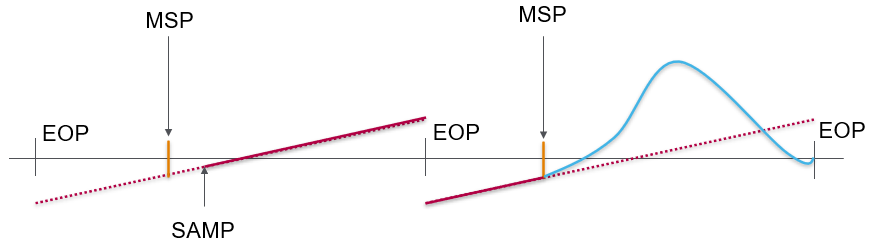
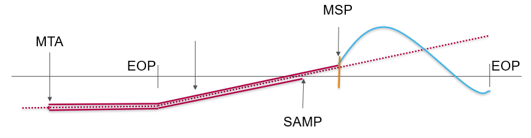
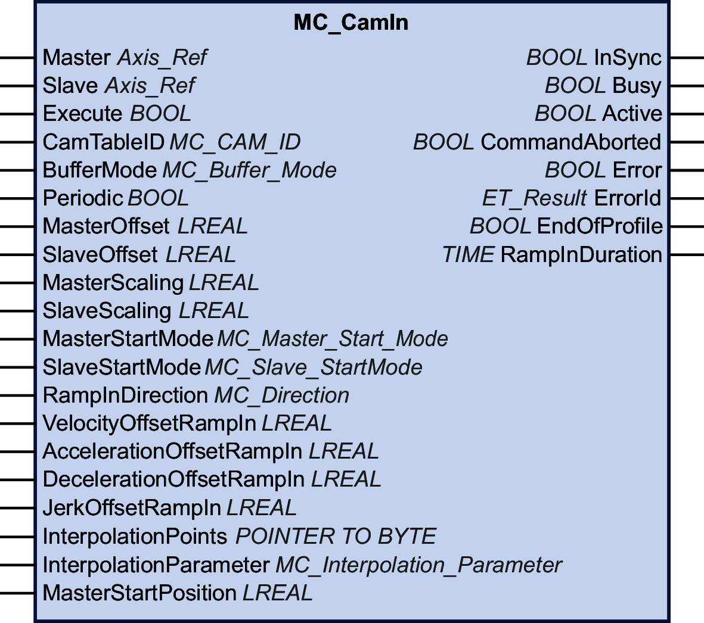

# MC\_CamIn

## Functional Description

This function block activates coupling of a master axis and a subordinate axis with the profile for an electronic cam specified in a cam table.

The library supports the following cam types (motion laws) via the CommonMotionTypes library (refer to ST\_MultiCam and ET\_CamType in the CommonMotionTypes library guide for details):

* Straight (straight line)
* Poly5Com (general fifth degree polynomial)
* SimplSin (simple sine)
* IncliSin (inclined sine)
* ModSin (modified sine)
* ModAccTrap (modified acceleration trapezoid)
* Poly5 (standard fifth degree polynomial)
* Parable2 (quadratic parabola)
* ModSinCom (general modified sine)
* ModAccTrapCom (general modified acceleration trapezoid)
* HarmComb (harmonic combination)
* SinStraightComb (sinus-straight line combination)

ST\_MultiCam is the same data structure used by PacDrive3 and therefore can be created with the same cam editor. For details on the motions laws and the cam editor, refer to the [EcoStruxure Machine Expert Programming Guide, Motion Editor](../../../../../api/crossBook?lang=en-US&virtualBookName=SoMProg&topicID=D_SE_0062374).

UserCam provided by PacDrive3 is not supported (detected error InvalidCamTableID).

| WARNING | |
| --- | --- |
|  | UNINTENDED EQUIPMENT OPERATION  Verify the physical position of the subordinate axis at the start of the cam and verify that it matches the position in the cam definition.  Failure to follow these instructions can result in death, serious injury, or equipment damage. |

In the case of absolute subordinate axis start mode, switching between two cams with certain combinations of master and subordinate axis scaling via the inputs MasterScaling and SlaveScaling can result in jumps in the subordinate axis position if no appropriate offset of the subordinate axis position is set at the point of switching.

| WARNING | |
| --- | --- |
|  | UNINTENDED EQUIPMENT OPERATION  Verify that you have set the correct offset of the subordinate axis position if you switch between two cams in absolute subordinate axis start mode and use master and subordinate axis scaling via the inputs MasterScaling and SlaveScaling.  Failure to follow these instructions can result in death, serious injury, or equipment damage. |

NOTE: The total working area of the axis depends on its parameterization. In order to help avoid mechanical damage by exceeding a defined limited working area, it is a good practice to limit movement by incorporating limit switches in your design to stop the axis if need be.

## Ramp-In Mechanism

The function block provides a ramp-in mechanism. The ramp-in mechanism is activated by setting the input SlaveStartMode to RampIn and configured via the inputs VelocityOffsetRampIn, AccelerationOffsetRampIn, DecelerationOffsetRampIn, and JerkOffsetRampIn. The ramp-in direction of a modulo axis can be set via the input RampInDirection.

## Interpolated Cam

The function block lets you implement interpolated cams. Four types of interpolated cams are available:

* Linear interpolation
* Interpolation with Poly5 cam law
* Linear non-equidistant interpolation
* Cubic interpolation

The cam is interpolated from an array of cam points. To use an interpolated cam, create an array in your application with a minimum of 3 points and a maximum of 10000 points.

**Linear interpolation:**

The array describes the function of the cam (Y = f(X)). The values you specify for the array are the Y coordinates of the cam points. These Y values are equidistantly distributed along the X axis (which means that the X coordinates are determined by the function block). The array values are assigned in ascending order to the individual points from left to right, starting with the lowest array index as the lowest X value.

**Interpolation with Poly5 cam law:**

The array describes the function of the cam in terms of the master position (X), the subordinate axis position (Y), the velocity at the cam point (V, corresponds to the slope), and the acceleration at the cam point (A, corresponds to the curvature). Use strictly monotonically increasing values for X.

**Linear non-equidistant interpolation:**

Linear non-equidistant interpolation allows you to define a cam with points having different X coordinate distances between two consecutive points. Use strictly monotonically increasing values for X.

**Cubic interpolation:**

Cubic interpolation mode allows you to define non-equidistant interpolation points that are used for interpolation with cubic splines. Equidistant interpolation points can be specified by explicitly defining X and Y values. Use strictly monotonically increasing values for X. Standard natural cubic spline is used for up to 100 interpolation points (curvature at limit points equals zero). This pre-calculated algorithm provides a continuous curvature. In the case of more than 100 interpolation points, Hermite cubic spline interpolation is used (no continuous curvature). Pre-calculations are not required.

To start an interpolated cam, set the input InterpolationPoints to the address of the array where the cam points are stored. If the input InterpolationPoints is not equal to zero on a positive edge of the input Execute, the function block MC\_CamIn starts an interpolated cam as parameterized via the input InterpolationParameter. Data provided via the input CamTableID is ignored. If the input InterpolationPoints is equal to zero on a positive edge of the input Execute, the function block starts the cam and ignores the data provided via the input InterpolationParameter.

The data type MC\_Interpolation\_Parameter is used to parameterize the interpolated cam. It is an alias of the structure ST\_Interpolation\_Parameter of the MotionInterface library. Parameterization:

* udiNumCamPoints

  Number of array entries filled with cam points. If the array is larger than the amount of filled cam points, additional array elements are ignored.
* lrMinMasterPosition and lrMaxMasterPosition

  For an array for linear interpolation, the position range of the master is set via lrMinMasterPosition and lrMaxMasterPosition. The cam point in the lowest array index corresponds to lrMinMasterPosition. The cam point in the array index set via udiNumCamPoints corresponds to lrMaxMasterPosition. The other cam points are evenly distributed between these master positions. lrMinMasterPosition and lrMaxMasterPosition are ignored for Poly5 interpolation and cubic interpolation.
* etInterpolationMode

  This enumeration specifies the interpolation type.

  + YArrayLinear (cam is a straight line between each of the cam points)
  + XYVAArrayPoly5 (polynomial of fifth degree)
  + XYArrayLinear (cam is a straight line between each of the cam points, X value can be non-equidistant)
  + XYArrayCubic (cubic interpolation)

| WARNING | |
| --- | --- |
|  | UNINTENDED EQUIPMENT OPERATION  * Verify that the number of interpolation points you specify for the input InterpolationPoints is the same value you specify for udiNumCamPoints of the structure ST\_InterpolationParameter used for the input InterpolationParameter if you use an interpolated cam. * Verify that the values for X of the structures ST\_InterpolationPointXYVA and ST\_InterpolationPointXY increase strictly monotonically. * Verify that the data in the array of cam points is not modified while the cam is buffered or being executed. * Verify that no online modifications are triggered while the cam is being executed. * Verify that potential position overshoot after the synchronous phase of the axes does not result in movements beyond the permissible movement range, for example, by incorporating hardware limit switches in your machine design.  Failure to follow these instructions can result in death, serious injury, or equipment damage. |

Refer to the MotionInterface library guide for details on parameterizing an interpolated cam via ST\_InterpolationParameter.

## Starting a Cam at a Specific Master Position

The input MasterStartPosition is provided to start a cam at the specified master position. This input is ignored unless the buffer mode is set to StartAtMasterPosition via [MC\_BufferMode](D-SE-0094936.html#D-SE-0094936__D-SE-0094936.4).

If MC\_CamIn with the buffer mode StartAtMasterPosition is started, the subordinate axis need to be performing an other cam. If this is not the case, MC\_CamIn detects an error without interfering with the movement of the subordinate axis. The value provided via the input MasterStartPosition has to be inside the range of MasterAsSeenBySlave defined by the currently running cam. If this is not the case, MC\_CamIn detects an error without interfering with the movement of the subordinate axis.

If there is another job already buffered behind the currently running cam when MC\_CamIn with the buffer mode StartAtMasterPosition is started (input Execute set toTRUE), the buffered job is set to CommandAborted as if the function block with the buffer mode StartAtMasterPosition had interrupted the running cam with the buffer mode Aborting.

Behavior in conjunction with output EndOfProfile:

* If the running cam finishes its last segment (output EndOfProfile is set to TRUE), before the position MasterStartPosition of a function block with the buffer mode StartAtMasterPosition is reached, the running cam behaves as if no other command is started.
* If the position MasterStartPosition of a function block with the buffer mode StartAtMasterPosition is reached before the running cam finishes its last segment, the running cam behaves as if it was aborted by the buffered function block (CommandAborted is set to TRUE, EndOfProfile remains FALSE).

Behavior of StartAtMasterPosition with running periodic cam:

* If a function block MC\_CamIn with the buffer mode StartAtMasterPosition is triggered during the execution of a running periodic cam, and if the running cam reaches its EndOfProfile before the position MasterStartPosition is reached, the running cam “turns around” and sets its output EndOfProfile to TRUE for one cycle.
* In the next cycle of the running periodic cam, the position MasterStartPosition is reached before the running periodic cam reaches its EndOfProfile. This is when the new cam with the buffer mode StartAtMasterPosition is started.

The following figure illustrates this behavior:

Legend:

* MSP = Position MasterStartPosition
* SAMP = MC\_CamIn with buffer mode StartAtMasterPosition is triggered
* EOP = Position at EndOfProfile

Behavior of StartAtMasterPosition with running onetime cam:

* If a function block MC\_CamIn with the buffer mode StartAtMasterPosition is triggered during the execution of a running onetime cam, and if the running cam reaches its EndOfProfile before the position MasterStartPosition is reached, the running cam sets its output EndOfProfile to TRUE and remains at the position as if no other cam is triggered.
* When the master “turns around” and the position MasterStartPosition is reached, the function block MC\_CamIn with the buffer mode StartAtMasterPosition is started. CommandAborted is set to TRUE, EndOfProfile remains FALSE.

The following figure illustrates this behavior:

Legend:

* MSP = Position MasterStartPosition
* SAMP = MC\_CamIn with buffer mode StartAtMasterPosition is triggered
* EOP = Position at EndOfProfile
* MTA = Master “turns around”

## Graphical Representation

## Inputs

| Input | Data type | Description |
| --- | --- | --- |
| Master | Axis\_Ref | Reference to the axis for which the function block is to be executed. |
| Slave | Axis\_Ref | Reference to the axis for which the function block is to be executed. |
| Execute | BOOL | Value range: FALSE, TRUE.  Default value: FALSE.  A rising edge of the input Execute starts the function block. The function block continues execution and the output Busy is set to TRUE.  This function block can be restarted while it is executed. The target values are overwritten by the new values at the point in time the rising edge occurs. |
| CamTableID | MC\_CAM\_ID | Identifier of the cam table to be used.  The data type MC\_CAM\_ID is an alias of ST\_MultiCam of the CommonMotionTypes library. Refer to the CommonMotionTypes library guide for details. |
| BufferMode | [MC\_Buffer\_Mode](D-SE-0094936.html#D-SE-0094936__D-SE-0094936.4) | Default value: Aborting  Buffer mode.  Possible values:   * Value Aborting * Value Buffered * Value StartAtMasterPosition   See MC\_Buffer\_Mode for a description of the values. |
| Periodic | BOOL | Value range: FALSE, TRUE.  Default value: FALSE.  TRUE starts periodic mode for MC\_CamIn. This mode repeats the execution of the cam on a continuous basis.  FALSE starts the cam in single-shot mode. The subordinate axis position of the closest edge (first or last cam point) is frozen if it is outside the defined range, that is, the subordinate axis is at a standstill (but still in the state SynchronizedMotion) if the cam is outside the defined range.  NOTE: Regardless of whether a cam is started in periodic or single-shot mode, it signals EndOfProfile, and a buffered motion job (if such a job exists) becomes active when EndOfProfile is reached (even if the cam is defined as periodic). |
| MasterOffset | LREAL | Value range: LREAL value  Default value: 0  The MasterOffset is used for interpolated cams and multi cams. If the cam is started in periodic mode (input Periodic set to TRUE), the offset is applied only in the first period.  The offset is not supported with MasterStartMode Relative.  Calculation if MC\_CamIn is executed with MasterStartMode Absolute, MasterScaling and MasterOffset:   * stMotionOfMaster.RefPosition = MasterScaling \* MasterPosition + MasterOffset   A master offset not equal to zero can only be used with buffer mode Aborting.  The master and subordinate axes must be decoupled if a master offset not equal to zero is used. This means that MC\_CamIn cannot be active on the same master and the same subordinate axis when you try to start a cam with a master offset. |
| SlaveOffset | LREAL | Value range: LREAL value  Default value: 0  A mechanical analogy to a subordinate axis offset is a cam welded with additional constant layer thickness.  The SlaveOffset is used for interpolated cams and multi cams. If the cam is started in periodic mode (input Periodic set to TRUE), the offset is applied only in the first period.  The offset is not supported with SlaveStartMode Relative.  For a modulo axis, the subordinate axis offset value must be less than the modulo period. |
| MasterScaling | LREAL | Value range: A positive LREAL value  Default value: 1  The MasterScaling factor is used to calculate the position of the master as seen by the subordinate axis by multiplying the master position (in case of absolute start mode), or the master position offset (in case of relative start mode). |
| SlaveScaling | LREAL | Value range: LREAL value  Default value: 1  The SlaveScaling factor is applied by multiplying the subordinate axis position obtained from the cam (in case of absolute start mode), or the subordinate axis position offset (in case of relative start mode). |
| MasterStartMode | [MC\_Master\_Start\_Mode](D-SE-0094936.html#D-SE-0094936__D-SE-0094936.7) | Default value: Absolute  Possible values:   * Value Absolute * Value Relative * Value KeepEncoderPosition   See MC\_Master\_Start\_Mode for a description of the values. |
| SlaveStartMode | [MC\_Slave\_Start\_Mode](D-SE-0094936.html#D-SE-0094936__D-SE-0094936.7) | Default value: Relative  Possible values:   * Value Relative * Value RampIn * Value Absolute   See MC\_Slave Start\_Mode for a description of the values. |
| RampInDirection | [MC\_Direction](D-SE-0094936.html#D-SE-0094936__D-SE-0094936.3) | Direction of ramp-in for coupling if the subordinate axis is a modulo axis. The direction is the direction to the absolute target of the ramp-in mechanism (where MC\_CamIn is considered to be InSync) from the position of the subordinate axis, not the Y period of the cam profile.  If the subordinate axis is not a modulo axis, the values for this input have no effect.  Default value: PositiveDirection  Possible values:   * Value PositiveDirection: * Value NegativeDirection * Value ShortestWay   See MC\_Direction for a description of the values. |
| VelocityOffsetRampIn | LREAL | Value range: A positive LREAL value  Default value: 0  Velocity offset for ramp-in mechanism in user-defined units. |
| AccelerationOffsetRampIn | LREAL | Value range: A positive LREAL value  Default value: 0  Acceleration offset for ramp-in mechanism in user-defined units. |
| DecelerationOffsetRampIn | LREAL | Value range: A positive LREAL value  Default value: 0  Deceleration offset for ramp-in mechanism in user-defined units. |
| JerkOffsetRampIn | LREAL | Value range: A positive LREAL value and zero   * Positive values: Jerk limit (in units/s3) (maximum jerk with which the acceleration is modified). * Zero: Jerk limit disabled. The acceleration jumps from zero to maximum acceleration (infinite jerk).   Default value: 0 |
| InterpolationPoints | POINTER TO BYTE | Memory address of an array with a length from 3 up to 10,000. Array type depends on value of etInterpolationMode for the input InterpolationParameter, either ARRAY OF LREAL or ARRAY OF ST\_InterpolationPointXYVA.  Value range: 0 and 3 ... 10000  Default value: 0  NOTE: The value must be the same as for udiNumCamPoints of ST\_InterpolationParameter used by the input InterpolationParameter. Refer to the MotionInterface library guide for details. |
| InterpolationParameter | MC\_Interpolation\_Parameter | Uses MC\_InterpolationParameter for parameterization of an interpolated cam. Refer to MC\_InterpolationParameter for details. |
| MasterStartPosition | LREAL | Value range: LREAL value  Default value: 0  Position of master (as seen by subordinate axis) of a previous cam when a new cam becomes active.  This input is ignored unless StartAtMasterPosition is used for [MC\_BufferMode](D-SE-0094936.html#D-SE-0094936__D-SE-0094936.4). |

## Outputs

| Output | Data type | Description |
| --- | --- | --- |
| InSync | BOOL | Value range: FALSE, TRUE.  Default value: FALSE.   * FALSE: If the axes are not coupled and the cam is not processed. * TRUE: If the axes are coupled and the cam is processed. |
| Busy | BOOL | Value range: FALSE, TRUE.  Default value: FALSE.   * FALSE: Function block is not being executed. * TRUE: Function block is being executed. |
| Active | BOOL | Value range: FALSE, TRUE.  Default value: FALSE.   * FALSE: The function block does not control the movement of the axis. * TRUE: The function block controls the movement of the axis. |
| CommandAborted | BOOL | Value range: FALSE, TRUE.  Default value: FALSE.   * FALSE: Execution has not been aborted. * TRUE: Execution has been aborted by another function block. |
| Error | BOOL | Value range: FALSE, TRUE.  Default value: FALSE.   * FALSE: Function block is being executed, no error has been detected during execution. * TRUE: An error has been detected in the execution of the function block. |
| ErrorID | [ET\_Result](ET_Result-GeneralInformation-13E75E6E.html#ET_Result-GeneralInformation-13E75E6E) | This enumeration provides diagnostics information. |
| EndOfProfile | BOOL | Value range: FALSE, TRUE.  Default value: FALSE.   * FALSE: The last segment of the cam has not been completed. * TRUE: After the last segment of the cam has been completed. |
| RampInDuration | TIME | Indicates the time remaining until the ramp-in procedure is completed and the output InSync is set to TRUE. |

## Notes

As opposed to the specifications of PLCopen Motion Control Part 1, Version 2.0, the library does not provide a separate function block MC\_CamTableSelect. The cam table is specified as an input of MC\_CamIn.

The library does not provide a separate function block MC\_CamOut. A running function block can be replaced by any other function block.

This function block provides high flexibility for both absolute and relative movements. For example, there is not necessarily a relation between the modulo of a master (or subordinate) axis and the application period of a cam in X (or Y) direction. Therefore, offset corrections can be applied on the fly by slightly adjusting the application period of the cam profile in X or Y direction. This would not be possible with the axis modulo which cannot be modified while the axis executes a function block.

The cam utility functions FC\_GetCamSlaveMovementFromGivenMasterForInterpolatedCam and FC\_GetCamSlaveMovementFromGivenMasterForMultiCam of the MotionInterface library assist you in recovering the axis position after an interruption or a stop of a movement resulting from a detected error. These functions calculate the target position, velocity and acceleration of a subordinate axis at the point in time of executing the function if this axis is coupled to the movement of a master axis through a cam. The subordinate axis is not moved or otherwise affected. These functions can only be called once to determine the start conditions for the subordinate axis so it does not ramp in. They cannot be used cyclically to read the subordinate axis values on an ongoing basis.

The cam utility functions FC\_GetMasterPositionFromGivenSlavePositionForInterpolatedCam and FC\_GetMasterPositionFromGivenSlavePositionForMultiCam of the MotionInterface library allow you to calculate the master position from a given subordinate axis position.

The utility functions FC\_GetMasterPositionFromGivenSlavePositionForMultiCam, FC\_EvaluateMultiCam, FC\_CamBounds and FC\_GetCamSlaveMovementFromGivenMasterForMultiCam can be used with the cam types of the enumeration ET\_CamType of the CommonMotionTypes library, with the exception of UserCam. If you use the functions with the cam type UserCam, an error is detected (InvalidCamTableID).

EIO0000003871.08